# PC-FXGA Authoring Software

# “GMAKER” Starter Kit (Version 1.0)

# Device Notes: HuC6230

NEC Home Electronics, Ltd.  
November 10, 1995

## Contents

1. Introduction
   - 1.1 HuC6230 overview
   - 1.2 Features
2. Internal registers
   - 2.1 Register list
   - 2.2 Register functions
   - 2.3 Register programming
3. Reset operation
4. ADPCM decompression and playback
5. Sampling-frequency switching
6. Four-channel mixing
7. PSG
8. Reference material

# Chapter 1: Introduction

## 1.1 HuC6230 overview

The HuC6230 is an audio-processing LSI containing two-channel ADPCM decompression/playback, a PSG, a four-channel mixer for two ADPCM channels plus PSG and CD-ROM PCM, and electronic volume controls.

Every operation is controlled by signals from the HuC6272 and the CPU.

## 1.2 Features

### ADPCM decompression and playback

Data encoded by the specified ADPCM method is reconstructed as PCM at a preselected transfer rate and output through `SLOUT` and `SROUT`. Two channels are provided and can be controlled independently.

### Selectable sampling rate

Four sampling frequencies are available: 31.47, 15.73, 7.87, and 3.93 kHz. At 15.73, 7.87, or 3.93 kHz, linear interpolation can be enabled or disabled by register setting.

### PSG

The sound generator uses waveform memory under software control. It also includes two noise generators and one low-frequency oscillator for sound effects.

### Four-channel mixer

Two ADPCM outputs, the PSG output, and the CD-ROM PCM output can be mixed and output in stereo.

### Electronic volume

Independent electronic volume controls are provided for the left and right sides of both ADPCM channels and both PCM input paths. ADPCM attenuation is adjustable in 1.5-dB steps down to -52.5 dB. The PCM path can select either an external VCA controlled by the VCA pins or the on-chip VCA.

Programming these registers permits level adjustment, fade-in, fade-out, and similar effects.

### ADPCM output-level hold

The HuC6272 normally transfers data at the selected rate. If transfers stop for longer than the specified interval, the HuC6230 automatically holds the level of the last received sample. Audio can therefore be stopped simply by stopping data transfer.

# Chapter 2: Internal Registers

## 2.1 Register list

Register addresses are selected by `A0–A4`.

### 2.1.1 PSG registers

Most PSG registers exist independently for each channel. `R00`, `R01`, `R08`, and `R09` are addressed directly by `A0–A4`. Registers `R02–R07` are selected by the channel number previously written to `R00` together with `A0–A4`.

**Complete register list**

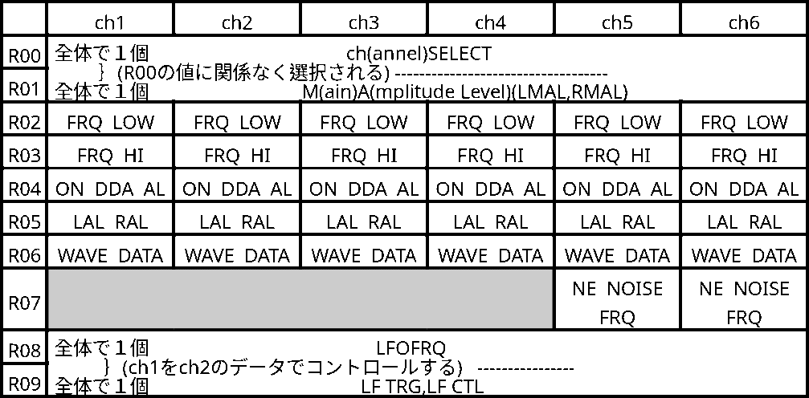

**Register details**

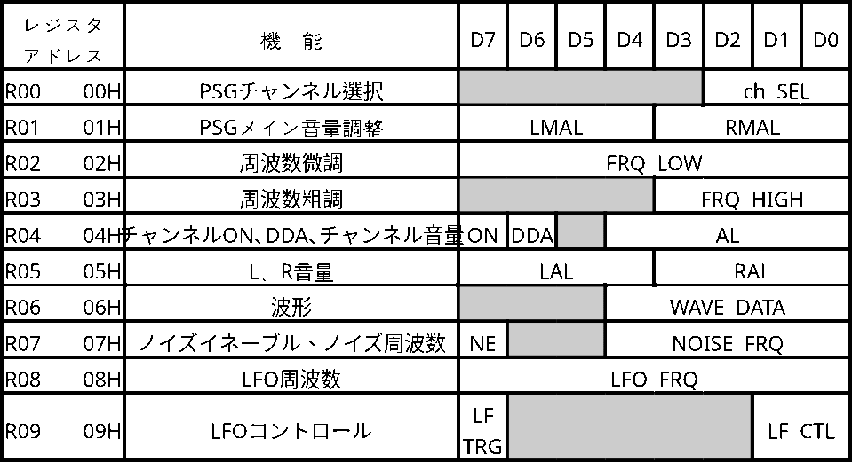

### 2.1.2 ADPCM and PCM registers

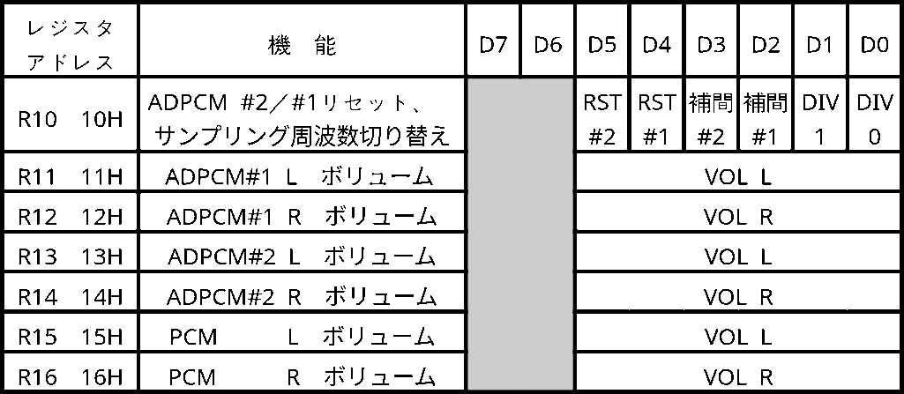

- `#1`: ADPCM channel 1
- `#2`: ADPCM channel 2
- `PCM`: direct input/output line

## 2.2 Register functions

### 2.2.1 PSG registers

#### 1. PSG Channel Select Register — R00, write

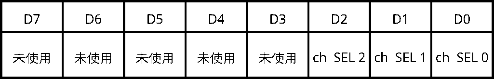

This register forms part of the address for channel-specific registers `R02–R07`. Write the channel address to `R00`, then select `R02–R07` with `A4–A0`. Bits D2–D0 contain the channel address. For example, `011B = 3` selects channel address 3, so accesses to `R02–R07` apply only to channel 4.

#### 2. PSG Main Volume Register — R01, write

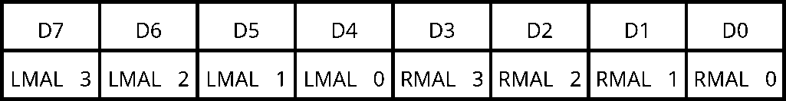

Controls the amplitude of the final mix. `LMAL` controls left output and `RMAL` controls right output. Each is four bits; `0FH` is maximum volume, and each decrement reduces output by approximately 3 dB.

#### 3. Frequency Fine Register — R02, write

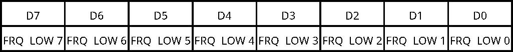

Fine portion of the output-frequency setting; used with `R03`.

#### 4. Frequency Coarse Register — R03, write

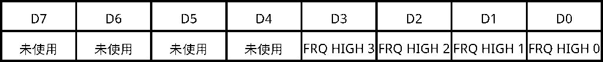

Coarse portion of the output-frequency setting; used with `R02`.

For each channel, concatenate `R03` and `R02` to form the 12-bit frequency value `f`:

`fOUT = fmaster / (2 × 32 × f)`

where `fmaster = 7.16 MHz` and `f` is interpreted as a decimal integer. Do not set `f = 0`; internal counter operation is undefined.

#### 5. Channel On, DDA, and Channel Volume Register — R04, write

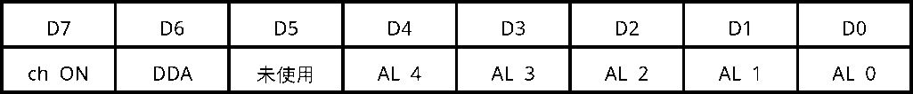

- D7 controls channel output/mixing and access to the waveform register.
- D6 controls direct D/A mode.
- D4–D0 control channel amplitude.

When D7 is 1, the channel is mixed into the output. When D7 is 0, output is disabled and `R06` can be written. When D6 is 1, the waveform-address counter is reset and data is sent directly to the D/A converter.

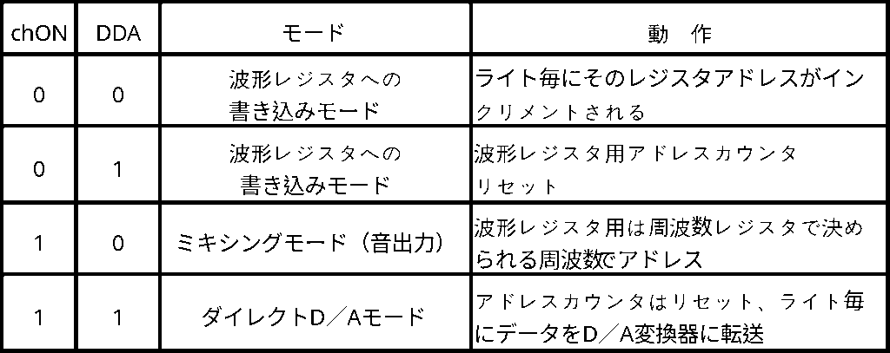

For volume control, `1FH` gives maximum output. Each decrement reduces amplitude by approximately 1.5 dB.

#### 6. Left/Right Volume Register — R05, write

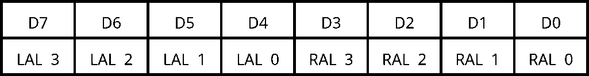

Controls left/right distribution. `LAL` controls left amplitude and `RAL` right amplitude. Each is four bits; `0FH` is maximum, with approximately 3 dB attenuation per decrement.

#### 7. Waveform Register — R06, write

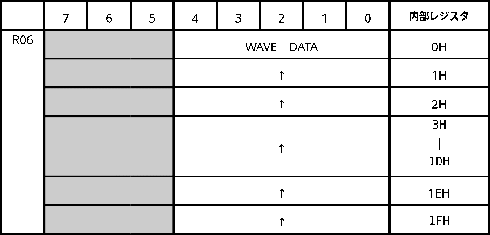

Each channel has 32 five-bit words defining one complete waveform period.

#### 8. Noise Enable/Frequency Register — R07, write

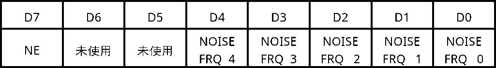

D7 selects noise instead of tonal output. When D7 is 1, noise is enabled and tonal output is suppressed. D4–D0 select the noise-generator input clock; `00H` is the low-frequency end and `1FH` the high-frequency end.

#### 9. LFO Frequency Register — R08, write

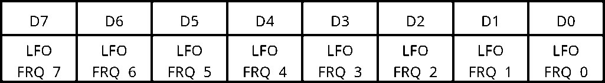

Controls the low-frequency oscillator used for frequency modulation. The LFO uses channel 2’s tone-frequency counter. `R08` together with channel 2 `R02/R03` determines how quickly channel 2 waveform addresses advance. Do not write `00H`.

#### 10. LFO Control Register — R09, write

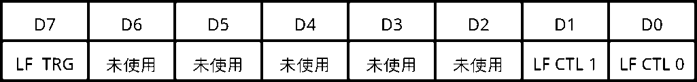

**LF TRG:** Writing resets the LFO. In the reset state, waveform address 0 of channel 2 is held as the modulation datum and modulation stops. Writing 0 restarts modulation at the LFO frequency.

**LF CTL:** The low two bits select modulation depth. Channel 2 waveform data, addressed at the LFO rate, is added to or subtracted from the channel 1 frequency register. The most significant bit of the five-bit waveform datum acts as a sign: 1 adds and 0 subtracts, allowing continuous waveform-shaped modulation.

LFO output is valid only while both channels 1 and 2 are enabled. Channel 2 amplitude controls remain active; normally set them to minimum to prevent audible channel 2 output. Deliberately allowing channel 2 output can create additional effects.

### 2.2.2 ADPCM and PCM registers

#### 1. ADPCM Reset, Sampling Frequency, and Interpolation Register — R10, write

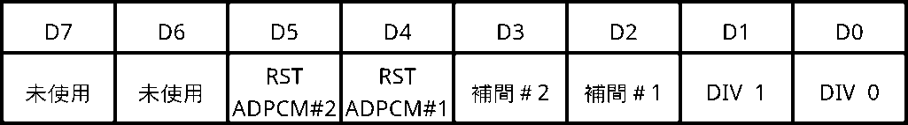

- **Interpolation #2/#1:** when the sampling frequency is not 31.47 kHz, select linear interpolation.
  - 1: enable linear interpolation
  - 0: disable interpolation
- **RST ADPCM #2/#1:** independent software reset.
  - 1: reset asserted
  - 0: reset released
- **DIV1/DIV0:** sampling-frequency mode.

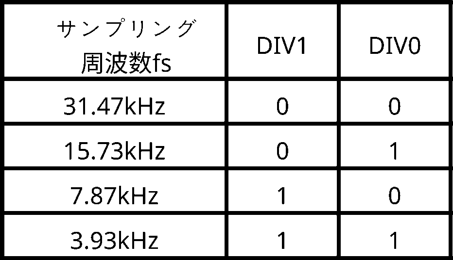

`fs = 31.47 kHz / 2^DIV`, where `DIV = 0, 1, 2, or 3`.

#### 2–5. ADPCM volume registers

- `R11`: ADPCM #1 left
- `R12`: ADPCM #1 right
- `R13`: ADPCM #2 left
- `R14`: ADPCM #2 right

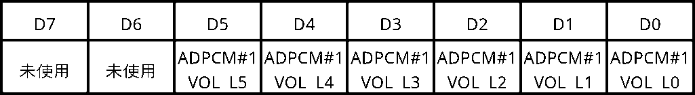

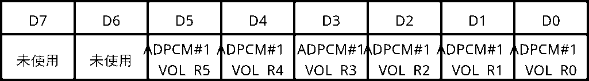

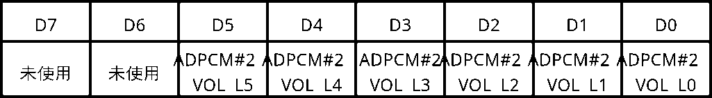

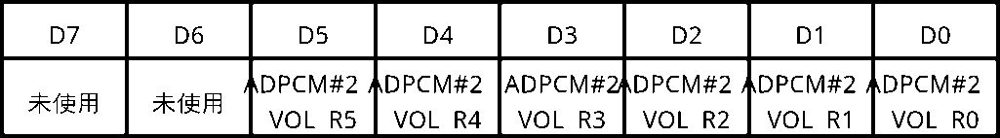

Writing `3FH` to D5–D0 gives maximum output. Each decrement attenuates by about 1.5 dB. Maximum finite attenuation is -52.5 dB; values `1BH–00H` produce silence, equivalent to -∞ dB.

#### 6–7. PCM volume registers

- `R15`: PCM left
- `R16`: PCM right

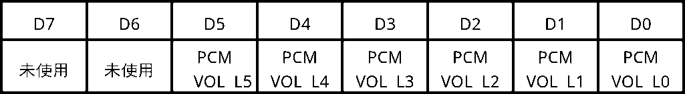

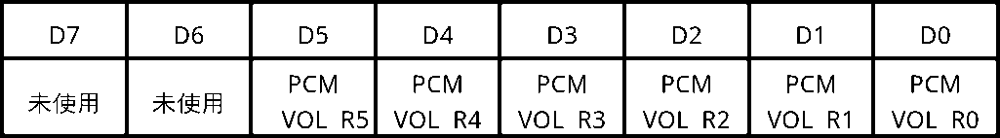

These registers control either an external or on-chip VCA and therefore behave differently from the ADPCM volume controls.

Each one-count change normally corresponds to 16 of 1,023 peak-level steps. The transitions `00H↔01H` and `3EH↔3FH` use special step counts. Step response time also varies with register value to produce a logarithmic time characteristic.

Example: changing `3FH` to `00H` reaches -∞ dB in approximately:

`T = 1.49×512 + 2.98×256 + 5.96×128 + 11.92×64 + 23.84×32 + 47.68×16 + 2956.16 = 7.53 ms`

Changing `3DH` to `3FH` raises the level by:

`20 log10(1023/991) = 0.27 dB`

and takes:

`T = 1.49 × (1023 - 991) = 47.68 μs`

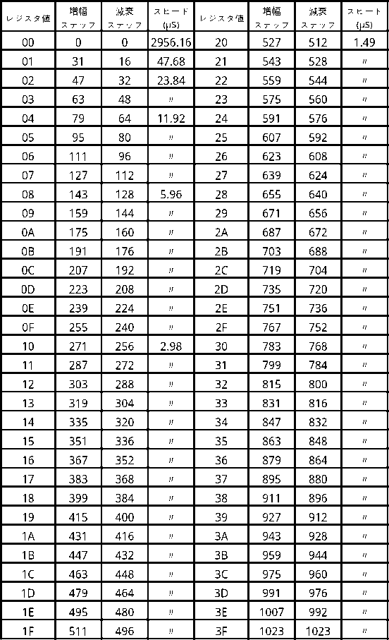

## 2.3 Register programming

All registers are programmed by the CPU. `R10` is synchronized internally and becomes effective on the falling edge of the next `-HSYNC`. If `R10` is written more than once in one horizontal period, the last value present immediately before that falling edge takes effect.

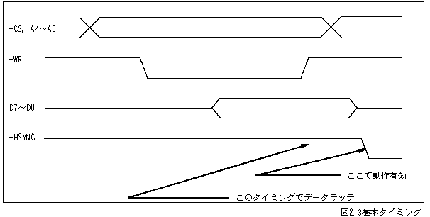

# Chapter 3: Reset Operation

## 3.1 System reset

Drive the `-RESET` pin low. Perform a system reset at least once during startup.

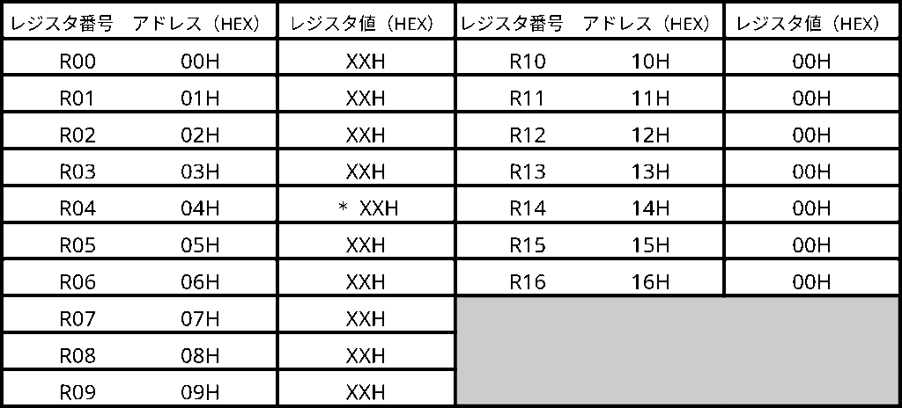

The PSG registers are not generally cleared, but D7 of each `R04` is forced to 0 so no PSG channel outputs audio.

Other reset results:

- PSG output stops.
- ADPCM software resets are released.
- ADPCM interpolation is disabled.
- Sampling rate is set to 31.47 kHz.
- ADPCM and PCM electronic volumes are set to -∞.
- ADPCM converters enter output-level hold at the analog-ground code and wait for HuC6272 data.

## 3.2 Software reset

`R10` can reset ADPCM channels 1 and 2 independently. The setting takes effect on the falling edge of the next `-HSYNC`.

Only the ADPCM decompression circuit is initialized; registers and the PSG are unaffected.

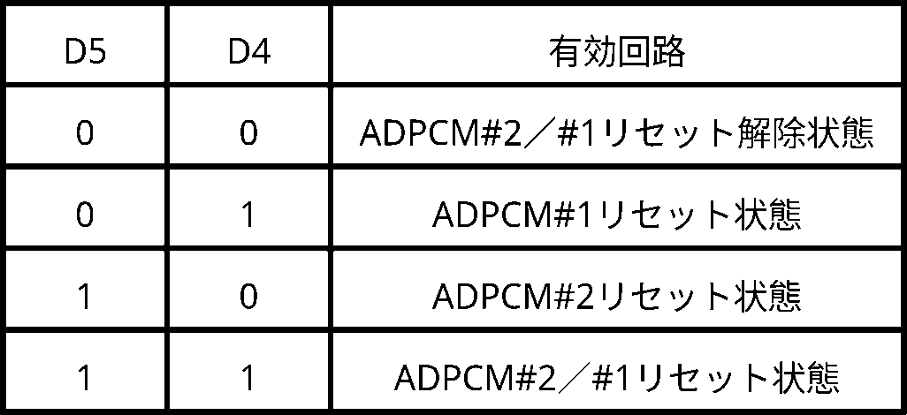

Initial decompression coefficients after reset:

- PCM value `P(N) = 200H`
- Scale value `S(N) = 16`
- Scale level `S'(N) = 0`

Change interpolation or sampling frequency only while software reset is asserted. Changing either while reset is released is prohibited and operation is not guaranteed.

# Chapter 4: ADPCM Decompression and Playback

## 4.1 Decompression flow

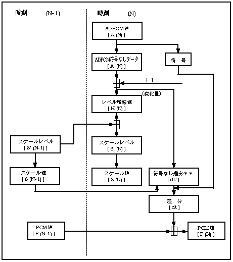

The difference term is:

`dt' = (A(N) + 1) × S(N-1) / 8`

That is, multiply the coded change amount by one-eighth of the previous scale.

## 4.2 HuC6272-to-HuC6230 transfer timing

1. After reset release and before the first datum, output-level hold is active at analog-ground code `200H`.
2. The first transfer establishes the transfer cycle. The cycle remains fixed until hardware reset or an appropriate software reset and is common to both ADPCM channels. To change it by software, reset both channels at the same time.
3. Entering output-level hold does not change the established cycle.
4. Within one cycle, a channel accepts only two bytes, representing four ADPCM nibbles. If more are written, only the final two bytes present at the cycle start, synchronized to the falling edge of `-HSYNC`, are valid. A write exactly at that instant may be captured but can race the internal process and corrupt ordering.
5. `-CS0` and `-CS1` distinguish channels, so channel order is unrestricted. Each channel’s two bytes must nevertheless be consecutive and must not straddle the established transfer-cycle boundary.
6. Immediately after hardware reset or simultaneous two-channel software reset, the cycle is re-established. Because playback begins at the next `-HSYNC`, transfer all four bytes within one horizontal period, or two bytes if only one channel is used.
7. Chip-select behavior is shown below.

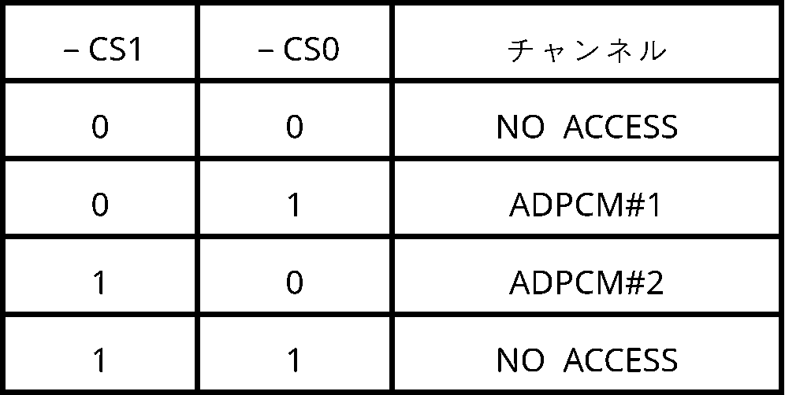

### ADPCM data structure

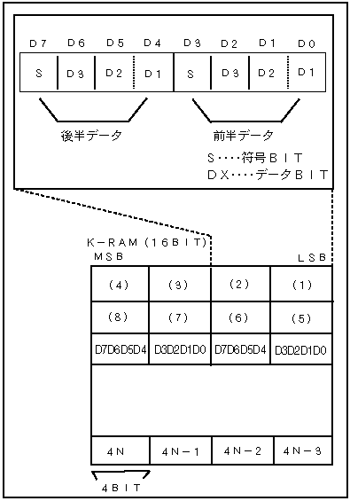

Each 8-bit input byte carries two 4-bit ADPCM codes:

- D3–D0: earlier code
- D7–D4: later code

Within each nibble, the high bit is the sign: 0 indicates a positive change and 1 a negative change. The remaining three bits encode the magnitude.

ADPCM data in KRAM must end on a 16-bit boundary. The HuC6272 transfers the low byte first, then the high byte. The HuC6230 identifies them through `RH/-L`:

- High: low byte
- Low: high byte

### Timing at 31.47 kHz

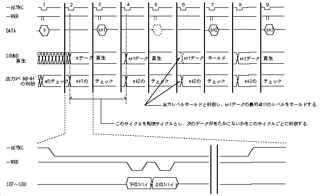

## 4.3 Output-level hold

If HuC6272 transfers stop for longer than the specified interval, the affected ADPCM channel independently holds the level produced by the last received data.

Restart by resuming transfer. Because the decompressor state is retained, either reset the channel first or ensure that the new stream is a true continuation of the old one.

If the held DC level is far from analog ground, an abrupt reset can produce a click or other artifact. Software should first reduce volume to -∞ and then reset.

Fundamental transfer rules:

- During playback, send at least the required two bytes per channel within every transfer cycle.
- To hold a channel, send no data to that channel.
- A single byte is treated as no valid transfer and causes level hold.

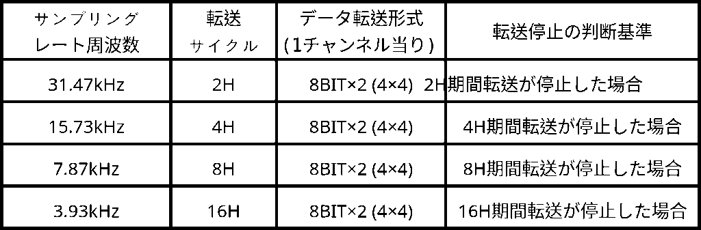

Channel hold is selected independently by `-CS0/-CS1`, although both channels share playback timing.

When external synchronization temporarily stops `-HSYNC`, output automatically enters hold. When HuC6272 transfer resumes, continuous playback resumes, provided the HuC6272 has maintained the required cycle in terms of `-HSYNC` counts.

## 4.4 Operation while audio output is disabled

Setting ADPCM electronic volume to -∞ stops audible output but does not stop decompression while data continues. This permits fade-in and fade-out. To begin a new unrelated sound after restoring volume, reset the channel once.

## 4.5 PCM calculation limits

- Scale level initial value: 0
- Minimum: 0
- Maximum: 48
- Underflow is clamped to 0; overflow is clamped to 48.
- PCM code: 12-bit offset binary
- Intermediate precision: 18 bits, including three fractional bits
- D/A uses the upper bits; lower bits are truncated.
- PCM initial value in the decompression arithmetic: `800H`
- PCM output range: `000H–FFFH`, with saturation on underflow/overflow.

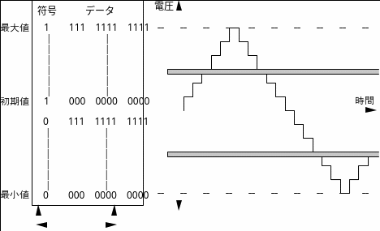

# Chapter 5: Sampling-Frequency Switching

The base sampling frequency is 31.47 kHz. Lower rates may be interpolated to 31.47-kHz output intervals, with interpolation selectable by register.

## 5.1 Sampling-frequency list

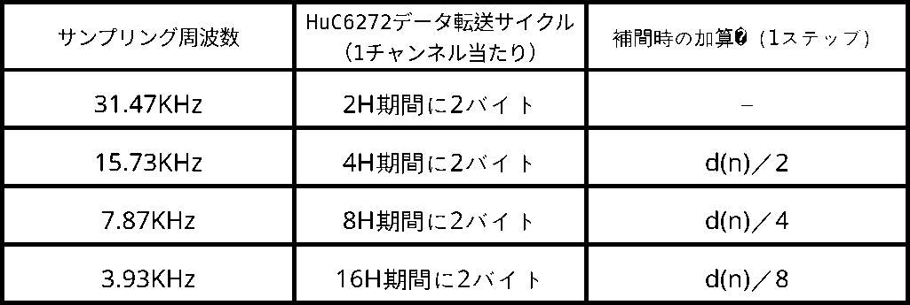

`d(n)` is the decompressed ADPCM difference value at time `n`.

## 5.2 Output interpolation

Interpolation operates only at sampling frequencies below 31.47 kHz. An interpolation-enable setting is ignored at 31.47 kHz. See the preceding table for the increment used at each rate. Linearity relative to the theoretical straight line is within ±1 LSB because of arithmetic error.

### 8-kHz interpolation example

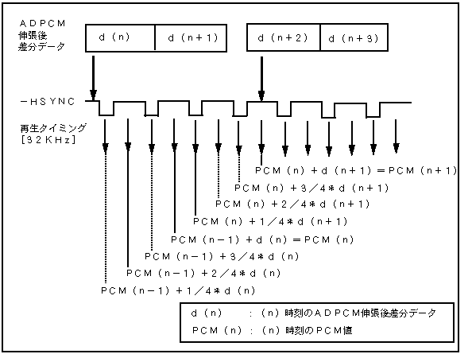

# Chapter 6: Four-Channel Mixing

The two ADPCM channels, one line-input channel, and the PSG output can be mixed and output. Left and right are mixed independently.

Mixing ratio `ADPCM #1 : ADPCM #2 : LINE : PSG` is `1 : 1 : 1 : 2`; the PSG contribution represents all six PSG channels.

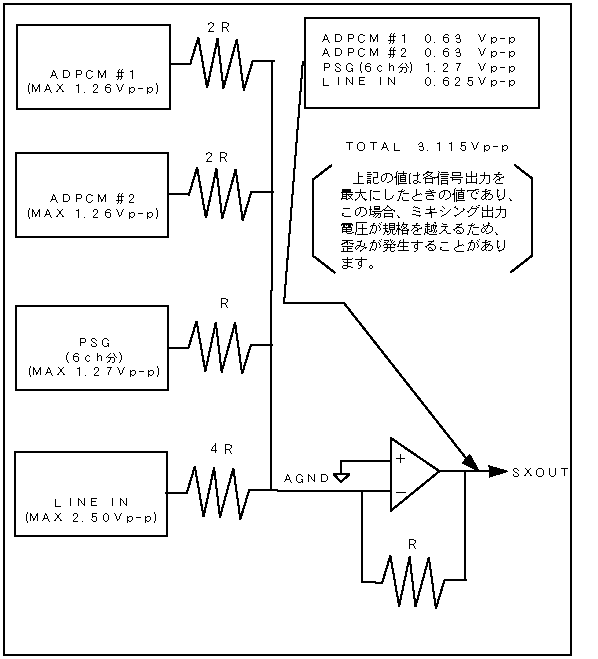

# Chapter 7: PSG

## 7.1 Overview

The PSG uses waveform memory and can synthesize many sounds under software control. It includes noise generators for rhythm and effects and one low-frequency oscillator for effects and vibrato.

Features:

- Monolithic CMOS programmable sound generator
- Waveform-memory synthesis, 32 addresses per period
- Six tonal channels and two square-wave noise generators
- Configurations from six tones to four tones plus two noises
- Five-bit logarithmic volume control with wide dynamic range
- Stereo output
- Direct D/A mode for sampled or synthetic effects
- Built-in LFO

## 7.2 Operation

Except for DDA mode, all PSG behavior is controlled by register contents.

- Waveform generator: produces each channel’s waveform from 32 five-bit words.
- Noise generator: produces a pseudo-random square wave.
- Volume control: sets amplitude according to register values.
- LFO: modulates channel 1 frequency with channel 2 waveform data.

### 7.2.1 System reset

Driving `-RESET` low clears D7 of every `R04`, disabling all channels. Other registers are undefined and must be initialized before sound generation.

### 7.2.2 Built-in D/A converters

1. A five-bit logarithmic D/A converter sets maximum amplitude in 1.5-dB steps, producing natural decay.
2. A five-bit linear D/A converter converts waveform data to amplitude.

### 7.2.3 Block diagram

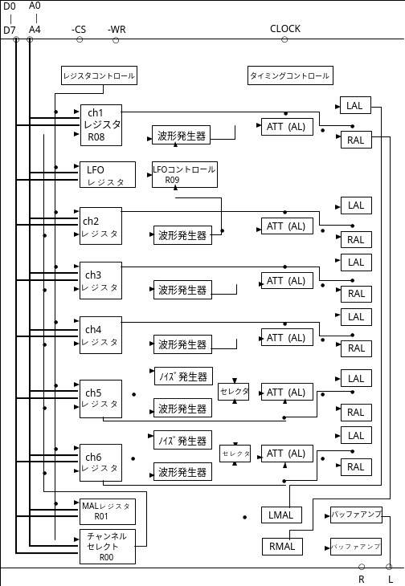

### 7.2.4 Creating waveform data

Observe the desired waveform and quantize one period into 32 time samples, each with five-bit amplitude. Write the resulting words to the waveform register.

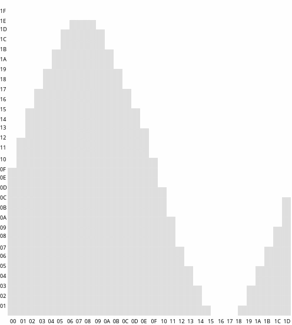

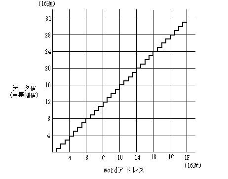

The example increments waveform data by one at every address.

#### Normal write

Set `ch ON = 0`, `DDA = 0`, then write 32 consecutive words to `R06`. Set `ch ON = 1`, `DDA = 0`, and configure `MAL`, `AL`, `LAL`, and `RAL` to play. The starting waveform address cannot be selected by this method.

#### Writing from address 0

First set `ch ON = 0`, `DDA = 1`, then set `ch ON = 0`, `DDA = 0`. This resets the waveform address counter to 0. Write 32 words to fill addresses `00H–1FH`, then enable and configure the channel as above.

#### Direct D/A mode

Set `ch ON = 0`, `DDA = 1`, write `00H` to `R06`, then set `ch ON = 1`, `DDA = 1`. Subsequent writes to `R06` go directly to the D/A converter and produce output without destroying waveform memory.

For channel 2, normal waveform writing is inhibited if `R09` contains `80H` or greater.

### 7.2.5 Volume adjustment

`R01` controls final left/right mix level. Per-channel `R04` and `R05` control channel level and stereo placement.

- `R01` and `R05`: approximately 3 dB per step
- `R04`: approximately 1.5 dB per step

Circuit dynamic range is about 45 dB. A channel produces no output if any relevant field is zero, or if the summed attenuation represented by `R01`, `R05`, and the upper four bits of the `R04` amplitude field reaches 15 steps or more.

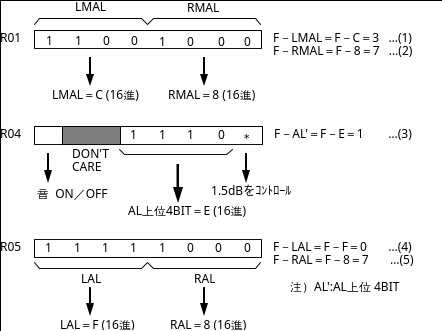

In the example, left attenuation is `(1) + (3) + (4) = 3 + 1 + 0 = 4`, or 12 dB. Right attenuation is `(2) + (3) + (5) = 7 + 1 + 7 = 15`, or 45 dB, so the right channel is silent.

Use `R01` for overall fades and stereo movement, `R04` for per-channel level or envelopes, and `R05` for per-channel pan and level.

### 7.2.6 Frequency setting

Concatenate `R03:R02` into the 12-bit value `F`:

`fOUT = fmaster / (2 × 32 × F)`

The 21.48-MHz signal from the system is divided to produce `fmaster = 7.16 MHz`. Interpret `F` as a decimal integer. Do not use zero.

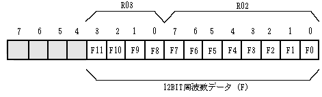

### 7.2.7 LFO frequency

The LFO is active when the low two bits of `R09` are 1, 2, or 3. Channel 2’s frequency counter is cascaded with the LFO frequency counter:

`fLFO = fmaster / (2 × 32 × f2 × fLF)`

where `f2` is channel 2’s `R03:R02` value and `fLF` is `R08`, both interpreted as decimal. `fLFO` is the rate at which all 32 channel-2 waveform addresses are traversed. Neither value may be zero.

### 7.2.8 Noise frequency

`R07` controls the noise-generator input clock:

`fNCL = fmaster / (2 × 32 × 2 × NF)`

`NF` is the five-bit one’s complement of the Noise Frequency field. If `NF = 0`, frequency is undefined and unusual noise results.

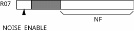

`R07` exists only for channels 5 and 6.

### LFO and modulation diagrams

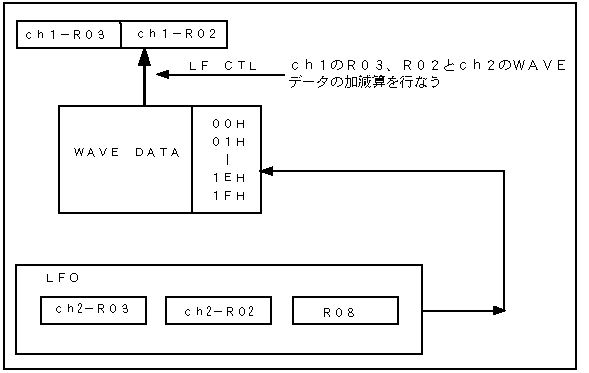

Waveform-data values and their add/subtract effect when used for LFO modulation:

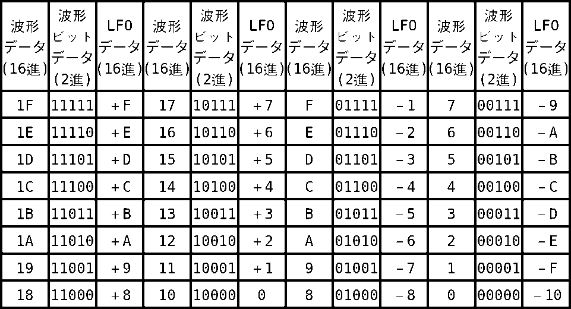

A plus sign moves frequency toward the lower-pitch direction.

Relationship between the two-bit `LF CTL` value and LFO control:

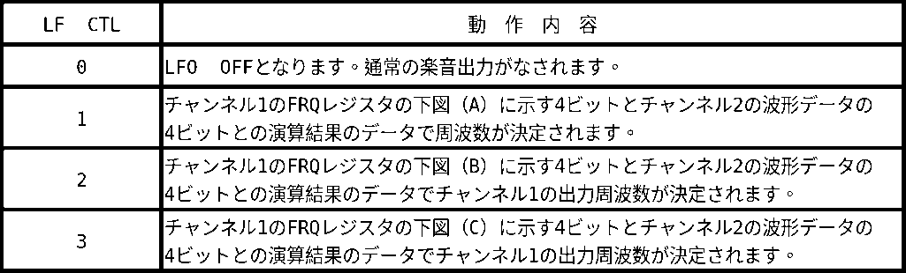

**LF CTL = 1**

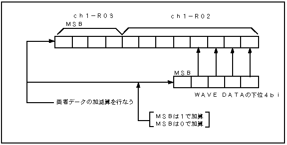

**LF CTL = 2**

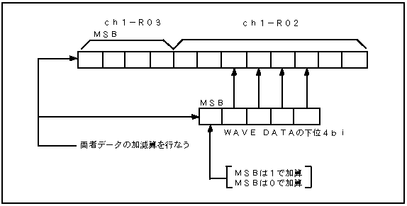

**LF CTL = 3**

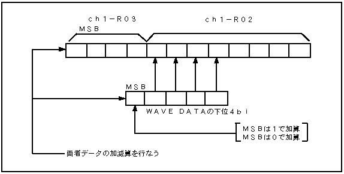

# Reference Material

## ADPCM compression flow

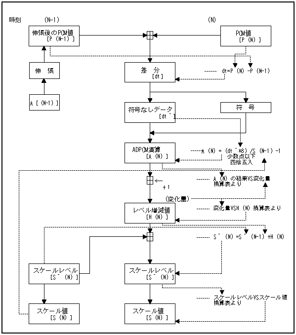

## Notes for implementing ADPCM compression

### 1. PCM difference calculation

`dt = P(N) - P(N-1)`

- `P(N)`: input datum at time N
- `P(N-1)`: reconstructed datum at time N-1

Retain three fractional digits when calculating `P(N-1)`.

### 2. ADPCM code calculation

`A(N) = (dt' × 8) / S(N-1) - 1`

Retain three fractional digits during the calculation and round the first fractional digit only at the final step.

### 3. Reconstructed data needed by the compressor

When calculating `dt'` in the decompression flow, retain all three fractional digits. Clamp reconstructed data to a maximum of 4095.875 and a minimum of 0.

## ADPCM data versus change amount and level increment/decrement

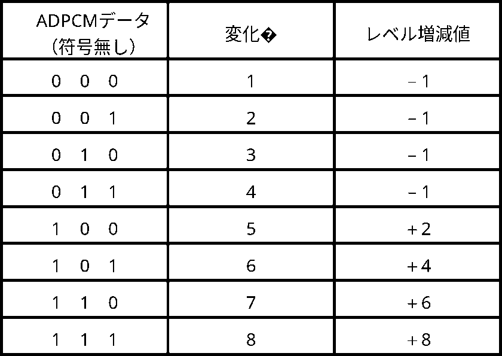

## Scale-level table

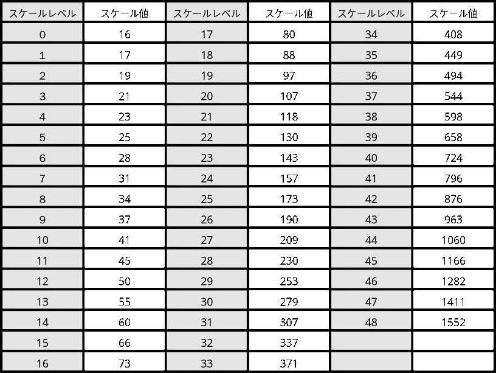

## Pitch table

Relationship between equal temperament and PSG output at `fmaster = 7.16 MHz`:

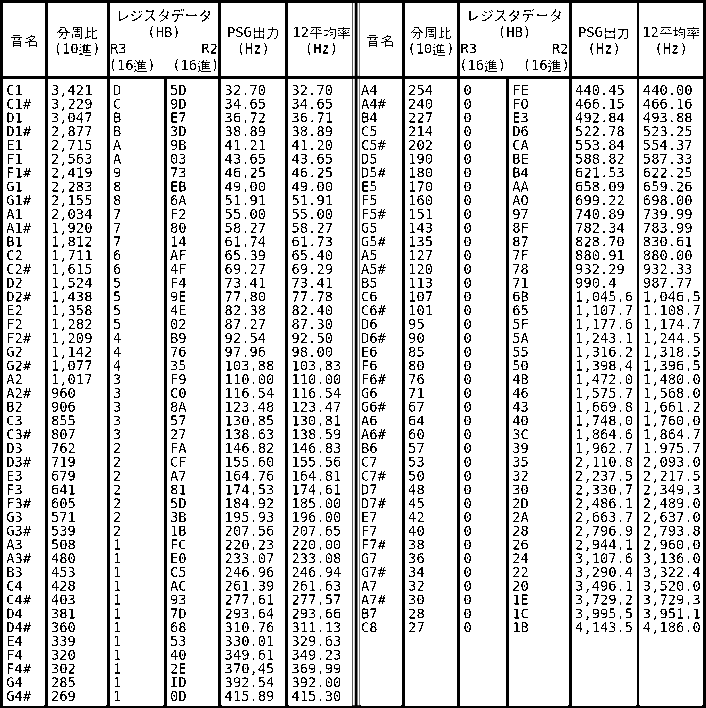

## Copyright and registered trademarks

- This technical document is part of the software-development tools for PC-FXGA. Do not use it for any purpose other than PC-FX or PC-FXGA software development.
- Hudson Soft assumes no responsibility or liability for direct or indirect damage resulting from use of this technical document.
- Hudson Soft does not answer questions directly concerning this technical document or its contents. Please refrain from contacting the company with such inquiries.
- Before using this technical document, read and comply with the applicable “Software Terms of Use.”
- Copyright in this technical document is held by Hudson Soft.

© 1995 HUDSON SOFT
