# PC-FXGA Authoring Software

# “GMAKER” Starter Kit (Version 1.0)

# Device Notes: HuC6261

NEC Home Electronics, Ltd.  
November 10, 1995

## Contents

1. Introduction
2. Operating functions
   - 2.1 Internal registers
   - 2.2 Color-palette RAM
   - 2.3 Priority
   - 2.4 Chroma key
   - 2.5 Cellophane blending
   - 2.6 Interlace and non-interlace modes
   - 2.7 320-dot mode
   - 2.8 YUV output
   - 2.9 HuC6270 registers
   - 2.10 Display position
   - 2.11 State after reset
   - 2.12 Displaying HuC6273 images

# Chapter 1: Introduction

## 1.1 HuC6261 overview

The HuC6261 is a CMOS video color encoder integrating a sync generator, color-palette RAM, priority logic, cellophane-blending logic, and video D/A converters.

It converts palette data from two HuC6270s, or from the HuC6273, HuC6272, and HuC6271, through its color-palette RAM. It can also accept YUV image data directly from the HuC6272 and HuC6271, combine the available planes according to priority, and output video signals.

## 1.2 Features

- Monolithic CMOS video color encoder
- Advanced image composition: priority, chroma key, and cellophane blending
- Input types: YUV data and palette data
- Maximum color count: 16.7 million from direct YUV; 65,536 through the 512-entry palette RAM
- Consecutive CPU reads and writes of color-palette RAM
- Built-in sync generator
- External synchronization capability
- Video output requiring few external components

# Chapter 2: Operating Functions

## 2.1 Internal registers

### 2.1.1 Accessing internal registers

The CPU configures operating modes and accesses palette RAM through the internal registers.

Registers directly accessible when chip enable and A1 are both low:

- Address Register, write
- Status Register, read

All other registers are accessed by first writing the register number to the Address Register, then accessing with chip enable low and A1 high. The Address Register retains its value until rewritten.

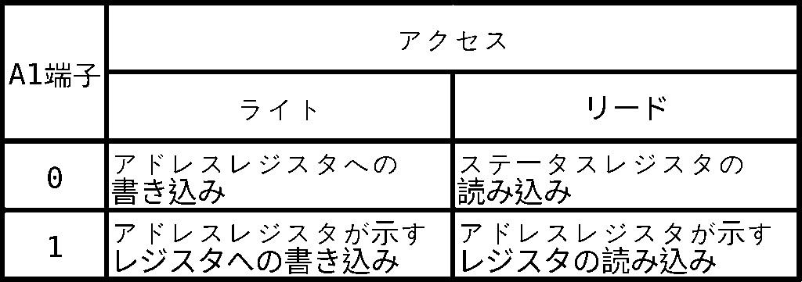

Use 16-bit halfword I/O instructions. A 32-bit word access performs two accesses to the same register, low halfword first and high halfword second; this can transfer two consecutive palette entries in one instruction. Other access sizes may malfunction. In the PC-FXGA system, the HuC6261 A1 pin is connected to CPU A2.

### 2.1.2 Internal register list

**Directly accessible registers**

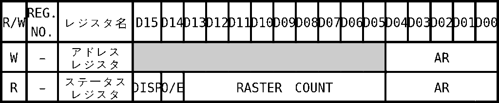

**Registers selected through the Address Register**

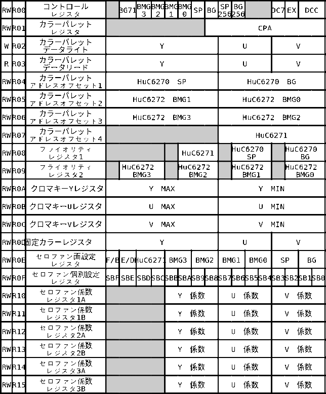

At reset, every register except the Status Register and Sprite Cellophane Individual-Enable Register `R0F` is cleared.

### 2.1.3 Register functions

Unused fields shown with an asterisk in the source figures must not be used.

#### Address Register — AR

Effective immediately after writing.

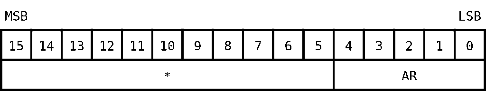

Selects internal registers `R00–R15`. Write the target register number before accessing it. Do not write `16H–1FH`; operation may become abnormal.

#### Status Register — SR

Continuously updated.

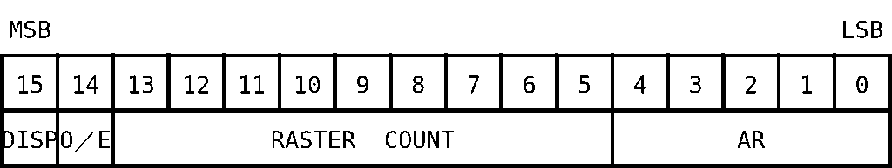

Reports the current Address Register value, raster number, interlace field, and whether the current time is within the display interval.

The raster count is the HuC6261 internal count and does not necessarily match the scanline numbering defined by NTSC. During external sync with a disturbed signal, the value becomes `1FFH`. Because it changes continuously, read it at least twice when a stable result is required.

- O/E: 0 = even field, 1 = odd field
- Display-period bit: 0 = blanking/non-display period, 1 = display period

#### Control Register — CR, R00

Bits 8–14 become effective in the next horizontal period; other mode fields become effective in the next vertical period.

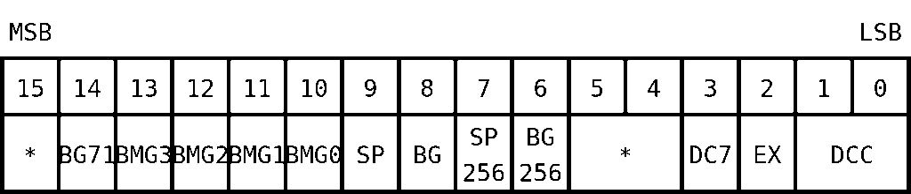

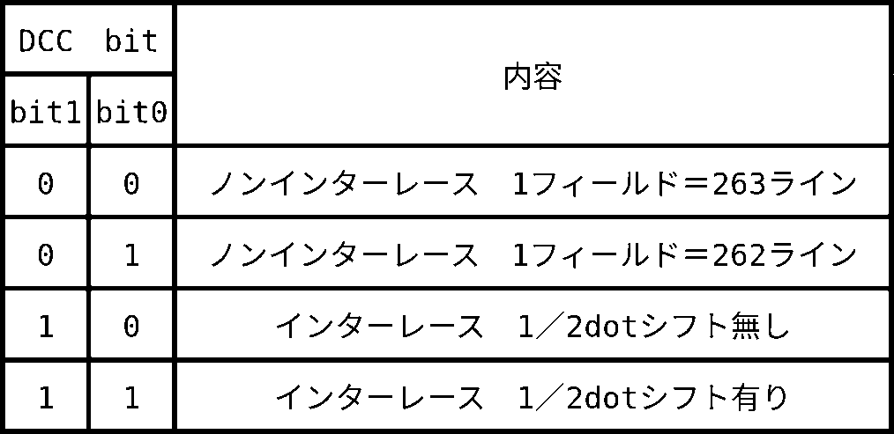

Controls interlace/non-interlace operation, half-dot shift, external synchronization, HuC6270 color modes, dot clock, and per-plane blanking.

External-sync enable causes free running until a valid external sync is detected, then locks to it. Setting 0 releases external sync, though release may be delayed while the external signal is severely disturbed. PC-FXGA has no external-sync input, so software must not set this bit.

Dot-clock mode:

- 0: 5-MHz dot clock, 256 horizontal dots
- 1: 7-MHz dot clock, 320 HuC6270 dots

HuC6271 and HuC6272 remain at 256 dots. At 7 MHz, all cellophane functions and HuC6271 YUV chroma key are disabled. When changing this bit, reprogram the HuC6270 horizontal-sync and memory-width registers. Never change it during external synchronization.

Plane-enable bits independently show or hide:

- HuC6270 BG
- HuC6270 sprites
- HuC6272 BMG0, BMG1, BMG2, BMG3
- HuC6271 BG71

The settings take effect in the next horizontal display period. If all display bits are zero, output is black: `Y=00H, U=80H, V=80H`.

#### Color-Palette Address Register — CPA, R01

Effective immediately.

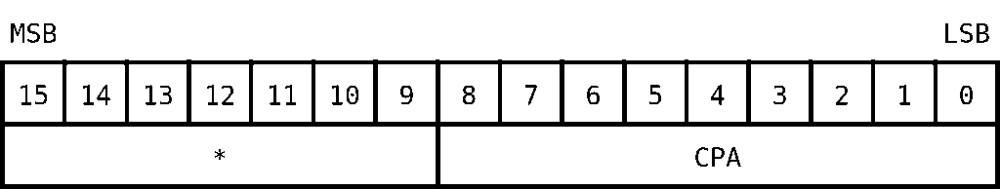

Selects the palette-RAM address used by `CPW` and `CPR`. It automatically increments after every palette-data read or write.

#### Color-Palette Data Write Register — CPW, R02

Effective immediately.

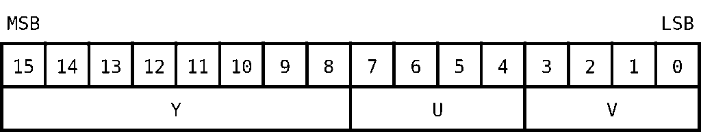

Writes data to the palette address selected by `CPA`, after which `CPA` increments. Writing palette RAM during active display produces visible noise.

#### Color-Palette Data Read Register — CPR, R03

Valid immediately after writing `CPA`.

Reads the palette entry selected by `CPA`, after which `CPA` increments. Reading palette RAM during active display produces visible noise.

#### Palette Address Offset Registers — CPO1 through CPO4, R04–R07

Become effective in the next horizontal display period.

- `CPO1`, R04: HuC6270 sprite and BG offsets
- `CPO2`, R05: HuC6272 BMG0 and BMG1 offsets
- `CPO3`, R06: HuC6272 BMG2 and BMG3 offsets
- `CPO4`, R07: HuC6271 palette-plane offset

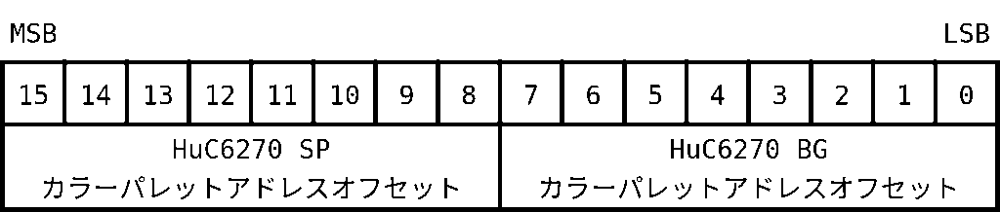

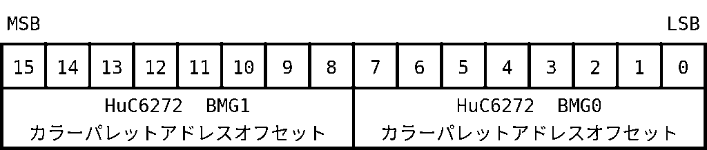

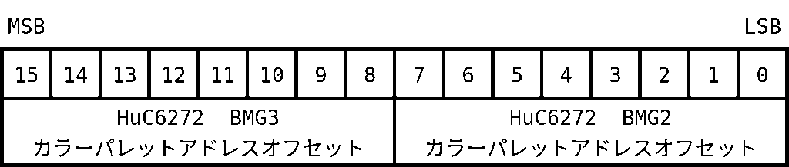

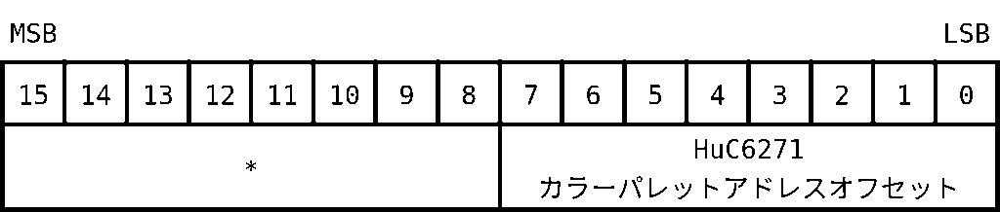

The hardware multiplies each field by two to obtain the actual palette-address offset. The effective address is the incoming palette datum plus twice the selected plane offset.

#### Priority Registers — PRI1 and PRI2, R08–R09

Become effective in the next horizontal display period.

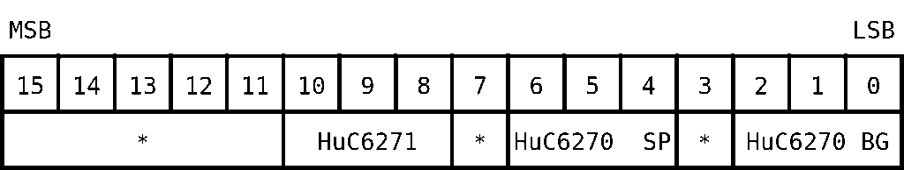

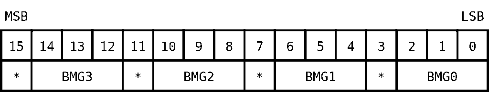

Assign each plane a unique 3-bit priority from 0 through 7. Larger values have higher priority. Do not assign the same value to multiple planes.

Changing these registers alone cannot reorder HuC6270 sprite versus BG or HuC6272 BMG0–BMG3 internally; update the corresponding source-device priority settings as well.

#### HuC6271 Chroma-Key Registers — CKY, CKU, CKV, R0A–R0C

Become effective in the next horizontal display period.

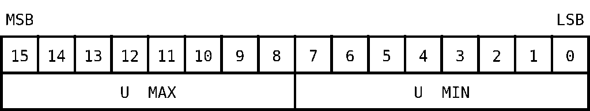

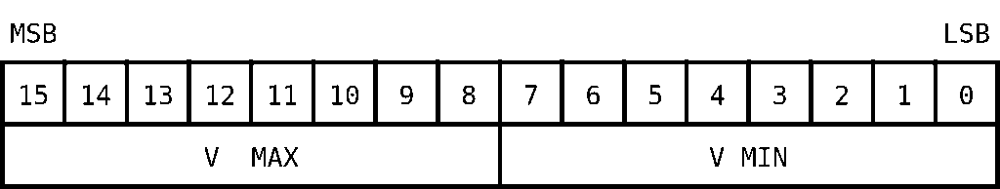

Specify unsigned lower and upper bounds for the Y, U, and V components of the HuC6271 direct-YUV plane. A pixel is transparent only when all three components are within their corresponding ranges.

After reset, all three registers are zero, so `Y=00H, U=00H, V=00H` is transparent. To disable HuC6271 chroma key, make at least one range impossible by setting maximum below minimum.

#### Fixed Color Register — CCR, R0D

Becomes effective in the next horizontal display period.

Stores the YUV color used by front or back cellophane. Use the same data format as a color-palette entry.

#### Cellophane Plane-Setting Register — BLE, R0E

Becomes effective in the next horizontal display period.

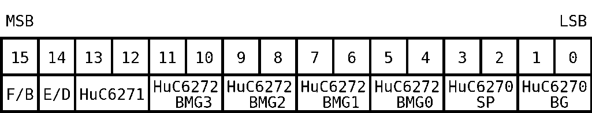

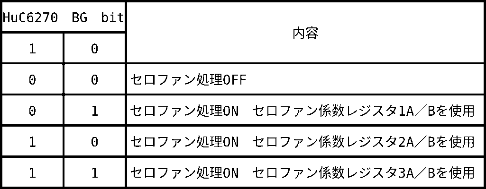

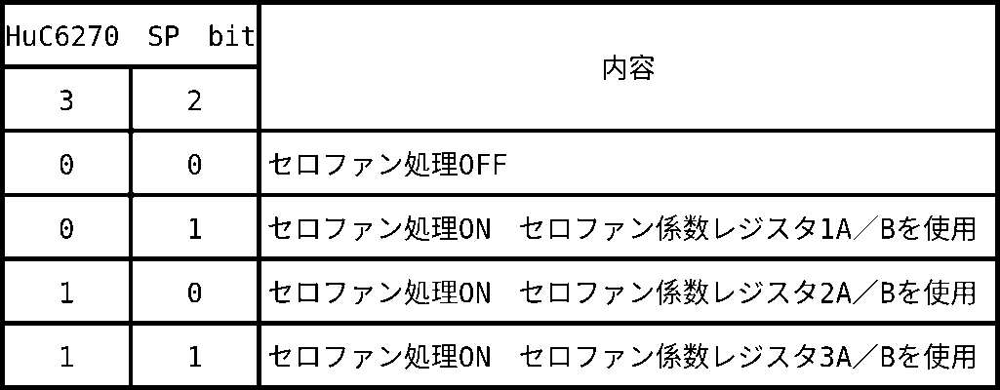

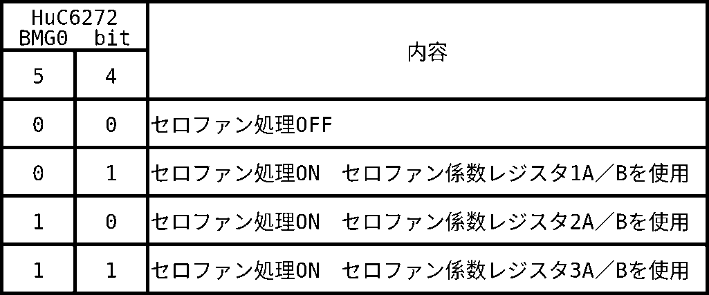

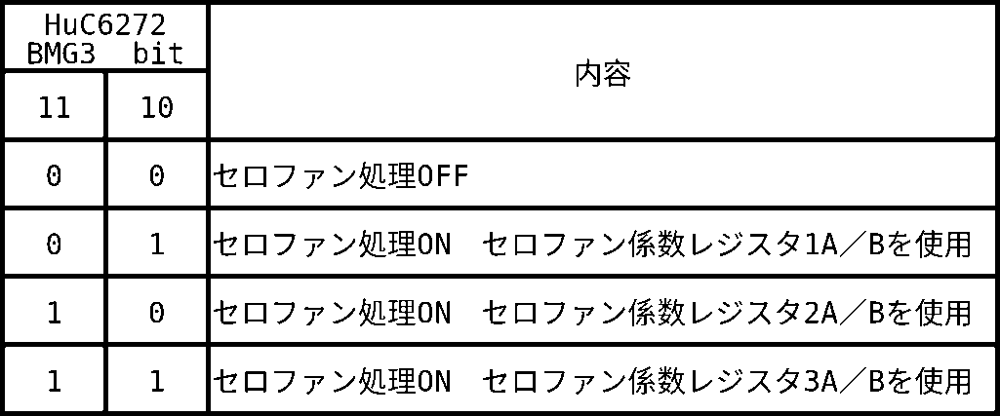

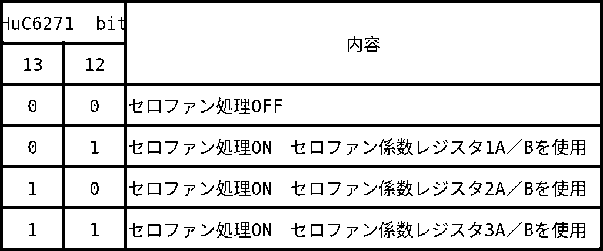

Selects cellophane enable and coefficient set for each plane, and controls front/back cellophane.

- 0: front/back cellophane off
- 1: front/back cellophane on
- Back/front selection: 0 = back, 1 = front

Front cellophane always uses coefficient pair 1A/1B. For ordinary plane blending, coefficient A applies to the overlaying plane and coefficient B to the plane underneath.

#### Sprite Cellophane Individual-Enable Register — SPBL, R0F

Becomes effective in the next horizontal display period.

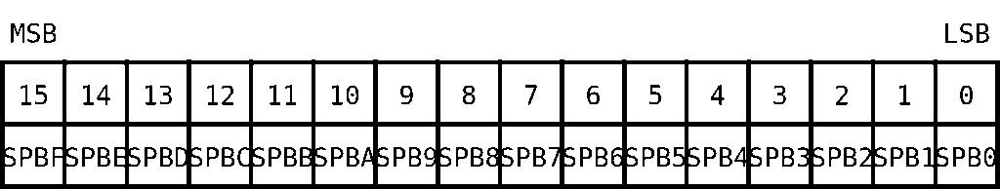

When HuC6270 sprite-plane cellophane is enabled globally, each bit independently enables or disables blending for sprites using palette banks 0 through 15. The bank number corresponds to `SPRITE COLOR` in the HuC6270 SATB.

- 0: no cellophane for sprites using that bank
- 1: apply cellophane

#### Cellophane Coefficient Registers — BL1A/1B, BL2A/2B, BL3A/3B, R10–R15

Become effective in the next horizontal display period.

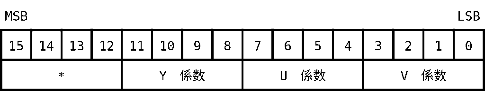

The registers are used as three A/B pairs. If overlay data is `(YA, UA, VA)` and underlying data is `(YB, UB, VB)`, the result is:

- `Y = my × YA + ny × YB`
- `U = mu × (UA - 80H) + nu × (UB - 80H) + 80H`
- `V = mv × (VA - 80H) + nv × (VB - 80H) + 80H`

Results above `FFH` are clipped. Coefficient values 9 through F are unsupported and do not produce valid arithmetic.

## 2.2 Color-Palette RAM

Palette data is converted to displayable YUV through a 512-address × 16-bit color-information table.

### 2.2.1 Organization

Each address stores one color, for 512 colors total. One entry contains eight Y bits, four U bits, and four V bits, representing 65,536 colors.

- Y: luminance, `00H–FFH`
- U: blue-yellow color difference, 0–15; neutral is 8
- V: red-green color difference, 0–15; neutral is 8

After reset, address 0 contains `Y=00H, U=00H, V=00H`; all other entries are undefined.

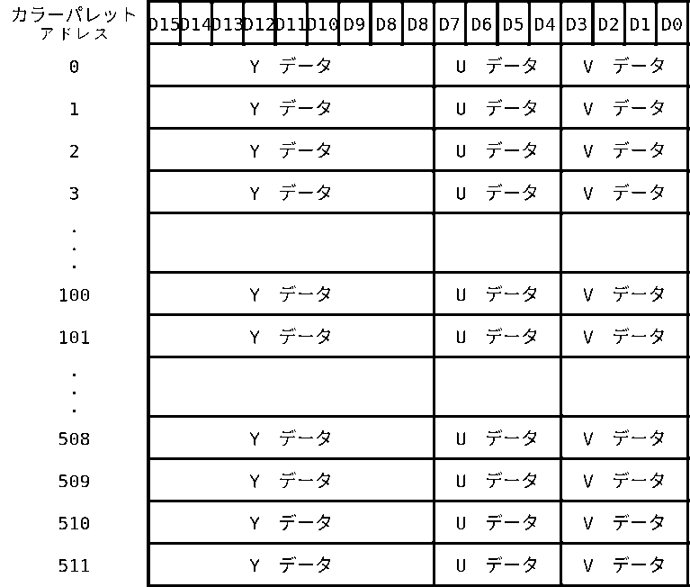

### 2.2.2 Writing and reading YUV palette data

#### Consecutive write

1. Write `01H` to AR to select `CPA`.
2. Write the starting palette address to `CPA`.
3. Write `02H` to AR to select `CPW`.
4. Write a palette datum to `CPW`; `CPA` increments.
5. Repeat step 4.

#### Consecutive read

1. Write `01H` to AR to select `CPA`.
2. Write the starting palette address to `CPA`.
3. Write `03H` to AR to select `CPR`.
4. Read `CPR`; `CPA` increments.
5. Repeat step 4.

### 2.2.3 Displaying palette data

All palette-based planes share the same palette RAM. Per-plane offset registers allow each plane to begin at a different portion of it.

After priority logic selects the visible plane for a pixel, a palette plane’s effective address is calculated as:

`9-bit palette address = 8-bit palette datum + (8-bit palette offset × 2)`

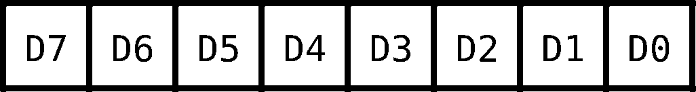

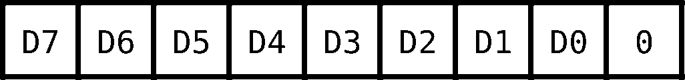

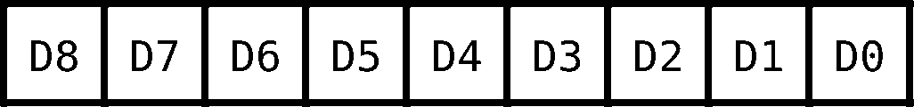

Both HuC6270 chips share one offset set. If the address exceeds 511, the tenth bit is discarded and addressing wraps to zero. CPU accesses ignore the plane offset.

Incoming palette-data formats are shown below.

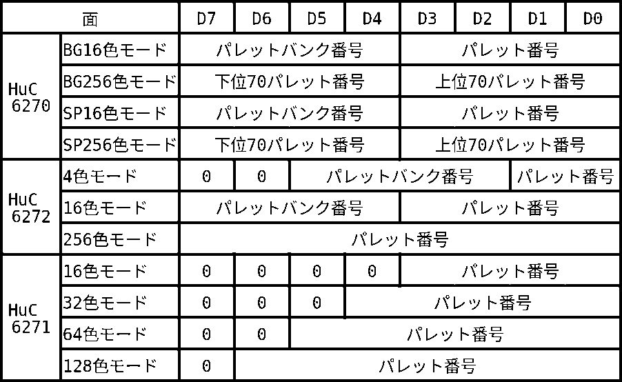

The palette-bank number is treated simply as upper palette-index bits. In HuC6270 16-color mode, one of the two HuC6270 inputs is selected. In 256-color expansion mode with `VDB7=1`, the low four bits of both HuC6270 inputs are combined. With `VDB7=0`, behavior is the same as 16-color mode.

Perform palette RAM reads and writes only during blanking; active-display access causes screen noise.

## 2.3 Priority Function

Priority logic chooses, for every pixel, which simultaneously supplied plane from the HuC6270, HuC6272, and HuC6271 is displayed.

### 2.3.1 Plane structure

- HuC6270: sprite plane and background plane
- HuC6272: BMG0, BMG1, BMG2, BMG3
- HuC6271: YUV or palette-data image plane

### 2.3.2 Relationship between upper and lower HuC6270s

Two HuC6270s can be connected. In 16-color mode, the upper HuC6270 is normally selected; if it outputs chroma-key data, the lower HuC6270 is selected. The HuC6261 then treats the selected result as one HuC6270 plane.

In 256-color expansion mode with `VDB7=1`, the low nibbles are combined as shown in the source. With `VDB7=0`, normal upper-first chroma-key selection is used.

### 2.3.3 Configuring priority

Assign each plane a unique value 0–7. Larger values are in front. Settings become effective in the next horizontal display period. Also update internal priority settings in the HuC6270 and HuC6272 as required.

### 2.3.4 Processing flow

For each pixel, the HuC6261 uses incoming plane information, priority values, and chroma-key status to choose the visible source.

In 256-dot mode, processing runs at four times the dot clock and includes priority, chroma key, and cellophane operations.

In 320-dot mode, HuC6270 data is 320 dots while HuC6271 and HuC6272 remain 256 dots. The selected source is resolved on a 21-MHz cycle and displayed immediately; HuC6271 direct-YUV chroma key and all cellophane processing are unavailable.

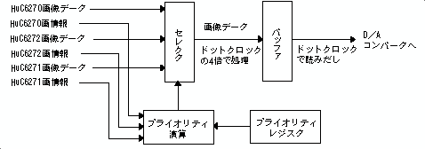

## 2.4 Chroma-Key Function

Chroma key treats a designated color as transparent, revealing the next lower-priority plane. It is always active; avoid key colors when transparency is not desired.

### 2.4.1 Concept

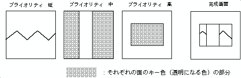

### 2.4.2 Palette-plane key color

Palette datum 0 is transparent. For HuC6270, palette number 0 is transparent in every bank. Even in 256-color expansion mode, an upper-HuC6270 palette number of 0 selects the lower HuC6270 regardless of bank.

HuC6272 may perform this test internally and send explicit transparent data to the HuC6261.

### 2.4.3 HuC6272 direct-YUV key color

In 16M- and 64K-color modes, every pixel with `Y=00H` is transparent regardless of U and V. Add at least `01H` to Y where black must remain opaque.

### 2.4.4 HuC6271 direct-YUV key color

A pixel is transparent when all components lie within the configured ranges:

`(Yu ≥ Ys ≥ Yl) AND (Uu ≥ Us ≥ Ul) AND (Vu ≥ Vs ≥ Vl)`

HuC6271 direct-YUV chroma key is disabled in 320-dot mode.

### 2.4.5 Lowest-priority transparent pixels

If the lowest-priority plane is transparent, palette address 0 supplies the displayed color. Thus, when all planes are transparent, palette entry 0 becomes the backdrop.

### 2.4.6 Summary

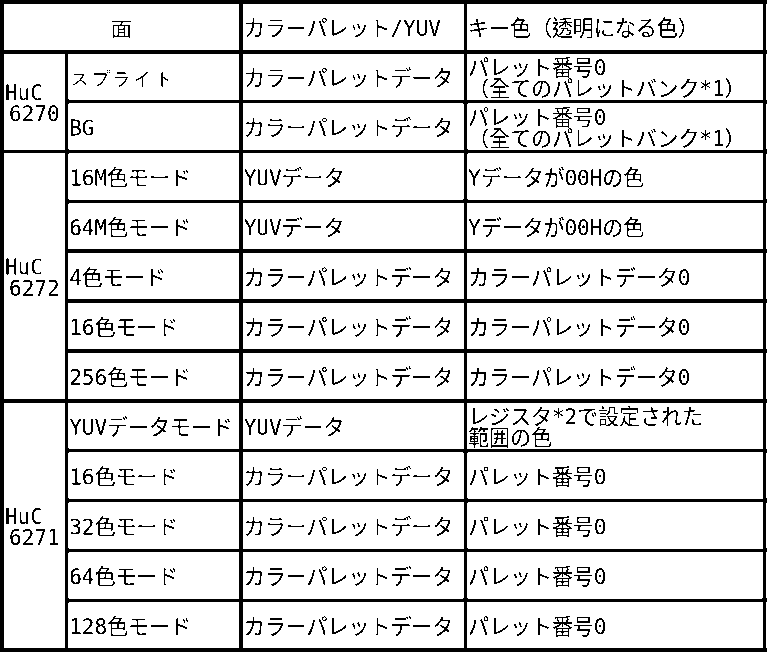

## 2.5 Cellophane Function

Cellophane blends a higher-priority plane with the plane beneath it, creating translucency, fades, and smooth transitions.

### 2.5.1 Main specification

For overlay data A and underlying data B:

- `Y = my × YA + ny × YB`
- `U = mu × (UA - 80H) + nu × (UB - 80H) + 80H`
- `V = mv × (VA - 80H) + nv × (VB - 80H) + 80H`

U and V are calculated as signed values centered on `80H`. Overflow clips to `FFH`; underflow clips to `00H`.

Coefficients have nine valid levels, `0/8` through `8/8`; the register stores the numerator. All six component coefficients are independently programmable, and three complete coefficient sets are available. Writing coefficient-set number 0 for a plane disables its cellophane. Do not use values 9–F.

No blend occurs over an overlay plane’s chroma-key pixels. Multiple successive blends are supported.

- **Front cellophane:** blends the completed picture with a fixed color to alter overall tone or brightness.
- **Back cellophane:** blends the lowest-priority plane with a fixed color.
- **Sprite special processing:** sprite blending can be enabled by palette bank.

### 2.5.2 Data flow

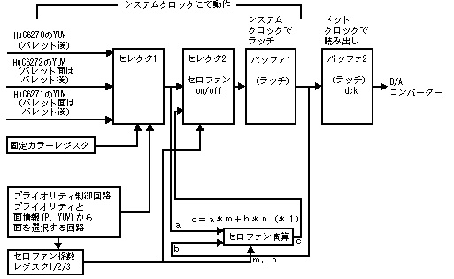

U and V are signed around `80H`.

### 2.5.3 Processing flow

The blending block executes the illustrated process once per dot clock.

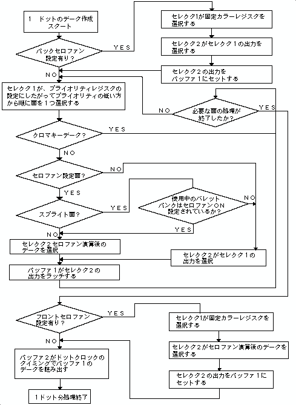

### 2.5.4 Conceptual example

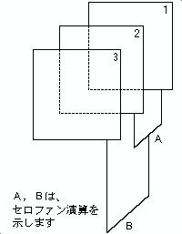

The three source devices occupy priority positions 1, 2, and 3 on a pixel-by-pixel basis. If position 2 has cellophane enabled, it blends with position 1. If position 3 also has cellophane enabled, it then blends with that result. If position 2 does not blend, it hides position 1 except where position 2 is transparent. Cellophane on the lowest plane has no effect unless back cellophane is enabled.

### 2.5.5 Restrictions

Planes emitted by the same source device cannot be blended with each other. Examples that are not possible include HuC6272 BMG1 with BMG2, HuC6270 sprite with HuC6270 BG, or the upper HuC6270 with the lower HuC6270. Each device outputs only its internally selected pixel, so the HuC6261 never receives the other same-device plane simultaneously.

### 2.5.6 Front and back cellophane

Both functions add a full-screen fixed-color plane programmed in `CCR`.

Front cellophane blends the final composite with the fixed color using coefficient set 1. Back cellophane first blends the lowest-priority source plane with the fixed color using that source plane’s selected coefficient set. Front and back modes cannot be active simultaneously. Changes take effect in the next horizontal display period.

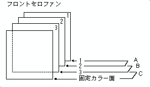

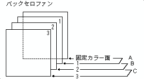

### 2.5.7 Sprite special processing

HuC6270 sprites are collectively treated as the sprite plane, so enabling sprite-plane cellophane normally affects all sprites. `SPBL` can exempt selected palette banks.

If a higher-priority plane is blended, every sprite below it remains part of that blend regardless of `SPBL`. In 256-color expansion mode, remember that the effective palette-bank number is replaced by the lower HuC6270 palette number.

If the lowest plane is transparent, a blended next plane is displayed without blending. If all data for a pixel is transparent while front cellophane is enabled, the fixed color itself is displayed.

## 2.6 Interlace and Non-Interlace Modes

The scan method is selectable. Interlace can additionally use half-dot shift for higher apparent detail.

### 2.6.1 Non-interlace

Uses a fixed 263- or 262-line frame, equivalent to HuC6260 operation. The active image begins around internal raster 22–24 and ends around 259–261, as illustrated by the original timing chart.

### 2.6.2 Interlace

The first 1/60-second field is odd (`O/E=1`) and is displayed like non-interlace. The second is even (`O/E=0`) and is vertically displaced by half a line to fill the gaps. The fields alternate.

Displaying the same image in both fields can cause fine vertical flicker. Best quality is obtained by providing field-specific images aligned to their respective positions.

### 2.6.3 Interlace plus half-dot shift

Every other scanline is shifted horizontally by half a dot, reducing jagged edges. Edge masking makes the effective width 255.5 dots.

## 2.7 320-Dot Mode

The HuC6261 supports 256-dot and 320-dot horizontal modes. Reset selects 256 dots.

At 320-dot mode, only the HuC6270 changes to 320 dots and must be reconfigured. The HuC6261’s equivalent full span is approximately 341.33 5-MHz dots. HuC6271 and HuC6272 remain at 256 dots.

All cellophane functions, including front/back modes, are disabled. HuC6271 direct-YUV chroma key is also disabled. The HuC6261 performs quarter-pixel priority calculations because a 7-MHz HuC6270 pixel is three-quarters the width of a 5-MHz pixel.

## 2.8 YUV Output

Built-in eight-bit D/A converters output Y, U, and V as analog signals. Four-bit U/V palette data is expanded by appending four zero low bits.

Y converts linearly from `00H` through `FFH`. U and V also convert linearly but are signed color differences centered on `80H`: values above are positive, below are negative, and `U=V=80H` is achromatic. Saturation is proportional to distance from `80H`; hue depends on the U/V ratio and signs.

Colors combining extreme chroma with very low luminance may not reproduce correctly on a display, and NTSC/PAL composite encoding further restricts the usable gamut.

## 2.9 HuC6270 Registers

Recommended vertical parameters:

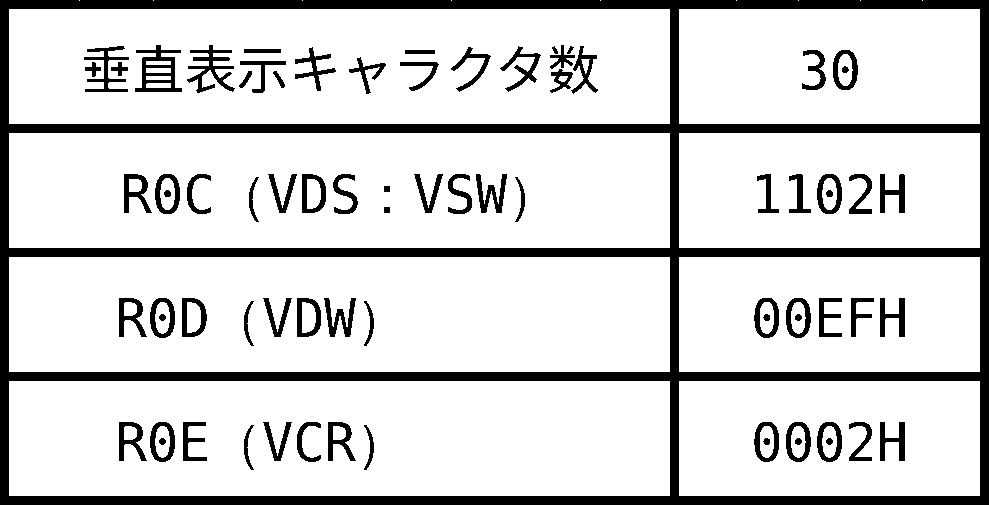

Recommended horizontal parameters:

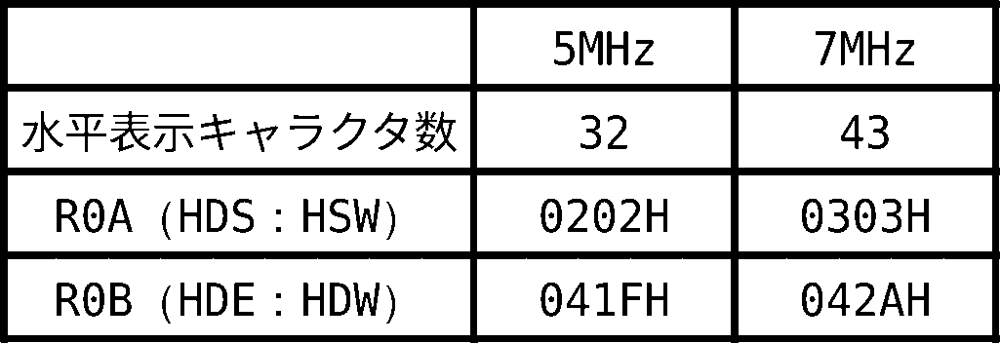

At 7 MHz these horizontal parameters shift display start by six dots; correct it with the scroll register.

## 2.10 Display Position

### 2.10.1 Center at 5-MHz dot clock

The active region is 240 rasters × 256 dots. Its center is raster 120.5 and dot 128.5.

### 2.10.2 Combining 256- and 320-dot images

The active output region remains equivalent to 240 × 256 at 5 MHz. At 7 MHz a HuC6270 pixel is 3/4 as wide, yielding `256 ÷ 3/4 = 341.333…` HuC6270-dot positions across the same span.

## 2.11 State After Reset

1. Clear all `R00–R15` except `SPBL`; set `SPBL=FFFFH`. Clear AR.
2. Continue outputting `DCKKR`, `DCK70`, `-HSYNCA/B/C`, `-VSYNC`, and `OD/-EV` during reset. Up to five rasters after oscillator startup may be needed for correct phase.
3. Continue outputting NTSC synchronization during reset, but output blanking level during the image interval.
4. Because all display-enable bits are clear, YUV output is black: `Y=00H, U=80H, V=80H`.
5. Clear palette address 0 to `Y=00H, U=00H, V=00H`, producing a greenish backdrop if display is enabled. Reprogram entry 0 after reset.
6. Although priority registers clear, effective device priority is HuC6270 above HuC6272 above HuC6271.

## 2.12 Displaying HuC6273 Images

The HuC6273 replaces the lower HuC6270 at the HuC6261 interface. Select it with bit 15 `SEL` in the HuC6273 Misc Status register. Power-on and HuC6273 reset set `SEL=0`, connecting the lower HuC6270. Set `SEL=1` to connect HuC6273.

### 2.12.1 HuC6273 settings

Set `SEL=1`.

Recommended 256-dot settings:

- PE Control `WDM=0`, 256 × 240 mode
- Horizontal timing: `EHB=61`, `SHB=317`
- Vertical timing: `EVB=22`, `SVB=262`

Recommended 320-dot settings:

- PE Control `WDM=1`, 320 × 200 mode
- Horizontal timing: `EHB=82–103`, `SHB=EHB+320`, or 402–423
- Vertical timing: `EVB=22–62`, `SVB=EVB+200`, or 222–262

### 2.12.2 HuC6270 setting

Set bits `SB` and `BB` in HuC6270 Control Register `R05` to zero to suppress HuC6270 display.

### 2.12.3 HuC6261 settings

HuC6273 display uses the HuC6270-related fields:

- In `CR:R00`, set both HuC6270 BG and sprite enable bits to 1 to show HuC6273; clear both to hide it.
- Set `DC7=0` for 256 dots or `DC7=1` for 320 dots.
- Set `CPO1:R04 = 8000H`.
- HuC6270 sprite and BG priority fields in `PRI1:R08` become HuC6273 priority. For `BMG3 > HuC6273 > BMG0 > BMG1 > BMG2 > HuC6271`, use:

`PRI1:R08 = 0165H`

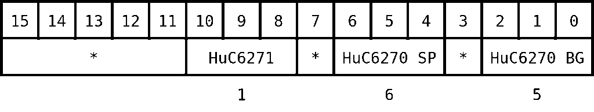

`PRI2:R09 = 7234H`

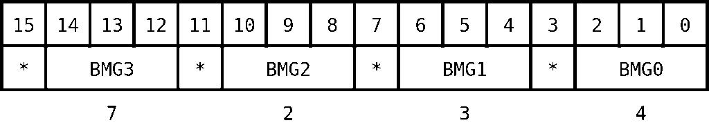

- In `BLE:R0E`, HuC6270 BG and sprite cellophane fields both apply to HuC6273; program them identically.
- To blend HuC6273, set all 16 bits of `SPBL:R0F` to 1: `FFFFH`.
- Program the required colors into palette RAM.

## Copyright and registered trademarks

- This technical document is part of the software-development tools for PC-FXGA. Do not use it for any purpose other than PC-FX or PC-FXGA software development.
- Hudson Soft assumes no responsibility or liability for direct or indirect damage resulting from use of this technical document.
- Hudson Soft does not answer questions directly concerning this technical document or its contents. Please refrain from contacting the company with such inquiries.
- Before using this technical document, read and comply with the applicable “Software Terms of Use.”
- Copyright in this technical document is held by Hudson Soft.

© 1995 HUDSON SOFT
