# PC-FXGA Authoring Software

# “GMAKER” Starter Kit (Version 1.0)

# Device Notes: HuC6272 — Overview, Operation, and Register Specification

NEC Home Electronics, Ltd.  
November 10, 1995

## Contents

1. Introduction
   - 1.1 HuC6272 overview
   - 1.2 Features
   - 1.3 KRAM memory map
2. Operating functions
   - 2.1 System clock and reset
   - 2.2 Data-transfer control
   - 2.3 Internal registers
3. Register specification

# Chapter 1: Introduction

## 1.1 HuC6272 overview

The HuC6272 is the PC-FXGA data-transfer and natural-picture background controller. It receives compressed moving-image data, natural-picture background data, and sound data from SCSI or the CPU, stores them in KRAM, and routes them to the HuC6271 motion-picture decoder, the HuC6230 audio processor, and the HuC6261 video-priority/color encoder.

It also contains a background processor capable of composing four natural-picture background planes, scrolling them independently, and applying affine rotation and scaling to BG0. A programmable fetch sequencer controls the order in which background data is read from KRAM during display.

## 1.2 Features

### Natural-picture background display

- Four independent background planes: BG0, BG1, BG2, and BG3.
- Nominal display size of 256 × 240 pixels.
- Selectable 4-, 16-, 256-, 65,536-, or 16.7-million-color formats.
- Internal dot-sequential, external block, and external dot-sequential data formats.
- BG0 can be up to 1024 × 1024 pixels; BG1–BG3 can be up to 512 × 512 pixels.
- Large logical planes can be assembled from subplanes. The subplane system supports cylindrical repetition and tiled composition.
- BG0 supports affine transformation using a 2 × 2 matrix and a programmable center point.
- Each plane supports independent horizontal and vertical scrolling.
- Display parameters can be changed during a frame to produce raster splits and line-by-line effects.
- Programmable plane priority determines the front-to-back order sent to the HuC6261.
- Transparent pixels are suppressed according to the active color format.

### Programmable background fetch sequence

The sequence used to fetch and combine background-plane data is stored as a microprogram. This allows the number of active planes and their fetch order to be tailored to the display mode and KRAM bandwidth available.

### Moving-image transfer

Compressed moving-image data can be transferred from KRAM to the HuC6271. The start address, start raster, number of blocks, transfer enable, and raster-monitor interrupt can be programmed.

### Sound-data transfer

Two independent KRAM buffers feed ADPCM channels 1 and 2 of the HuC6230. Each channel can use ring-buffer or sequential addressing and has independently programmable start, half, and end addresses.

### SCSI interface

An on-chip SCSI controller supports command, status, interrupt, DMA, and pseudo-DMA operation. Data read from the SCSI bus can be written directly to KRAM.

### DRAM control

The HuC6272 directly controls the KRAM DRAMs, including refresh and arbitration among background display, HuC6271 transfer, ADPCM transfer, SCSI DMA, and CPU access.

### CPU interface

The CPU accesses a small set of direct registers and the remaining internal registers through an address/data-register pair. KRAM can be read and written through dedicated auto-incrementing address registers.

## 1.3 KRAM memory map

KRAM is divided into two logical banks. In 4-Mbit mode each bank occupies its own address range; in 1-Mbit mode only page 0 is available.

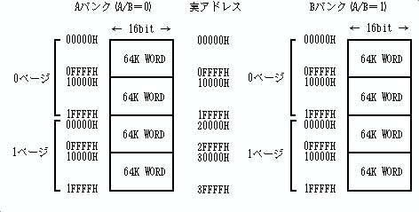

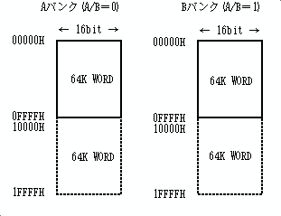

### Access restrictions

- The CPU and SCSI controller select one KRAM bank at a time.
- Internal transfer engines may access both banks according to their programmed pages.
- A single CPU or DMA transfer must not cross a bank boundary or the permitted page boundary.
- Auto-increment wraps within the selected KRAM address field; software must not rely on crossing into another page.
- Assign a KRAM page independently to each functional block whenever 4-Mbit mode is used.
- In 1-Mbit mode, all page selectors must be zero.

# Chapter 2: Operating Functions

## 2.1 System clock and reset

The HuC6272 operates from the system clock supplied by the board. All interface timing and internal transfer arbitration are derived from this clock.

### Reset requirements

1. Assert reset for the specified minimum period while the clock is stable.
2. Release reset only after the supply and clock have settled.
3. After reset, program the KRAM mode before performing any KRAM access.
4. Initialize the SCSI block, KRAM page assignments, background format and size registers, the microprogram, HuC6271 transfer registers, and HuC6230 buffer registers before enabling their respective functions.
5. The PC-FXGA IPL selects 4-Mbit KRAM mode as part of board initialization.

## 2.2 Data-transfer control

### SCSI to KRAM

The SCSI controller can transfer incoming bus data directly to KRAM. Software programs the KRAM destination address, transfer count, SCSI transfer mode, and DMA enable. Completion and exceptional SCSI conditions are reported through status and interrupt bits.

### KRAM to HuC6230 ADPCM

Each of two ADPCM channels reads 16-bit KRAM words and delivers their encoded samples to the corresponding HuC6230 channel at the sampling rate selected in the HuC6230. Ring mode wraps from the programmed end address to the start address; sequential mode stops at the end address. Half and end positions can generate status and interrupts.

### KRAM to HuC6271

The HuC6271 transfer engine reads compressed data from KRAM in blocks. A transfer may be synchronized to a programmed raster. The engine can support normal, scrolling, and split playback sequences when software changes the source and block parameters at the required times.

### KRAM through BG to HuC6261

During active display, the background processor reads the active planes according to the microprogram, resolves transparency and priority, and sends pixel data to the HuC6261. BG traffic receives the highest K-BUS priority during display.

### CPU to registers

The CPU selects an internal register number through the address register and then reads or writes the associated data port. A subset of status and control registers is directly mapped.

### CPU to and from KRAM

The CPU KRAM read and write address registers select the bank/page, transfer direction, and auto-increment behavior. The KRAM data register is then used for 16-bit transfers. Observe the busy indication and do not violate the address-boundary restrictions.

# Chapter 3: Internal Registers

## 3.1 Register-access model

Two groups of registers exist:

1. **Directly accessible registers.** These include the address register, status register, and selected KRAM/data ports.
2. **Address-selected internal registers.** Write the internal register number first, then access the data port.

Use 16-bit accesses unless the register description explicitly states otherwise. Reserved bits must be written as zero. Registers marked “immediate” take effect as soon as written; display-related values otherwise become active at the documented raster or transfer boundary.

## 3.2 Register list and initialization

The source register-map figures below define addresses, read/write attributes, and reset values. Registers without a defined reset value must be initialized by software before use.

## 3.3 Register details

### Address register — write

Selects the internal register accessed through the indirect data port. Only documented register numbers are valid.

### Status register — read

Reports interrupt causes and current operating state. Fields include:

- SCSI interrupt/status causes.
- DMA completion.
- CD-ROM subcode reception.
- HuC6271 raster-monitor event.
- HuC6230 sound-buffer events.
- Internal busy indication.
- Current SCSI bus state.
- Current subcode status.

Reading status does not necessarily clear all causes; clear each source using the associated control or interrupt-clear operation.

### SCSI registers — REG.00 through REG.0B

These registers expose the current data value, initiator command, mode, target command, current bus status, selection/reselection control, transfer mode, interrupt causes, subcode control/data, DMA control, and transfer count. Program them according to the SCSI phase sequence. Do not alter phase-sensitive command bits while a transfer is active.

### CPU KRAM write-address register — REG.0C

Selects the destination address for CPU writes to KRAM. The register includes the effective word address and the automatic address-update control. Program the KRAM page separately through REG.0F.

### CPU KRAM read-address register — REG.0D

Selects the source address for CPU reads from KRAM. It operates independently of the write-address register and supports automatic address update.

### KRAM data register — REG.0E

Transfers one 16-bit word between the CPU and KRAM using the currently selected read or write address. Wait for an accessible K-BUS interval or obey the busy indication before issuing another access.

### KRAM page register — REG.0F

Assigns KRAM pages to CPU read, CPU write, SCSI, BG, HuC6271, and HuC6230 functions. All page fields must be zero in 1-Mbit mode. In 4-Mbit mode, select pages so that each engine addresses its intended data region.

### BG plane-format register — REG.10

Selects the representation used by each background plane. The encoding is:

| Value | Format |
|---:|---|
| `0` | Plane unused |
| `1` | Internal dot-sequential, 4 colors |
| `2` | Internal dot-sequential, 16 colors |
| `3` | Internal dot-sequential, 256 colors |
| `4` | Internal dot-sequential, 65,536 colors |
| `5` | Internal dot-sequential, 16.7 million colors |
| `6–8` | Reserved |
| `9` | External block, 4 colors |
| `A` | External block, 16 colors |
| `B` | External block, 256 colors |
| `C` | External block, 65,536 colors |
| `D` | External block, 16.7 million colors |
| `E` | External dot-sequential, 65,536 colors |
| `F` | External dot-sequential, 16.7 million colors |

The setting is effective immediately. Disable the affected plane before changing its fundamental storage format unless the desired raster effect is intentional.

### BG priority register — REG.12

Assigns a priority value to each plane. Priority 4 is frontmost, priority 1 is rearmost, and 0 disables the plane. The register also selects whether BG0 uses ordinary scrolling or affine transformation.

Transparent values are:

- 16.7-million- and 65,536-color modes: luminance `Y = 0`.
- 256-color mode: palette index 0.
- 16-color mode: palette index 0.
- 4-color mode: palette index 0.

### Microprogram load-address register — REG.13

Selects the microprogram word to be written or read next.

### Microprogram data register — REG.14

Writes the microinstruction at the load address and advances according to the implemented load mechanism.

### Microprogram control register — REG.15

`MPSW = 1` enables execution of the background microprogram. Set `MPSW = 0` before loading or changing the program. Do not write microprogram memory while the sequencer is running.

### Subplane cylindrical-display register — REG.16

Controls subplane behavior outside the defined plane area:

- `0`: paste transparent data.
- `1`: repeat/tile the configured subplane to create a cylindrical display.

### BG BAT and CG address registers — REG.20 through REG.2B

Specify the KRAM base addresses of each plane’s block-attribute table (BAT) and character/pixel data (CG). Address bits A0–A9 are implicitly zero, so each base is aligned to the hardware block boundary. Keep every data set within the selected KRAM page.

### BG size registers — REG.2C through REG.2F

Select horizontal and vertical dimensions as powers of two. BG0 accepts exponents 3–10; BG1–BG3 accept 3–9. The values are effective immediately.

### BG horizontal and vertical scroll registers — REG.30 through REG.37

Each plane has independent X and Y offsets:

- BG0 range: -1024 through +1023.
- BG1–BG3 range: -512 through +511.

A positive X value moves the displayed image left; a positive Y value moves it upward. New values become effective from the next horizontal synchronization boundary. Horizontal scroll may therefore be changed on each raster.

### BG0 affine-transformation registers — REG.38 through REG.3D

The transformation matrix is:

`A = α cos θ`  
`B = -β sin θ`  
`C = α sin θ`  
`D = β cos θ`

`A`, `B`, `C`, and `D` use signed 8.8 fixed-point representation. The remaining registers specify the X and Y transformation center. Program all parameters coherently before enabling affine mode.

### HuC6271 transfer-control register — REG.40

Enables or disables compressed-data transfer and selects the transfer behavior. Changes are immediate unless the associated field is documented as deferred until the active transfer finishes.

### HuC6271 data start-address register — REG.41

Specifies the KRAM source address. A write during a transfer is accepted for the next transfer.

### HuC6271 transfer start-raster register — REG.42

Specifies the raster at which transfer begins. A value written during an active transfer applies after that transfer.

### HuC6271 transfer block-count register — REG.43

Specifies the number of blocks to transfer. A change made during transfer applies to the following transfer.

### HuC6271 raster-monitor register — REG.44

Generates status/interrupt indication when the selected raster condition is reached.

### HuC6230 control register — REG.50

Controls both ADPCM channels and reports/controls transfer enable, sampling-related handshaking, and read-enable behavior.

### HuC6230 buffer-control register #1 — REG.51

Selects ring or sequential operation for channel 1, enables transfer, and controls half/end event generation.

### HuC6230 buffer-control register #2 — REG.52

Same function as REG.51 for channel 2.

### HuC6230 status register — REG.53

Reports half-address and end-address events for both channels. An end flag is set after the datum at the corresponding end-address register has been transferred to the HuC6230 ADPCM channel.

### HuC6230 channel 1 start/end/half registers — REG.58, REG.59, REG.5A

Define the channel 1 KRAM buffer. In ring mode the read pointer wraps from end to start. In sequential mode transfer terminates at end. The half address provides a refill boundary and may generate an interrupt.

### HuC6230 channel 2 start/end/half registers — REG.5C, REG.5D, REG.5E

Equivalent channel 2 buffer definition.

### KRAM mode register — REG.61

- `0`: 1-Mbit mode.
- `1`: 4-Mbit mode.

Set this register exactly once after reset and before any KRAM access. The PC-FXGA IPL configures 4-Mbit mode.

## Programming cautions

- Do not access KRAM before KRAM mode and page registers are valid.
- Do not load the BG microprogram while it is enabled.
- When changing display parameters mid-frame, account for the next-HSYNC activation rule.
- A transfer engine may defer newly written source/count values until its current transfer completes.
- Clear all pending interrupt causes before enabling CPU-level interrupt masks.
- Keep reserved bits zero and preserve read-only status fields on read-modify-write operations.

# Original Figures Retained from the Source

The following figures are included in their original, unmodified form and in source order. Text embedded in these images remains Japanese.

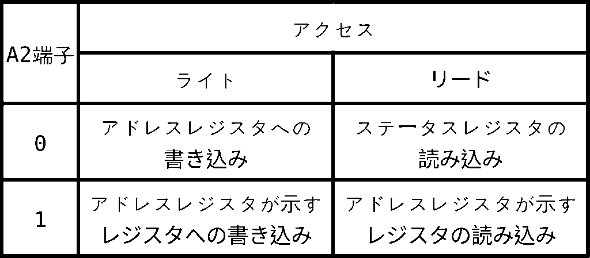

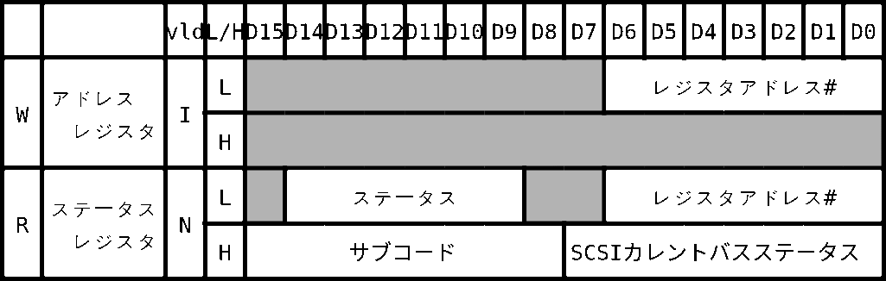

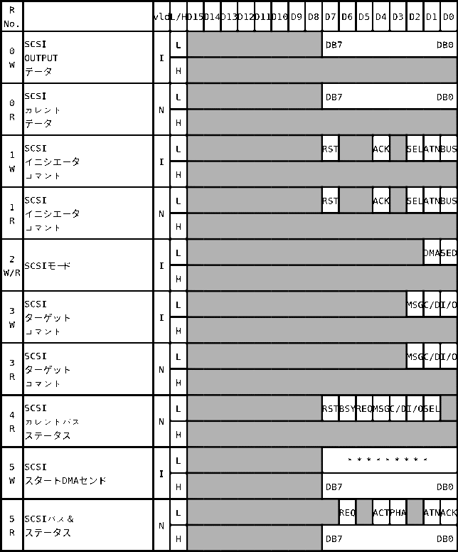

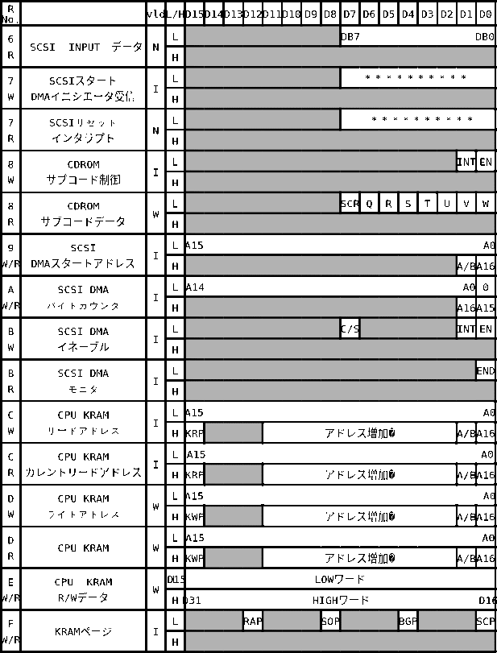

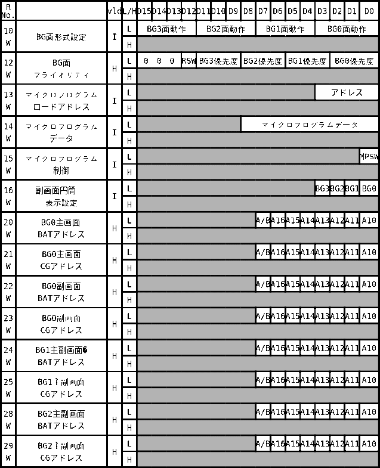

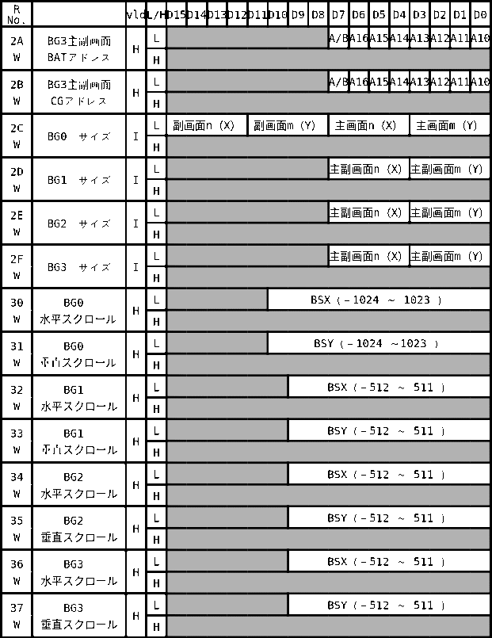

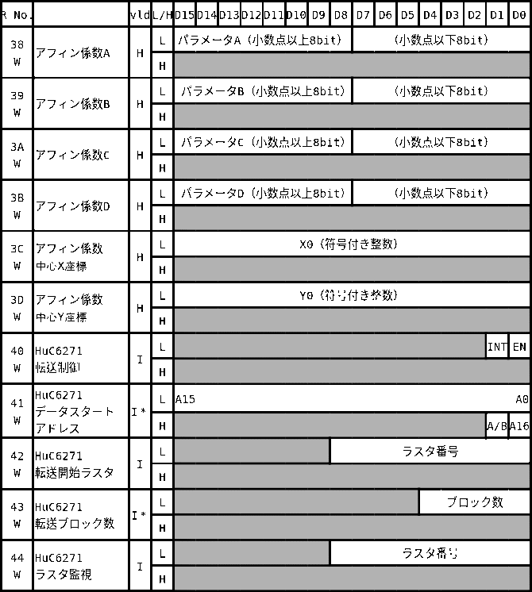

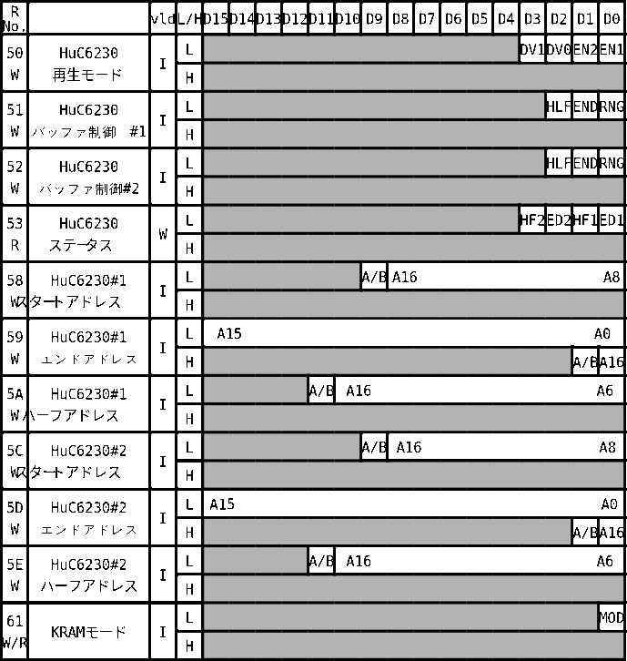

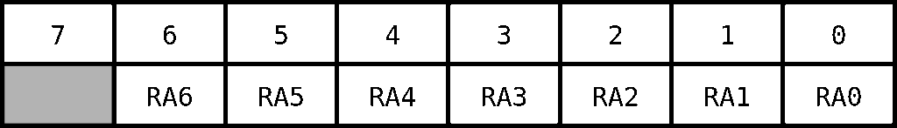

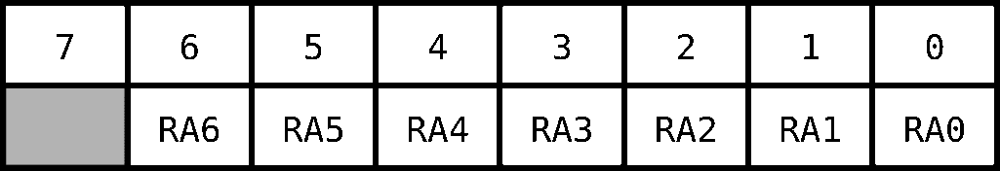

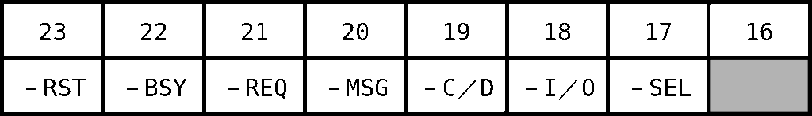

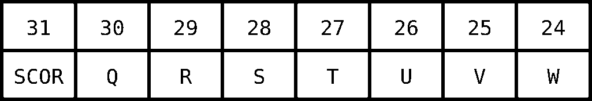

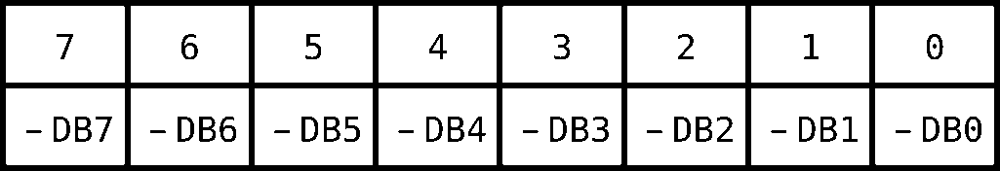

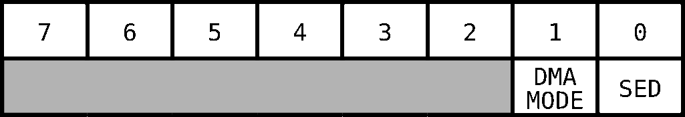

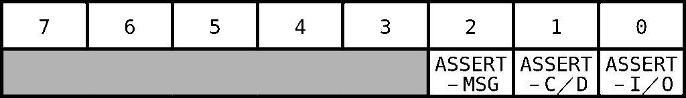

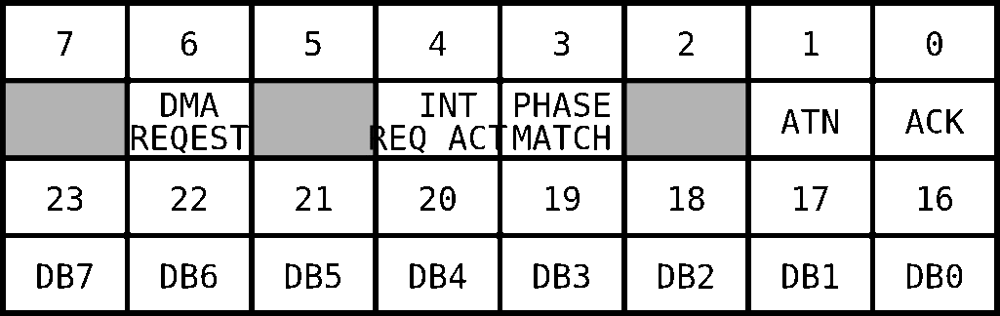

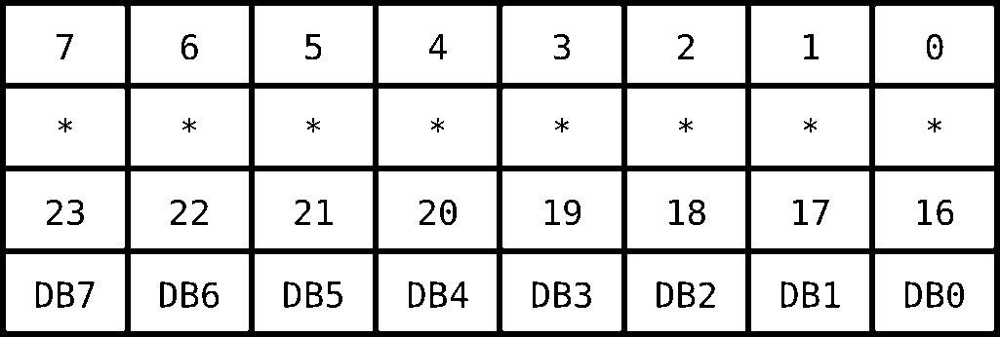

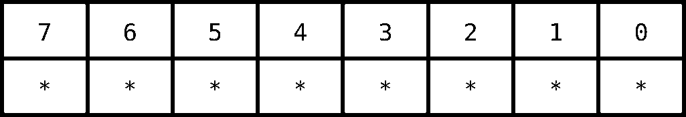

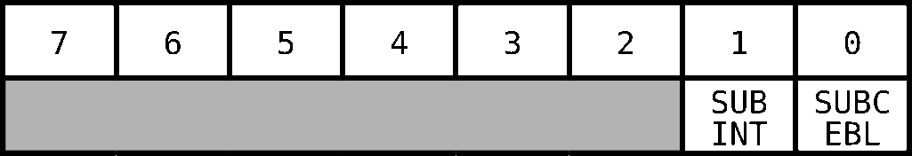

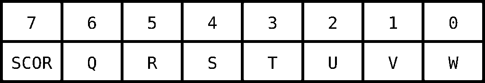

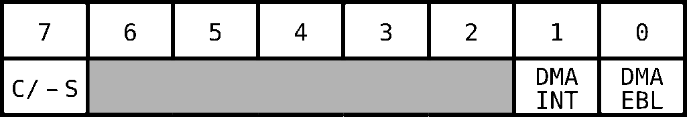

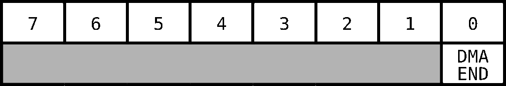

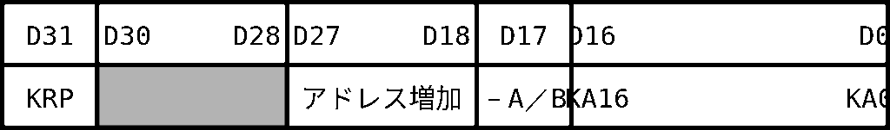

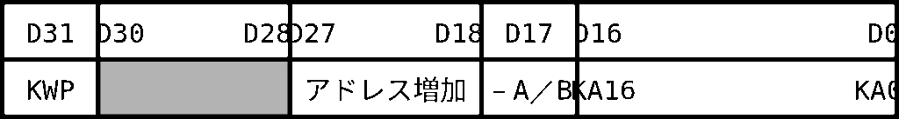

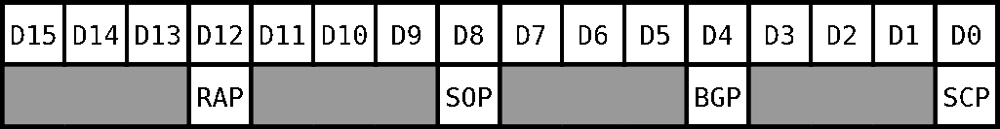

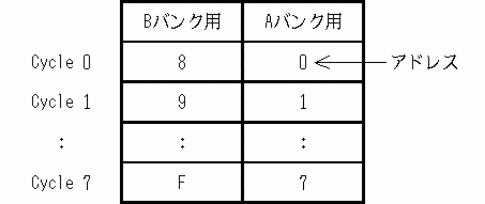

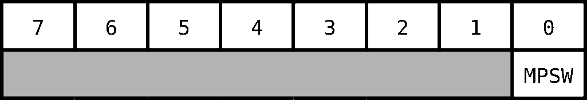

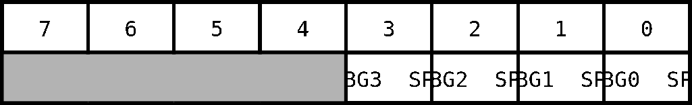

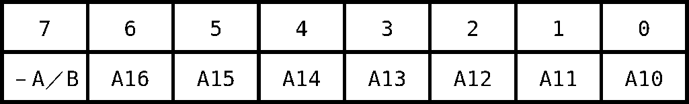

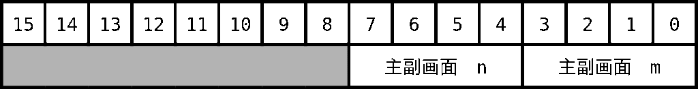

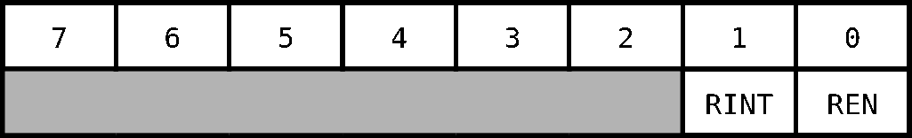

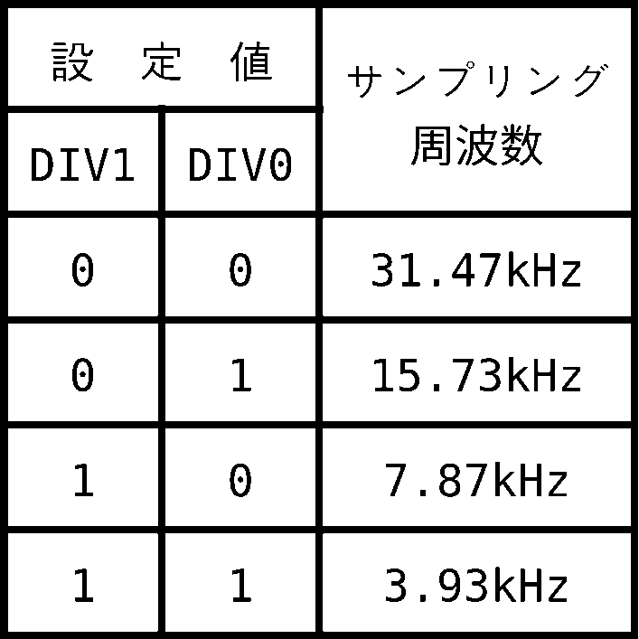

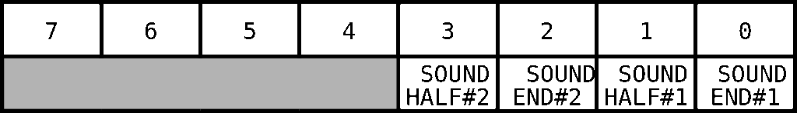

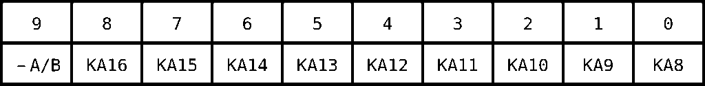

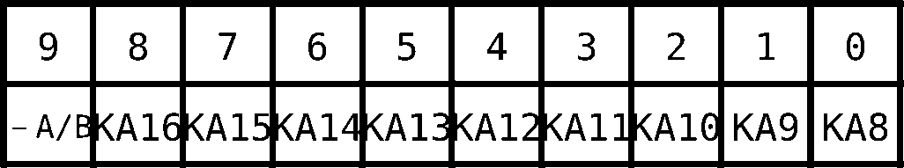

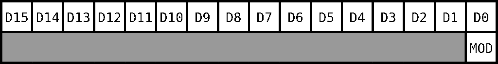
