## Reference

## a) Number of BG planes that can be displayed simultaneously

### I. When a rotation plane is present

1. One external-block rotation plane (4-, 16-, 256-, or 64K-color mode)
2. One external-dot 64K-color rotation plane
3. One internal-dot rotation plane (4-, 16-, 256-, or 64K-color mode), combined with the external-block-sequential or internal-dot-sequential non-rotation planes (4-, 16-, 256-, or 64K-color mode) shown below.

Provided conditions a) and b) in 2.3.5, **Internal Register Details (24): Combinations of Displayable BG Planes**, are satisfied, each plane may use either external-block-sequential or internal-dot-sequential format.

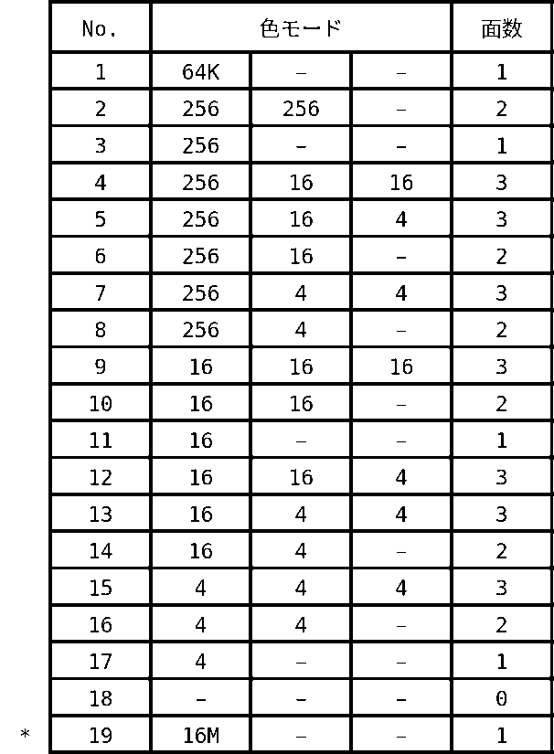

Note: The rotation plane (4-, 16-, 256-, or 64K-color mode) and the non-rotation plane (16M-color mode) can scroll only in even-numbered units.

When chroma-key processing is used, both the rotation and non-rotation planes require chroma-key data in even-dot units.

### II. When no rotation plane is present

1. One external-dot plane (16M- or 64K-color mode)
2. A combination of the external-block-sequential or internal-dot-sequential non-rotation planes shown below (4-, 16-, 256-, 64K-, or 16M-color mode).

Provided conditions a) and b) in **3.6.3.3, Combinations of BG-Plane Operating Formats**, are satisfied, each plane may use either external-block-sequential or internal-dot-sequential format.

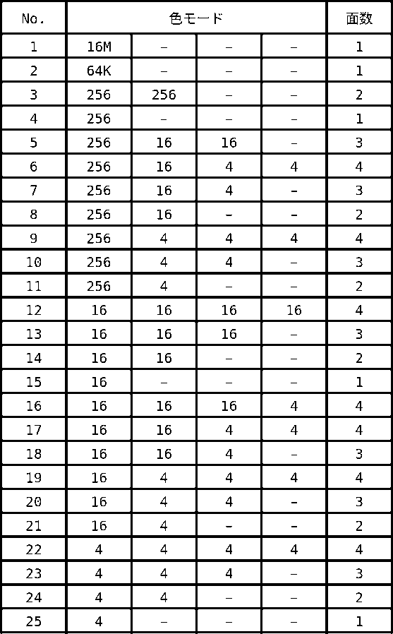

## b) Basic KRAM BG-image access formats and compressed-data formats

There are three basic operating formats for displaying one screen: internal dot sequential, external block sequential, and external dot sequential. Each operating format also has several variants according to the number of display colors.

### (1) Internal dot sequential

In this format, the HuC6272 generates CG addresses automatically without reading them from the BAT. CG data must therefore be stored at consecutive KRAM addresses. The following basic operating formats are available according to the display-color mode.

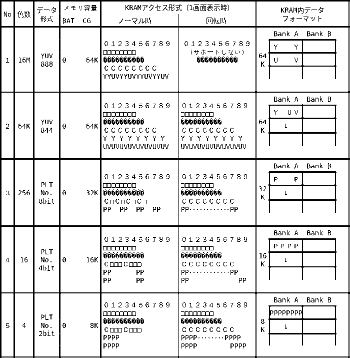

PLT No.: color-palette number; C: CG; Y, U, V: YUV data; P: color-palette data. Memory capacities are specified in words. KRAM banks A and B each have a 16-bit (one-word) data width. U and V in YUV888 format are horizontally subsampled by 1/2. Empty boxes are unused K-BUS cycles. The listed memory capacities are for a 256 × 256 BG plane.

### (2) External block sequential

In this format, the BAT stored in KRAM is read in 8 × 8-dot blocks and used to access CG data. The HuC6272 automatically generates the CG addresses within each block. This is equivalent to the BAT/CG operating model of the HuC6270. The following basic formats are available according to the display-color mode.

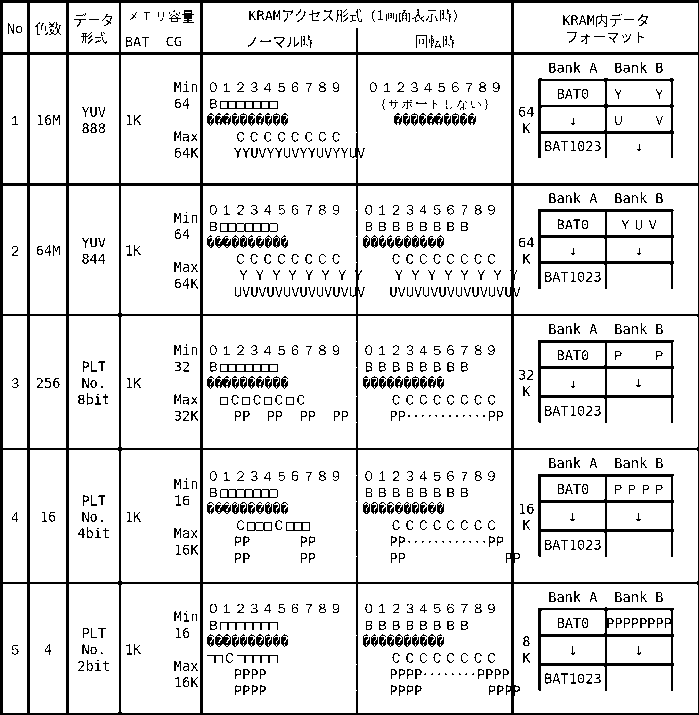

PLT No.: color-palette number; B: BAT; C: CG; Y, U, V: YUV data; P: color-palette data. Memory capacities are specified in words. KRAM banks A and B each have a 16-bit (one-word) data width. U and V in YUV888 format are horizontally subsampled by 1/2. Empty boxes are unused K-BUS cycles. The listed memory capacities are for a 256 × 256 BG plane.

### (3) External dot sequential

In this format, the BAT stored in KRAM is read in units of one or two dots and used to access CG data. The following basic formats are available according to the display-color mode.

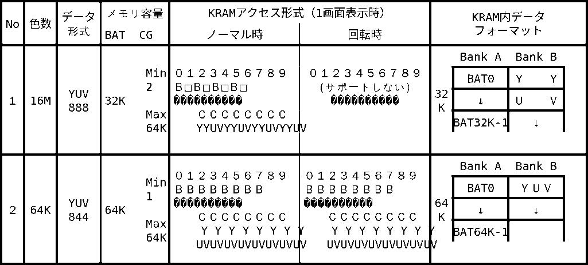

B: BAT; C: CG; Y, U, V: YUV data.

Memory capacities are specified in words. KRAM banks 0 and 1 each have a 16-bit (one-word) data width. U and V in YUV888 format are horizontally subsampled by 1/2. Empty boxes are unused K-BUS cycles. The listed memory capacities are for a 256 × 256 BG plane.

## c) Affine transformation (inverse transformation)

An affine transformation scales and rotates an image about `(X0, Y0)`.

The HuC6272 implements source-image scaling and rotation by inverse affine transformation.

The transformation equations are shown below.

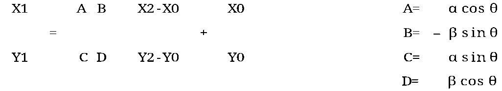

- `(x0, y0)`: center coordinates of rotation
- `(x1, y1)`: coordinates after inverse transformation
- `(x2, y2)`: coordinates before inverse transformation
- `α`: reduction ratio in the X direction (`α = 2` reduces the image to 1/2)
- `β`: reduction ratio in the Y direction
- `θ`: counterclockwise rotation angle

### Affine-transformation example

For example, to scroll the display area by `XS` dots in the X direction in source-image coordinates and then rotate the source image 90 degrees counterclockwise about `(X0, Y0)`, use the following settings.

- Affine-transform center-coordinate register: `X0 = X0`
- Affine-transform center-coordinate register: `Y0 = Y0`
- Affine-transform coefficient register: `A = 1 × cos 90°`
- Affine-transform coefficient register: `B = -1 × sin 90°`
- Affine-transform coefficient register: `C = 1 × sin 90°`
- Affine-transform coefficient register: `D = 1 × cos 90°`
- BG0 horizontal-scroll register: `BSX = XS`
- BG0 vertical-scroll register: `BSY = YS = 0`

The HuC6272 actually calculates the KRAM address for the source image, dot by dot, from display-system coordinates (the transformed coordinates). Consequently, if either the X or Y component of source-image coordinate `(X1, Y1)` lies outside the region defined by the BG main-plane size, it is treated as outside the plane.

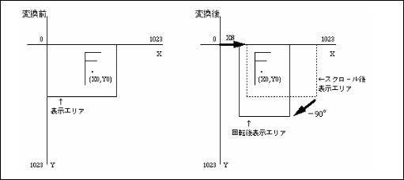

## d) BG-plane coordinate structure

As shown below, the BG-plane coordinate system covers a 2048 × 2048 range centered on the origin, with coordinates from -1024 through 1023. For BG1 through BG3, it covers a 1024 × 1024 range from -512 through 511. Coordinates outside this range wrap continuously as though the surface were cylindrical.

In other words, the right side of quadrant I connects to quadrant II, and the lower side of quadrant I connects to quadrant IV.

The BG main plane lies from the origin toward quadrant I. A BG image has a main plane and a sub plane; their configured sizes determine the display arrangements shown on the following pages.

The HuC6272 scrolling function can be regarded as moving the 256 × 240 display area vertically and horizontally within the 2048 × 2048 BG coordinate system (1024 × 1024 for BG1 through BG3). Scrolling the displayed image to the left is equivalent to moving the display area to the right.

### Image-plane coordinate system

Coordinates in parentheses apply to BG1 through BG3.

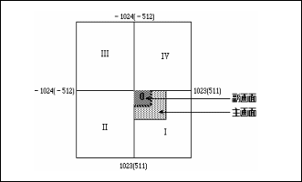

### Scroll values and the image-plane coordinate system

Coordinates in parentheses apply to BG1 through BG3.

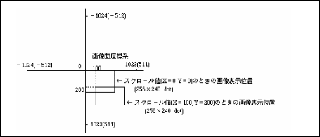

Note: The relationship between scroll values and the source-image coordinate system remains as shown above regardless of image size.

### Transparent-color paste mode

In transparent-color paste mode, every BG-plane region outside the main-plane or sub-plane region is treated as a transparent-color plane. When scrolling moves the display area into the transparent-color region, transparent portions appear on the screen.

Coordinates in parentheses apply to BG1 through BG3.

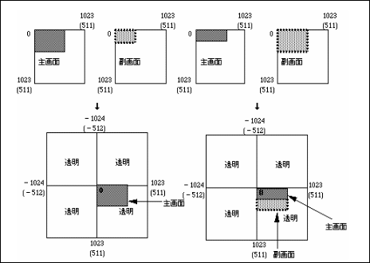

### Sub-plane cylindrical mode

As shown below, the main plane overlays the sub plane. Therefore, for the main/sub-plane arrangement in diagram B, only the portions of the sub plane outside the main plane are displayed.

In this mode the sub plane repeats cylindrically, effectively tiling the entire image area.

Coordinates in parentheses apply to BG1 through BG3.

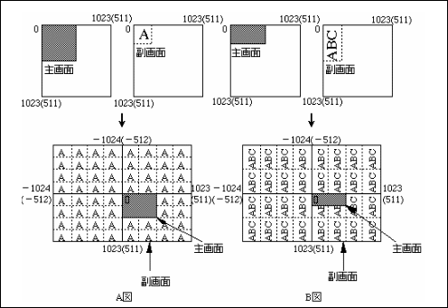

### HuC6272 reduction and enlargement functions

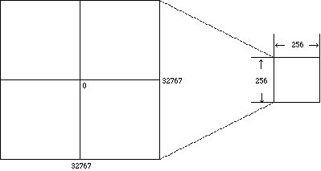

Centered on the origin, the HuC6272 can reduce an area as large as 32K × 32K dots into a 256 × 256-dot area. At the maximum reduction, a 256 × 256-dot main plane becomes 2 × 2 dots.

Conversely, a single dot can be enlarged to as much as 256 × 256 dots.

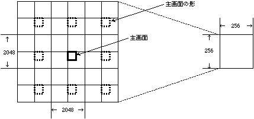

During reduction, the main plane also wraps cylindrically outside the 2048 × 2048-dot region.

The HuC6272 prevents the main plane from being displayed outside that region by testing whether coordinates lie inside or outside the 2048 × 2048-dot area.

## e) BAT/CG data structures for BG planes

### 1. BAT

The BAT (Background Attribute Table) is a table placed in KRAM that specifies which character is displayed, and in which color, at each character position on the virtual screen. It is used in:

- external block sequential mode; and
- external dot sequential mode.

#### (1) BAT address for a character on the virtual screen

For a 512 × 512-dot screen containing 64 × 64 characters:

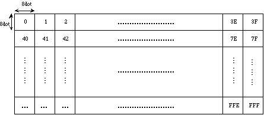

#### (2) BAT contents

##### [2-1] External block sequential mode

The BAT entry corresponding to one character occupies one 16-bit KRAM word.

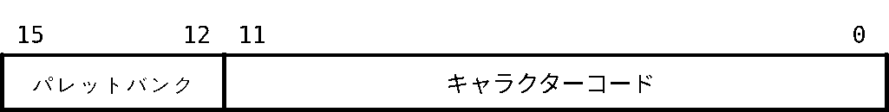

- **Palette bank (4 bits):** selects a color-palette bank in the HuC6261. This field is valid only in 4- and 16-color modes; it is ignored in 256-color, 64K-color, and 16M-color modes.
- **Character code (12 bits):** the pattern number of the character defined in CG data.

##### [2-2] External dot sequential mode

All 16 bits, D0 through D15, form the character code.

Only enough CG data for a maximum 256 × 256-dot area can be accessed.

#### (3) Actual CG-address generation

##### [3-1] External block sequential mode

The HuC6272 automatically generates the CG address from the 12-bit character code in the BAT and the 8-bit CG-address register, as shown below.

**4-color mode**

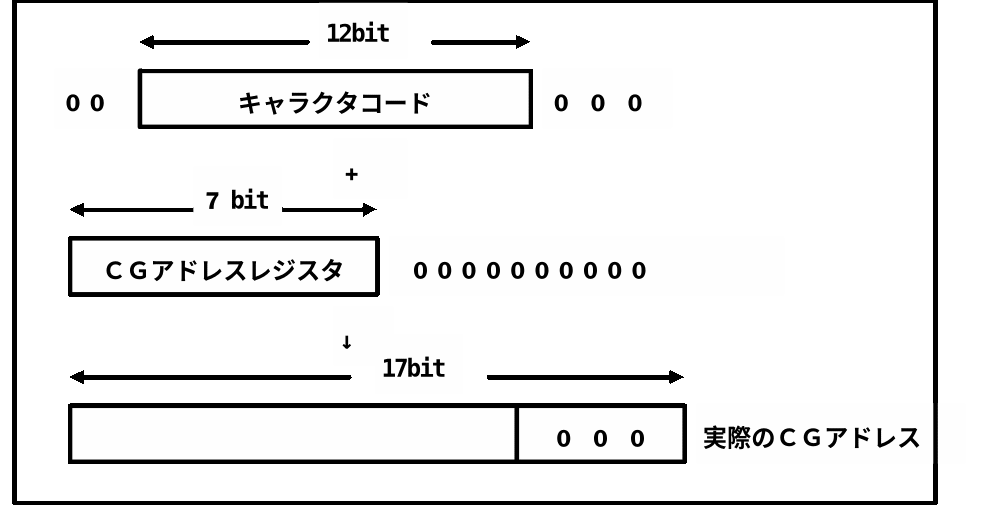

**16-color mode**

**256-color mode**

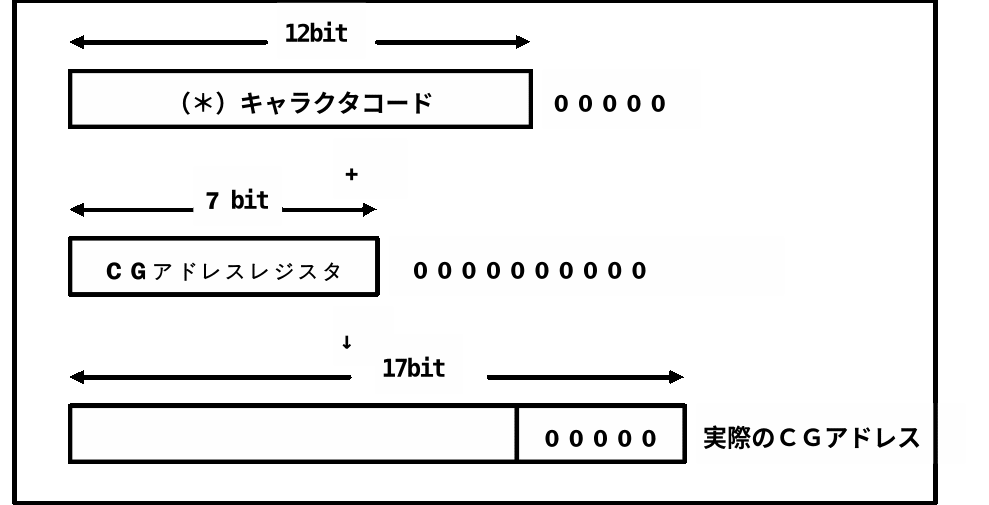

**64K-color mode**

**16M-color mode**

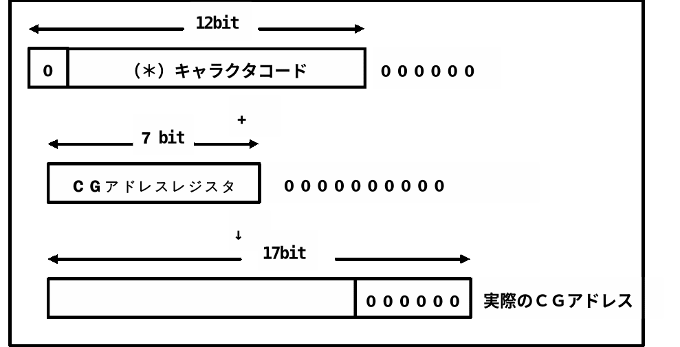

Note: When total KRAM capacity is 4 or 8 Mbit, specify the character code and CG start address as shown above.

For 2-Mbit KRAM, also observe the following restrictions.

- **Character code**
  - 256-color mode: set the most significant bit to 0.
  - 16M- and 64K-color modes: also set the second-most-significant bit to 0.
- **CG start address**
  - In every color mode, set bit A16, the seventh bit from the least-significant end, to 0.

##### [3-2] External dot sequential mode

Address generation is the same as in [3-1], except that the character code is 16 bits wide.

### 2. CG

CG (Character Generator) data is the KRAM region that defines character patterns.

- In internal dot sequential mode, CG is handled as a bitmap image.
- In external block sequential mode, each 8 × 8-dot block is handled as one character.
- The CG data structure changes with the color mode.

The following examples show concrete CG data structures for representative modes.

Assume that a CG block image in external block sequential mode is arranged as follows:

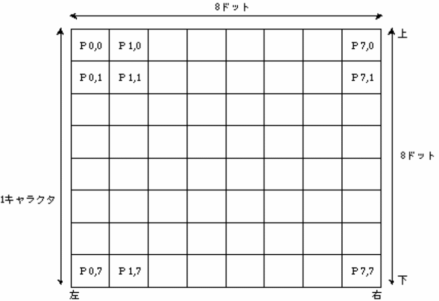

#### 4-/16-/256-color representation

In these modes, `P_X,Y` is the palette datum corresponding to integer coordinate `X, Y` (`0` through `7`) within one character.

#### 64K-/16M-color representation

These modes store YUV data directly. Data at coordinate `X, Y` within the character is written as `Y_X,Y`, `U_X,Y`, and `V_X,Y`. Y is luminance and ranges from `00H` through `FFH`.

U and V carry color-difference information. U represents the purple axis and ranges from `00H` through `0FH` in 64K-color mode or `00H` through `FFH` in 16M-color mode. V represents the orange axis over the same respective ranges. Neutral chroma is `08H` in 64K-color mode and `80H` in 16M-color mode.

#### (1) CG block-data structures in external block sequential mode

**4-color mode**

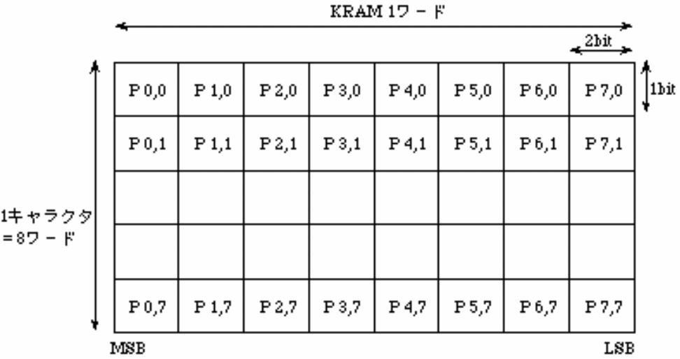

**16-color mode**

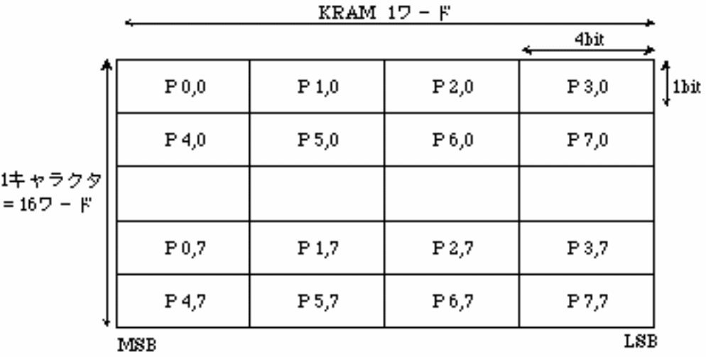

**256-color mode**

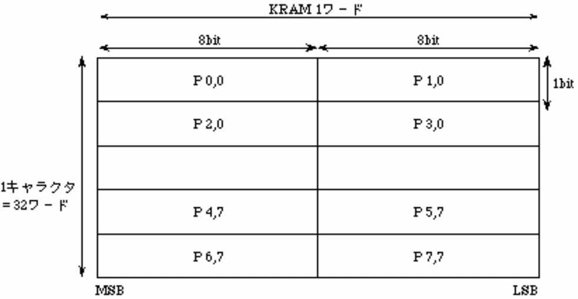

**64K-color (65,536-color) mode**

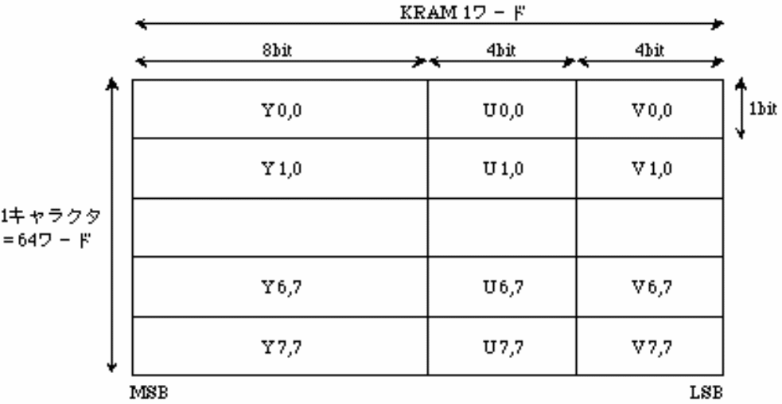

**16M-color (16,777,216-color) mode**

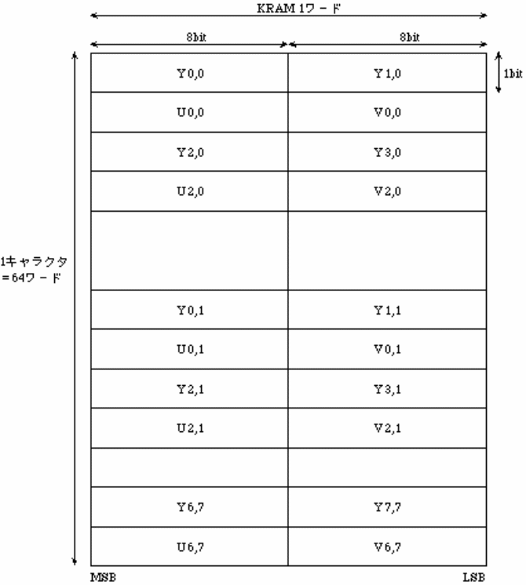

#### (2) CG in external dot sequential mode

**64K-color mode**

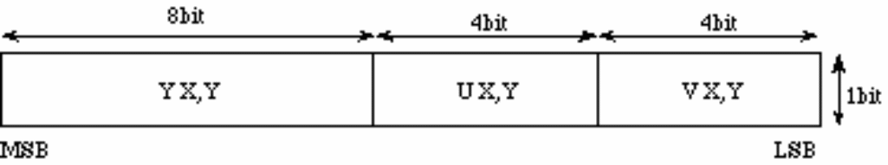

`Y_X,Y`, `U_X,Y`, and `V_X,Y` are the YUV values of dot `(X, Y)` on the virtual screen.

**16M-color mode**

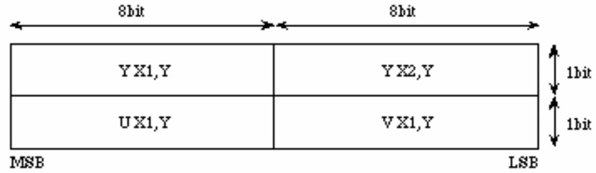

In 16M-color mode, use image data in which U and V are subsampled once for every two dots in the X direction.

Therefore, the CG corresponding to one BAT entry contains two horizontally adjacent dots.

- `X1 = 2m`, where `m = 0–255` and is an integer
- `X2 = 2m + 1`
- `Y = 0–511` and is an integer

#### (3) CG in internal dot sequential mode

In this mode, the CG arrangement in KRAM changes with the virtual-screen size, which is actually specified by the main/sub-plane size register. The following are examples for particular screen sizes.

**4-color mode, 512 × 512 dots**

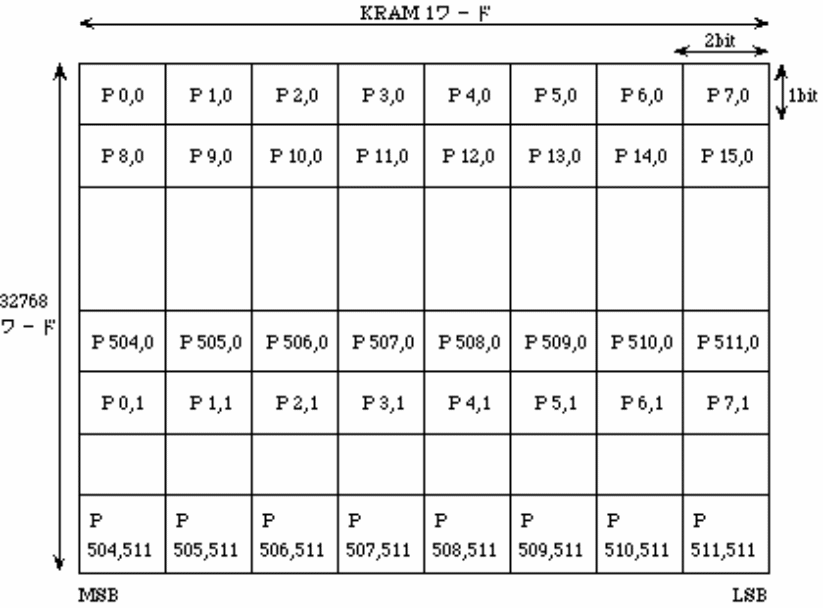

**16-color mode, 256 × 256 dots**

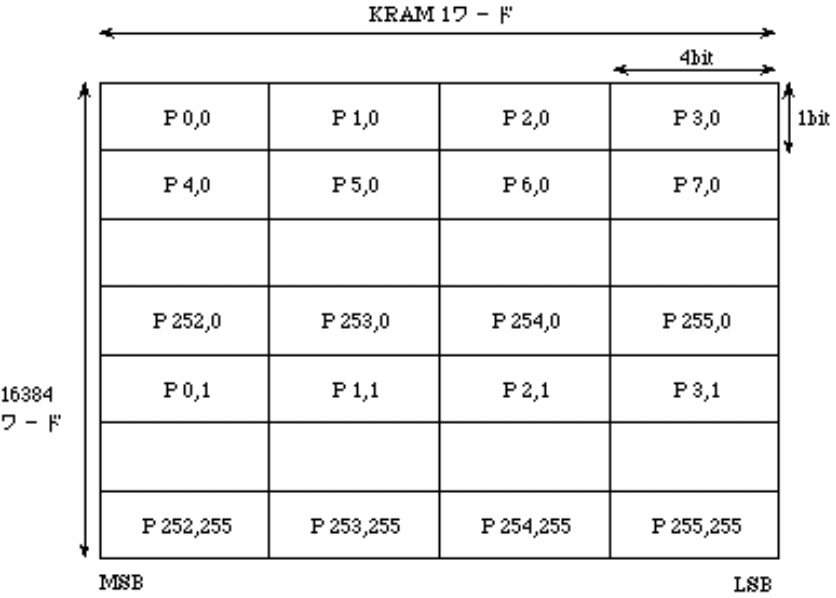

**256-color mode, 128 × 128 dots**

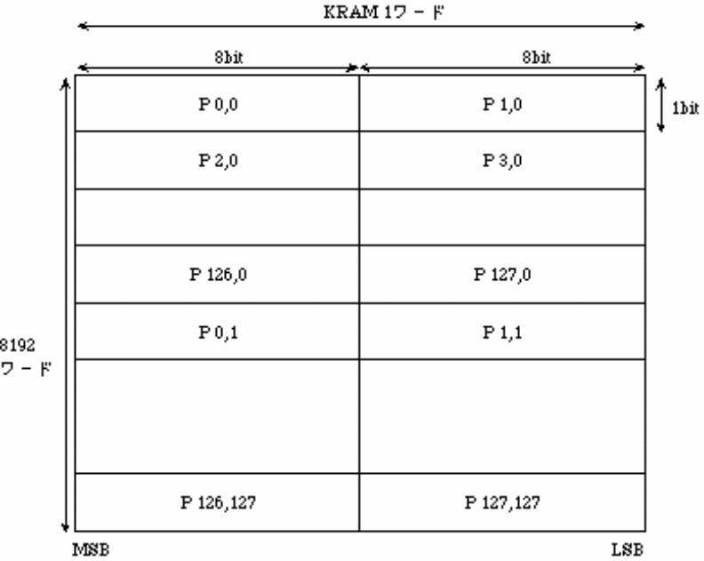

**64K-color mode, 64 × 64 dots**

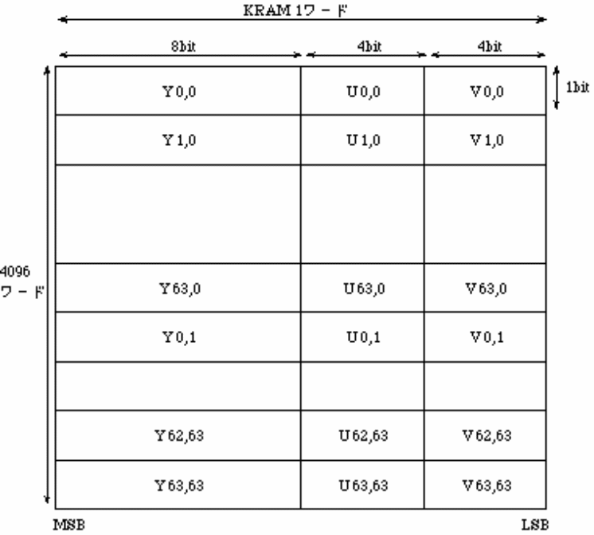

**16M-color mode, 32 × 32 dots**

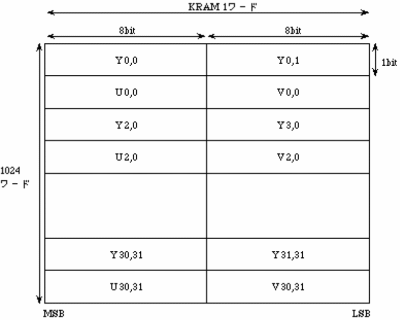

## Copyright and registered trademarks

- This technical document is part of the software-development tools for PC-FXGA. Do not use it for any purpose other than PC-FX or PC-FXGA software development.
- Hudson Soft assumes no responsibility or liability for direct or indirect damage resulting from use of this technical document.
- Hudson Soft does not answer questions directly concerning this technical document or its contents. Please refrain from contacting the company with such inquiries.
- Before using this technical document, read and comply with the applicable “Software Terms of Use.”
- Copyright in this technical document is held by Hudson Soft.

© 1995 HUDSON SOFT
