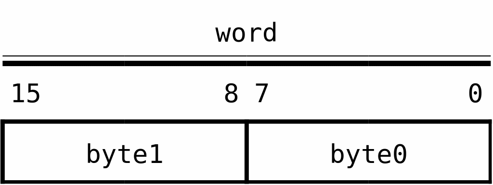
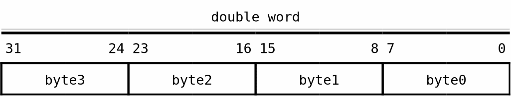
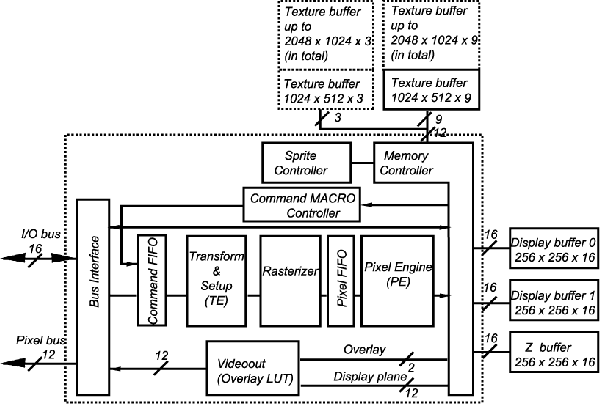
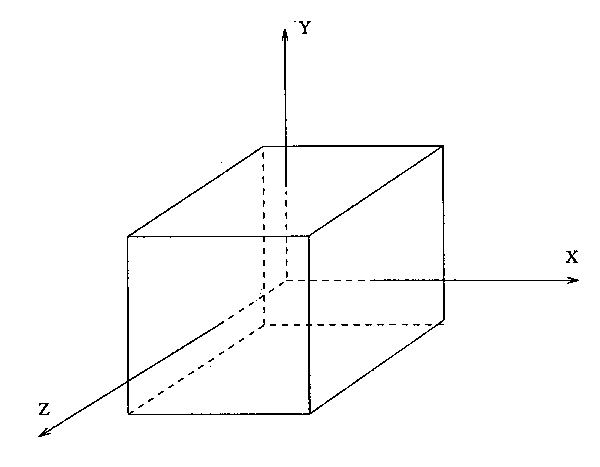
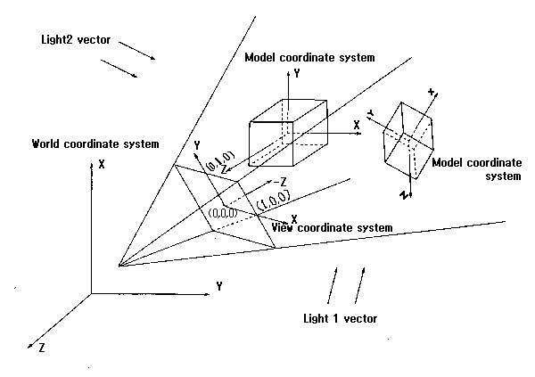
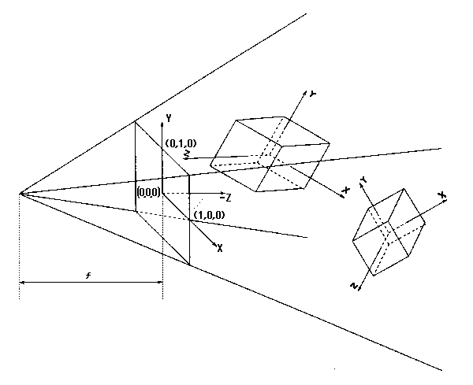
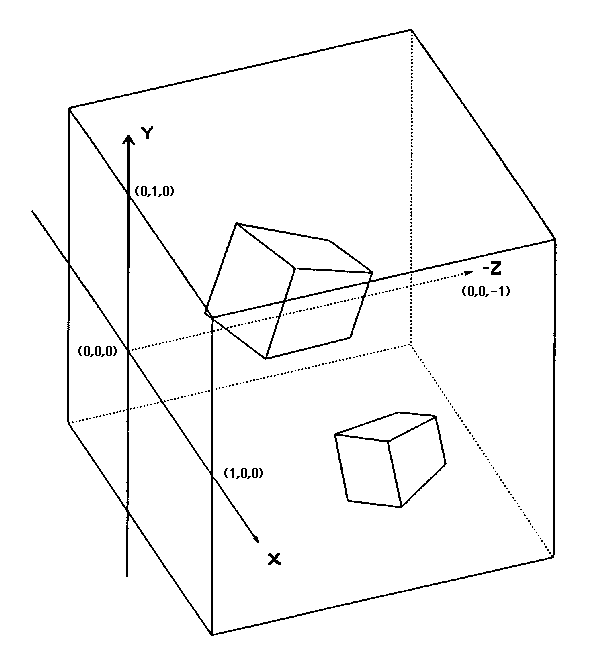

# PC-FXGA Authoring Software

## “GMAKER” Starter Kit (Ver. 1.0)

# HuC6273 Device Description

NEC Home Electronics, Ltd.  
November 10, 1995

## Contents

### Chapter 1 — Functional Overview

- 1.1 Introduction
  - 1.1.1 Basic Performance
  - 1.1.2 Block Diagram
- 1.2 3D Graphics Processing Functions
  - 1.2.1 3D Graphics Flow
  - 1.2.2 Coordinate Systems
  - 1.2.3 Coordinate Transformation
  - 1.2.4 Polygon Rejection and Clipping
    - 1.2.4.1 Rejection
    - 1.2.4.2 X/Y Clipping
    - 1.2.4.3 Z Clipping
  - 1.2.5 Lighting Calculations
  - 1.2.6 HuC6273 Fixed-Point Formats
  - 1.2.7 Matrix-Calculation Functions
  - 1.2.8 3D Primitives
  - 1.2.9 Shading
    - 1.2.9.1 Supplying Color Information
    - 1.2.9.2 Supplying Normals
- 1.3 Color Modes
  - 1.3.1 I-C Color Mode
  - 1.3.2 Indexed-Color Mode
- 1.4 Buffer Formats
  - 1.4.1 Display Size
  - 1.4.2 Display Buffer
    - 1.4.2.1 Display Plane
    - 1.4.2.2 Overlay Plane
    - 1.4.2.3 Collision-Detection Bit Plane
    - 1.4.2.4 Pixel-Valid Flag Plane
    - 1.4.2.5 Dither Random-Number Plane
  - 1.4.3 Z Buffer
  - 1.4.4 Texture Buffer
- 1.5 Commands
- 1.6 Per-Pixel Processing
  - 1.6.1 Normal Drawing Mode
  - 1.6.2 Shadow Mode
  - 1.6.3 Fog Mode
  - 1.6.4 Reverse-Fog Mode
  - 1.6.5 Texture Mapping
  - 1.6.6 Mesh Drawing
  - 1.6.7 Flash Drawing
- 1.7 Sprite Functions
- 1.8 Command-Macro Functions
- 1.9 Direct Texture-Buffer Access
  - 1.9.1 Pack Mode
  - 1.9.2 Unpack Mode
- 1.10 Display-Buffer Clear Functions

### Chapter 2 — Hardware Functional Specifications

- 2.1 Sprites
  - 2.1.1 Sprite Control Table Structure
  - 2.1.2 through 2.1.17 Words 0 through 15
  - 2.1.18 Parameter-Table Structure
- 2.2 Command-Accessed Registers
  - 2.2.1 TE Registers
  - 2.2.2 PE Registers
- 2.3 Memory-Mapped Registers
  - 2.3.1 Register List
    - 2.3.1.1 Function Registers
    - 2.3.1.2 Direct Texture-Buffer Access
  - 2.3.2 Command FIFO Port
  - 2.3.3 Command FIFO Status Register
  - 2.3.4 Command FIFO Control Register
  - 2.3.5 Command Macro Table Control Registers
    - 2.3.5.1 CMT Bank-Select Register
    - 2.3.5.2 CMT Start-Address Register
    - 2.3.5.3 CMT Byte-Count Register
  - 2.3.6 Interrupt Mask Register
  - 2.3.7 Interrupt Clear Register
  - 2.3.8 Interrupt Status Register
  - 2.3.9 Read-Back Register
  - 2.3.10 Video-Timing Registers
    - 2.3.10.1 Horizontal-Timing Registers
    - 2.3.10.2 Vertical-Timing Register
  - 2.3.11 Sprite Registers
    - 2.3.11.1 SCT Address-High Register
    - 2.3.11.2 Sprite Control Register
    - 2.3.11.3 CD Result Registers 0 and 1
    - 2.3.11.4 Sprite Window-Clip Register
  - 2.3.12 Miscellaneous Status Register
  - 2.3.13 Display Control Register
  - 2.3.14 Status Control Register
  - 2.3.15 Configuration Register
  - 2.3.16 Raster-Hit Register
  - 2.3.17 Result Registers [0..15]
  - 2.3.18 Test Registers
    - 2.3.18.1 TE Code-Control Register
    - 2.3.18.2 TE Code-Address Register
    - 2.3.18.3 Memory-Test Register
    - 2.3.18.4 Rasterizer Registers
    - 2.3.18.5 Error-Status Register
- 2.4 Direct Texture-Buffer Access
  - 2.4.1 Pack Mode
  - 2.4.2 Unpack Mode
  - 2.4.3 Texture-Buffer Addresses
- 2.5 Register Lists
  - 2.5.1 TE Registers
  - 2.5.2 PE Registers
  - 2.5.3 Overlay LUT
  - 2.5.4 Memory-Mapped Registers

### Chapter 3 — Command Functional Specifications

- 3.1 Command Definitions
- 3.2 Header Definition
- 3.3 Command-Format Error Checking
- 3.4 Opcode and Option List
- 3.5 3D Drawing
- 3.6 Command Details
  - 3.6.1 `NOP (0x0)`
  - 3.6.2 `Triangle strip (0x1)`
    - Vertex color, no normals
    - Vertex color, vertex normals
    - Facet color, facet normal
    - Texture map, no normals
    - Texture map, vertex normals
    - Texture map, facet normal
    - Default color, no normals
    - Default color, vertex normals
    - Default color, facet normal
  - 3.6.3 `Triangle list (0x2)` with the same color/normal variants
  - 3.6.4 `Poly line (0x3)` with vertex, facet, or default colors and applicable normal variants
  - 3.6.5 `Line list (0x4)` with vertex, facet, or default colors and applicable normal variants
  - 3.6.6 `Put image (0x6)`
    - To D/Z buffer
    - To texture buffer
    - To D/Z buffer with D/Z values
  - 3.6.7 `Read pixel (0x7)`
    - From D/Z buffer
    - From texture buffer
  - 3.6.8 `Write TE register (0x8)`
    - Object matrix [4][4]
    - Normal matrix [3][3]
    - Light 1 vector [3]
    - Light 2 vector [3]
    - Light coefficients [5]
    - TE control register
    - Window-clip register
    - Window-scaling register
    - Mesh-pattern register
    - Source-matrix register [4][4]
    - Source-matrix register [6]
    - UV-offset register
    - Default-color register
    - Addressed write
  - 3.6.9 `Write PE register`
    - Texture-select register
    - Target register
    - Mask register
    - PE control register
    - Clear-Z-value register
    - Frame-control register
    - Clear-color-value register
    - I-C mask register
    - Flash I-C-value register
    - Clear texture-select register
    - Clear-mask register
    - CWT/DTT offsets
    - CWT X offset
    - CWT Y offset
  - 3.6.10 `Misc command (0xA)`
    - Fill buffer
    - Vertex test
    - TE sync
    - Matrix operations
    - Matrix copies among destination, source, object, normal, result, and light-vector registers
  - 3.6.11 `Read TE register (0xC)`
  - 3.6.12 `Read PE register (0xD)`
  - 3.6.13 `Write LUT (0xE)`
  - 3.6.14 `Read LUT (0xF)`

### Appendices

- Appendix A: Ordering of Write PE Register Commands
  - A.1 Symptom
  - A.2 Workaround
  - A.3 Explanation
- Appendix B: Hidden Clear Mode

# Chapter 1 — Functional Overview

## 1.1 Introduction

The HuC6273 is a graphics processor providing the functions required for 3D graphics, including coordinate transformation, lighting calculations, and texture mapping. It also incorporates a sprite function capable of a wide range of transformed displays.

The HuC6273 supports a logical space with 16-bit integer precision in each of the X, Y, and Z directions. It applies rotation, scaling, translation, and other calculations to 3D polygons placed in this space, according to a supplied coordinate-transformation matrix, converts them to 256×256 device coordinates, and draws them. A Z buffer is provided, and hidden-surface removal using the Z-buffer method is performed in hardware.

Unless otherwise stated, this specification uses the following definitions:

```text
word         16 bits
double word  32 bits
```

Byte order within a word is little-endian.





---

## 1.1.1 Basic Performance

### 3D Drawing Primitives

Triangle strips, triangle lists, polylines, and line lists.

### 3D Drawing Speed

Up to approximately 100,000 triangles per second.

### Frame-Buffer Size

```text
Display plane  256×256×12 bits×2  (double-buffered)
Overlay plane  256×256×2 bits×2   (double-buffered)
Z buffer       256×256×16 bits
Texture buffer 512×1024×9 bits×2  (PC-FXGA)
```

The visible area of one screen is either 256×240 or 320×200.

### Displayable Colors

512 colors in 9-bit mode; 4,096 colors in 12-bit mode.

### Shading Functions

Flat shading, pseudo-Gouraud shading, and texture mapping.

### Lighting Calculations

Hardware support for one ambient light and up to two directional lights. Only white light is supported.

### Special Effects

Shadow, fog, and mesh effects.

### Sprite Functions

Frame-buffer-based sprites. There is no overall limit on the number drawn, although a maximum of 2,048 sprites may be processed per start operation. There is no horizontal limit. Rotation, enlargement, reduction, and arbitrary deformation are supported.

### Other Functions

1. Fixed frame-rate control from 1/60 second to 1.07 seconds.
2. Coprocessor operation as a matrix calculator.
3. Command macros that execute 3D drawing command lists stored in the texture buffer.
4. Direct access to texture-buffer memory.
5. Hidden clear, which clears the frame buffer without overhead.
6. Clear With Texture (CWT), which clears the display buffer by copying from the texture buffer.
7. Display To Texture copy (DTT), which transfers an image generated in the display buffer to the texture buffer.
8. Windowing.
9. Collision detection for nontransparent pixels.
10. Raster detection.

### Pixel Drawing Speed

```text
3D pixels with Z comparison                         approx. 5 million pixels/s
Texture-mapped 3D pixels, with or without Z compare approx. 5 million pixels/s
3D and 2D pixels without Z comparison               approx. 10 million pixels/s
```

## 1.1.2 Block Diagram

The following is a simplified HuC6273 block diagram.



*Figure 1.1 — HuC6273 block diagram*

## 1.2 3D Graphics Processing Functions

## 1.2.1 3D Graphics Flow

3D graphics processing consists broadly of two stages.

### Modeling

The 3D object to be represented is constructed as data within the computer. Its shape, dimensions, color, surface reflectance, and other properties are encoded. This process is normally performed by software called a 3D modeler.

### Rendering

A model of a 3D object created by the modeler is displayed using the actual graphics hardware. Rendering itself consists of two stages.

1. **Coordinate transformation and lighting calculations.** The viewpoint position and direction, lighting effects, and other conditions are applied to the modeled object. The system calculates where and how each polygon making up the object appears on the screen. The HuC6273 performs most of this stage in hardware.
2. **Rasterization.** Pixels making up each polygon are generated and written to the display buffer.

## 1.2.2 Coordinate Systems

Rendering with 3D graphics means generating on the screen an image of a modeled object as viewed under specified conditions. It may help to imagine arranging a camera, lights, and a subject in a photographic studio and taking a picture. The subject corresponds to the 3D model, the camera to the viewpoint, and the film to the display. Coordinate systems are needed as references for placing the object and positioning the camera. The HuC6273 uses the following five coordinate systems.

### 1. Model Coordinate System

The coordinate system used as the reference when modeling an object. Each object is modeled in its own independent coordinate system, with the origin and axes selected wherever they make modeling easiest. This is also called the body coordinate system. On the HuC6273, the range is limited to:

```text
-1.0 < x < 1.0
-1.0 < y < 1.0
-1.0 < z < 1.0
```

See Figure 1.2.

### 2. World Coordinate System

The coordinate system corresponding to the studio. It is the global coordinate system in which objects defined in model coordinates are placed. The camera (viewpoint) and light sources are also placed in world coordinates. See Figure 1.3.

### 3. View Coordinate System

A coordinate system whose origin is at the center of the projection plane and whose Z axis points along the viewing direction. Because the HuC6273 hardware corresponds to the camera, this is the coordinate system used as the external-world reference for internal HuC6273 processing. It is also called the viewpoint coordinate system. See Figure 1.4.

### 4. Normalized Screen Coordinate System

Objects in view coordinates are projected onto a screen corresponding to the film plane. Coordinates defined on this screen are normalized screen coordinates. They incorporate perspective transformation from view coordinates, so distant objects appear smaller. See Figure 1.5.

### 5. Device Coordinate System

A coordinate system matched to the physical display-buffer size and pixel addresses. The HuC6273 physical display buffer is either 256×256 or 320×200. In each case, the upper-left corner is `(0,0)` and the lower-right corner is respectively `(255,255)` or `(319,199)`.

An object defined in model coordinates is transformed successively through the coordinate systems above until it reaches device coordinates. The resulting data is passed to rasterization, converted to pixel data, written to the display buffer, and shown on the display.



*Figure 1.2 — Model coordinate system*



*Figure 1.3 — World coordinate system*



*Figure 1.4 — View coordinate system*



*Figure 1.5 — Normalized screen coordinate system*
