# 1.2.3 Coordinate Transformation

The coordinates of each polygon vertex, defined in the model coordinate system that forms the object, are transformed into the device coordinate system. Coordinate transformation is represented by an affine transformation using a 4×4 homogeneous matrix. Let the coordinates of a vertex in model coordinates be `[xm, ym, zm]`, and let the coordinates of that point in view coordinates be `[xv, yv, zv]`. The relationship is as follows.

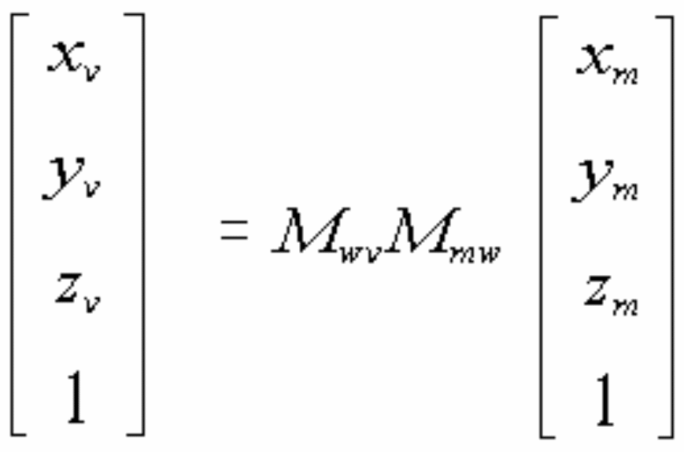

Here, `Mmw` is the transformation matrix from model coordinates to world coordinates, and `Mwv` is the transformation matrix from world coordinates to view coordinates.

A perspective transformation is then applied to obtain normalized screen coordinates `[xs, ys, zs]`. This perspective transformation is calculated in the following two steps.

## Step 1

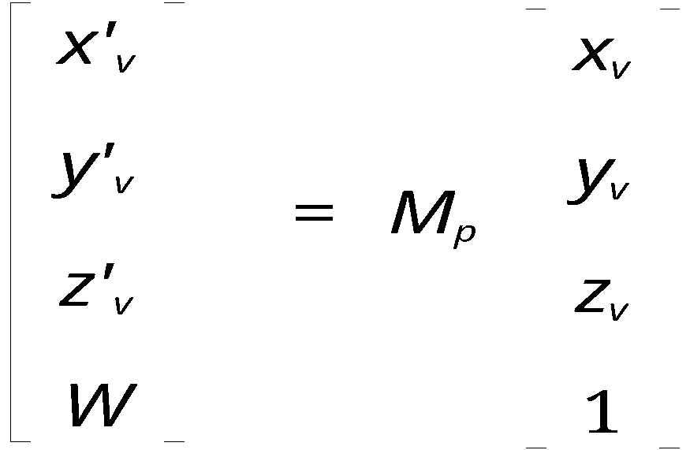

`Mp` is the perspective matrix, whose contents are shown below. `f` is the distance from the screen plane to the viewpoint. For parallel projection, `f = ∞`, so `Mp` becomes the identity matrix. See Figure 1.4.

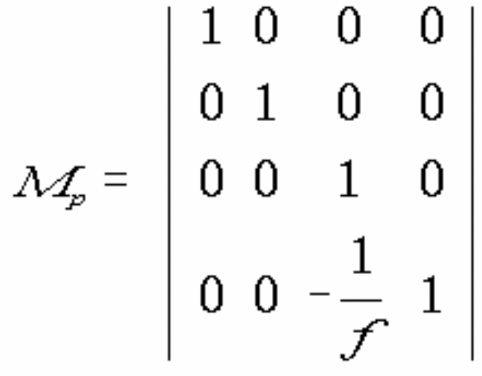

---

### Note

Except for row 4, column 3, the perspective matrix is the identity matrix. Therefore `(x'v, y'v, z'v)` is equal to `(xv, yv, zv)`, and:

```text
        zv - f
W = -  --------
           f
```

## Step 2

```text
xs = x'v / W
ys = y'v / W
zs = z'v / W
```

The normalized screen coordinates are then transformed into device coordinates:

```text
xd = scx × xs + trx
yd = scy × ys + try
zd = 65,536 × zs + 65,535
```

For a transformation in which the line of sight passes through the center of a 256×256-pixel screen and the horizontal-to-vertical ratio is 1:1, use:

```text
scx = 128
scy = -128
trx = 128
try = 128
```

This maps:

```text
-1.0 ≤ xs < 1.0
-1.0 ≤ ys < 1.0
-1.0 < zs ≤ 0.0
```

to the physical device-screen range:

```text
0 ≤ xd < 256
0 ≤ yd < 256
0 ≤ zd ≤ 65,535
```

On the HuC6273, `scx`, `trx`, `scy`, and `try` are set in the TE window-scale register.

---

Combining the transformations from model coordinates through step 1 of perspective transformation gives the following.

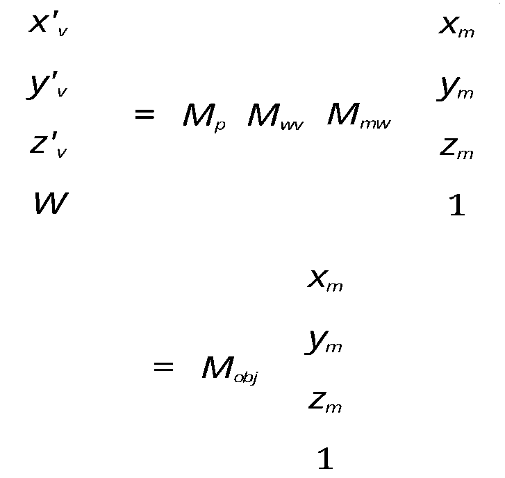

`Mobj` is the matrix product `Mp × Mwv × Mmw` and is called the object matrix. The HuC6273 performs coordinate transformation, including perspective transformation, in hardware by loading this object matrix into the hardware coordinate-transformation matrix. Consequently, the HuC6273 hardware does not explicitly represent a world-coordinate stage; it transforms directly from model coordinates to normalized screen coordinates.

Set the object matrix in the TE object-matrix register.

# 1.2.4 Polygon Rejection and Clipping

Removing a primitive that lies outside the viewing volume is called **rejection**. When only part of a polygon lies within the viewing volume, extracting and displaying only the portion inside it is called **clipping**. The following sections describe rejection and clipping during HuC6273 coordinate transformation.

## 1.2.4.1 Rejection

In normalized screen coordinates, the HuC6273 has the logical range:

```text
-7.0 ≤ x < 8.0
-7.0 ≤ y < 8.0
-8.5 ≤ z ≤ 7.0
```

In device coordinates, its logical range is:

```text
-4088 ≤ x < 4096
-4088 ≤ y < 4096
```

Any primitive with a vertex outside these logical regions after transformation is rejected in its entirety. For example, a triangle with one vertex outside the region and two vertices inside is still rejected.

---

Rejection occurs in two stages:

1. If transformation by the object matrix specified in the TE object-matrix register places a vertex outside the normalized-screen logical region, the primitive containing that vertex is rejected.
2. Vertices inside the normalized-screen logical region are transformed into device coordinates using the values set in the TE scale register. If the result lies outside the device-coordinate logical region, the primitive containing that vertex is rejected.

## 1.2.4.2 X/Y Clipping

Clipping is performed in device coordinates. X/Y clipping is specified by the TE window-clip register. The physically displayable region is normally set to either:

```text
256×240: 0 ≤ xd ≤ 255, 0 ≤ yd ≤ 239
320×200: 0 ≤ xd ≤ 319, 0 ≤ yd ≤ 199
```

To divide the screen and draw only within a particular area, set the register to that area.

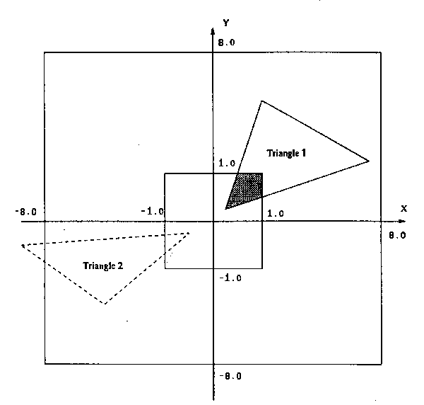

The hatched area is displayed. A primitive with a vertex outside the diagonally shaded logical region is rejected. Triangle 2 has a vertex outside the logical region, so the entire triangle is rejected and is not drawn.

*Figure 1.6 — X/Y clipping*

## 1.2.4.3 Z Clipping

In normalized screen coordinates, the visible region is:

```text
-1.0 < z ≤ 0.0
```

The internal logical Z region is `-8.5 ≤ z ≤ 7.0`. Polygons whose vertices lie within this internal logical region are clipped against the `z = 0.0` and `z = -1.0` planes and displayed. Polygons with a vertex outside the logical region are rejected. A polygon is also rejected when its Z value in view coordinates is greater than the perspective parameter `f`, because the perspective calculation cannot then be performed correctly.

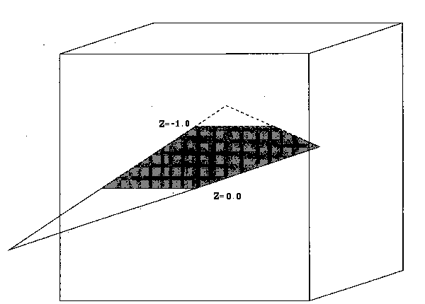

The hatched area is displayed.

*Figure 1.7 — Z clipping*

For perspective projection, consider how far into the depth direction the view extends—that is, where the Z clipping plane lies in view coordinates. Refer to Section 1.2.3, Coordinate Transformation.

```text
      z'v
zs = -----
       W
```

Because `z'v = zv` and:

```text
        zv - f
W = -  --------
           f
```

then:

```text
       zv
zs = -----
       W

       f × zv
   = - -------
       zv - f
```

This equation is a hyperbola with asymptotes at `zv = f` and `zs = -f`. The Z clipping planes are `zs = -1.0` and `zs = 0.0`. Thus, for example, when `f ≤ 1`, there is no Z clipping in the depth direction. However, as Figure 1.8 shows, reducing `f`—increasing the perspective effect—compresses Z values in normalized screen coordinates. At large-magnitude negative Z values, corresponding to points far from the screen, Z resolution becomes poor. Take this into account.

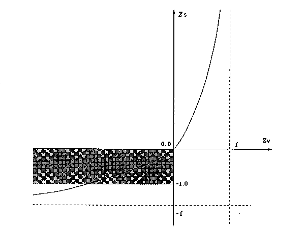

The figure shows the case `f > 1`. The hatched area is drawn.

*Figure 1.8 — Relationship between Z clipping and f*

# 1.2.5 Lighting Calculations

The HuC6273 supports ambient light and two directional lights. They are controlled by the following parameters.

## TE Light-Coefficient Register

- **Ambient coefficient** — Intensity with which ambient light is reflected by the object surface.
- **Diffuse coefficient 1** — Intensity with which light 1 is diffusely reflected by the object surface.
- **Diffuse coefficient 2** — Intensity with which light 2 is diffusely reflected by the object surface.
- **Specular coefficient 1** — Intensity with which light 1 is specularly reflected by the object surface.
- **Specular coefficient 2** — Intensity with which light 2 is specularly reflected by the object surface.

## TE Light-1 Vector Register

A vector indicating the direction of light 1 in view coordinates. It must be normalized to unit length.

## TE Light-2 Vector Register

A vector indicating the direction of light 2 in view coordinates. It must be normalized to unit length.

Each coefficient above is the product of the material’s reflection coefficient and the light intensity. Ambient light applies a constant coefficient independent of polygon orientation and represents light scattered from all directions. Diffuse reflection varies surface brightness according to the dot product of a light-direction vector and the normal vector attached to each polygon. Specular reflection is the component, typical of metals and similar surfaces, in which light from the source reflects from the polygon surface directly toward the viewer. It is also called a highlight.

Lighting calculations are enabled by setting `TE control register: LTEN = 1`. To enable the specular-reflection effect, also set `TE control register: SPEN = 1`.

The color mode must be I-C color mode. See Section 1.3.1.

HuC6273 lighting calculations are performed in view coordinates. The normal vector attached to each polygon is defined in model coordinates. The matrix `Mn` that transforms it into view coordinates is called the normal matrix. Let the normal vector attached to a polygon in model coordinates be:

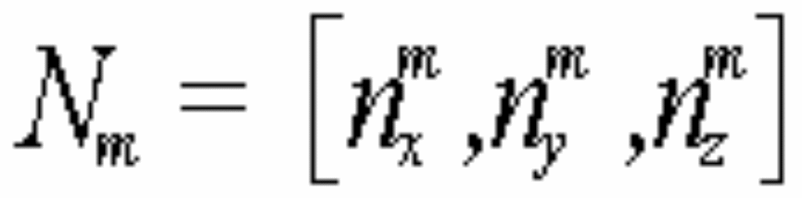

and the transformed normal vector in view coordinates be:

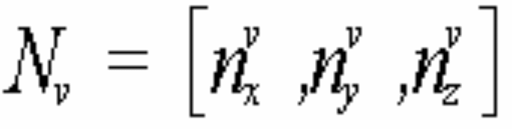

Because this transformation contains rotation only, a 3×3 matrix is used. Set the normal matrix in the TE normal-matrix register.

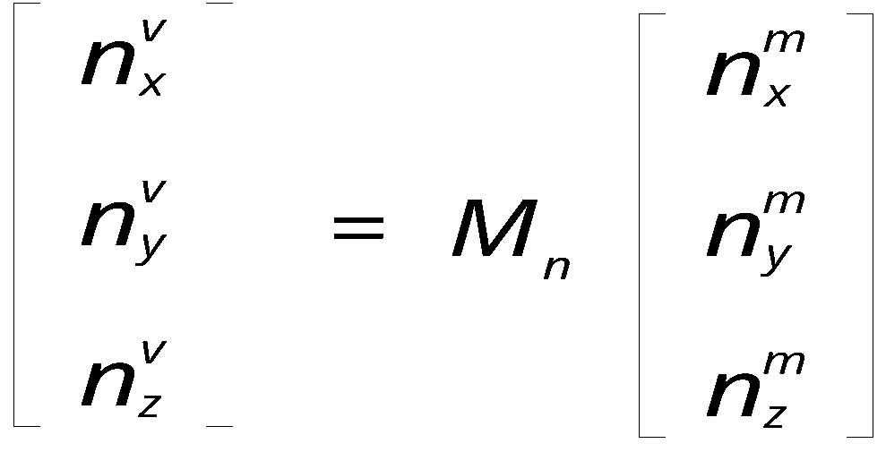

# 1.2.6 HuC6273 Fixed-Point Formats

Coordinate transformations, lighting calculations, and related operations are all performed in fixed point. This manual uses the notation `s.i.f` to indicate the binary-point position. The integer values `s`, `i`, and `f` respectively specify the number of sign bits, integer bits, and fractional bits. For example, `1.8.7` denotes a 16-bit value whose most significant bit is the sign bit, followed by eight integer bits and seven fractional bits.

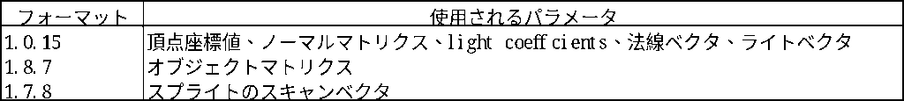

# 1.2.7 Matrix-Calculation Functions

As described in the coordinate-transformation section, matrix operations are required to obtain the object matrix. The HuC6273 can perform these calculations as a coprocessor.

The register sets used for matrix operations are:

- TE source-matrix register, `Msrc[4][4]`
- TE destination-matrix register, `Mdst[4][4]`
- Matrix supplied as a command argument, `Mcmd[4][4]` or `Mcmd[3][3]`
- Result register accessible by the CPU as memory-mapped registers, `Mrst[4][4]`

The following operations are supported.

## 1. Matrix Operations

```text
(a) Matrix op. (4×4, 1.0.15)
    Mdst[4][4] = Mcmd[4][4] × Msrc[4][4]

(b) Matrix op. (3×3, 1.0.15)
    Mdst[3][3] = Mcmd[3][3] × Msrc[3][3]

(c) Matrix op. (4×4, 1.8.7)
    Mdst[4][4] = Mcmd[4][4] × Msrc[4][4]

(d) Matrix op. (3×3, 1.8.7)
    Mdst[3][3] = Mcmd[3][3] × Msrc[3][3]

(e) Matrix op. (3×1, 1.0.15)
    Mdst[3] = Msrc[3][3] × Mcmd[3]
```

## 2. Matrix Copies

```text
(a) Msrc[4][4]          = Mdst[4][4]
(b) Mobject[4][4]       = Mdst[4][4]
(c) Mnormal[3][3]       = Mdst[3][3]
(d) Mresult[4][4]       = Mdst[4][4]
(e) Mresult[6]          = Msrc[6]
(f) Msrc[4][4]          = Mresult[4][4]
(g) light1_vector[3]    = Mdst[3]
(h) light2_vector[3]    = Mdst[3]
```

For example, these operations can calculate `Mobj = Mp × Mwv × Mmw` as follows.

1. Write `Mmw` to the TE source-matrix register using `Write TE register (src matrix register[4][4])`.
2. Supply `Mwv` as the command argument and execute `Matrix Op. (4×4, 1.8.7)`:

   ```text
   Mdst[4][4] = Mcmd[4][4] × Msrc[4][4]
   ```

3. Copy the TE destination matrix to the source matrix:

   ```text
   Msrc[4][4] = Mdst[4][4]
   ```

4. Supply `Mp` as the command argument and execute `Matrix Op. (4×4, 1.8.7)`:

   ```text
   Mdst[4][4] = Mcmd[4][4] × Msrc[4][4]
   ```

5. The object matrix is now in the TE destination matrix. Copy it to the TE object matrix:

   ```text
   Mobject[4][4] = Mdst[4][4]
   ```

Normal matrices and light vectors can be calculated in the same way.

# 1.2.8 3D Primitives

The following 3D primitives are supported.

## Triangle Strip

A connected strip of triangles. Each additional vertex defines one triangle, so it can be drawn faster than a triangle list.

## Triangle List

A set of independent triangles. Three vertices define each triangle. Compared with a triangle strip, approximately three times as many vertices are required to draw the same number of triangles. Coordinate transformation therefore takes longer and drawing is slower.

## Polyline

A connected sequence of line segments. Each additional vertex defines one line, so it can be drawn faster than a line list.

## Line List

A set of independent line segments. As with triangle lists, drawing is slower than with a polyline.

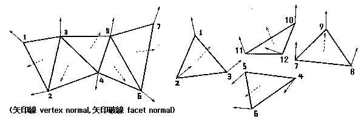

*Figure 1.9 — Triangle strip; Figure 1.10 — Triangle list*

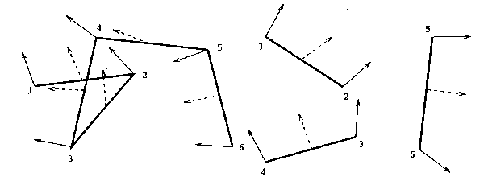

*Figure 1.11 — Polyline; Figure 1.12 — Line list*

# 1.2.9 Shading

In addition to vertex coordinates, a primitive definition can include normal vectors, color information, and texture coordinates. The required information depends on the polygon-shading method.

## 1.2.9.1 Supplying Color Information

### Default Color

The color set in the TE default-color register is assigned to every primitive in the command packet.

### Facet Color

One color is assigned to each primitive—triangle or line.

### Vertex Color

One color is assigned to each vertex.

### Texture Map

Texture coordinates `(u,v)` are assigned to each triangle vertex. The offset values set in the TE UV-offset register are added to each vertex’s U and V values. The hardware interpolates texture coordinates for the pixels within the primitive.

## 1.2.9.2 Supplying Normals

### Without Normals

No shading is performed. The color assigned to the primitive is used directly.

### Facet Normal

One normal vector is assigned to each primitive—triangle or line. If `TE control register: ICM = 1` (I-C color mode) and `LTEN = 1`, lighting intensity is calculated once per primitive from the light vectors and normal vector. The result is multiplied by the I value of the primitive’s color—or by the default color for texture mapping. This shading method is called flat shading.

### Vertex Normal

One normal vector is assigned to each vertex. If `TE control register: ICM = 1` and `LTEN = 1`, lighting is calculated at each vertex using the light vectors and vertex normal. The result is multiplied by the I value of that vertex’s color—or by the default color for texture mapping. This shading method is called Gouraud shading.

When `TE control register: ICM = 1` (I-C color mode), the I value or intensity at each point of the primitive is obtained by interpolating the vertex I values. For the C value, the C component of the color code assigned to the primitive’s final vertex—the third vertex of a triangle or the second vertex of a line—is used for the entire primitive. When `ICM = 0` (indexed-color mode), the complete color code of the final vertex is used for the entire primitive.

For primitives using texture mapping, the `TLEN` and `TLM` flags in the PE control register affect drawing as follows:

- `TLEN = 0`: draw the texture pixel unchanged.
- `TLEN = 1, TLM = 0`: multiply the vertex I value by the texture pixel’s I value.
- `TLEN = 1, TLM = 1`: replace the texture pixel’s I value with the vertex I value.

The supported 3D primitive command combinations are shown below.

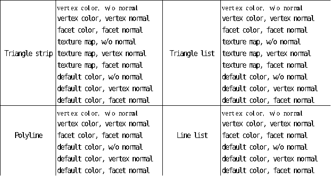
