# 1.3 Color Modes

The following color formats are supported. There are restrictions on mixing the two modes within a single application because both modes share the HuC6261 color palette.

1. 9-bit I-C color mode
2. 9-bit indexed-color mode

## 1.3.1 I-C Color Mode

Inside the HuC6273, color data is always handled as 12-bit data. It is divided into a 6-bit color-selection field, the C field, and a 6-bit intensity field, the I field. In 9-bit I-C color mode, nine of these bits are output. The PE I-C mask register selects how many bits are output from each field. The C field may use three through six bits and the I field may also use three through six bits, but their total is always nine bits. An application can therefore trade color count for intensity resolution, or intensity resolution for a larger color count.

To select I-C color mode, set:

```text
TE control register: ICM = 1
PE control register: C12M = 0
```

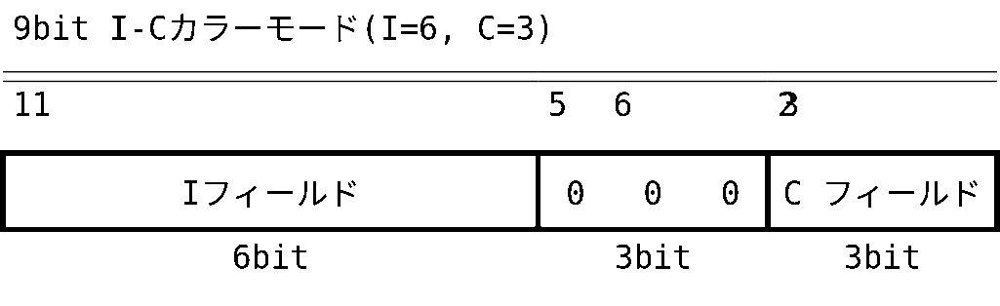

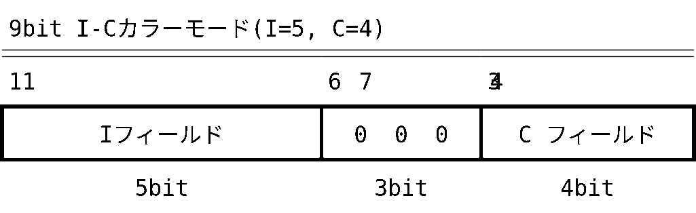

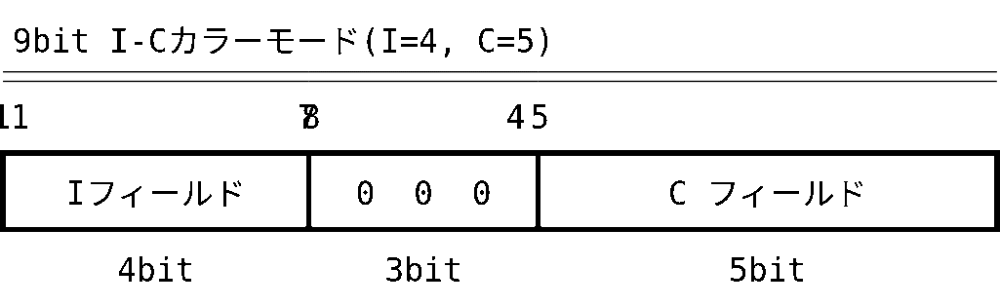

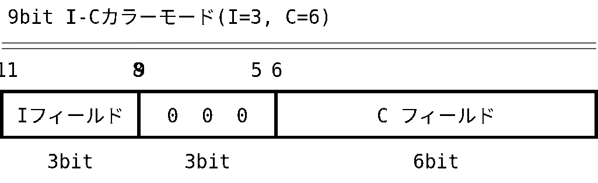

In 9-bit I-C color mode, the Video Out block merges the selected I-field and C-field bits and outputs them to the HuC6261. If the low four bits of this output are all zero, the HuC6261 treats the value as transparent. The color codes shown below therefore cannot be used for the corresponding C-field configurations. The HuC6273 hardware does not perform any special handling for these transparent values; application software must avoid them.

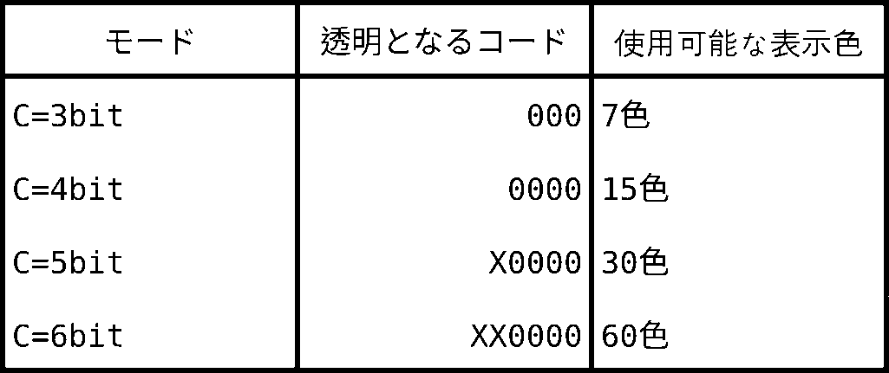

For example, with a 4-bit I field and a 5-bit C field, the five-bit color code can specify up to 30 colors, each with 16 intensity levels.

Gray, red, and green are represented as shown below.

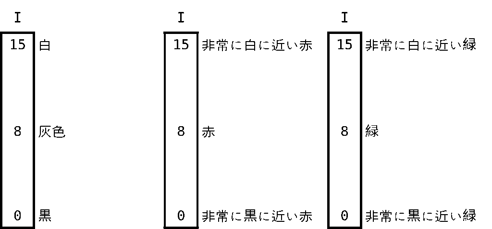

For the selected 30 colors, the corresponding `(Y,U,V)` color map must be loaded into the HuC6261 color-palette RAM according to this format.

I-C color mode supports the following functions.

### 1. Gouraud Shading and Flat Shading

Lighting calculations and shading are supported for white light: one ambient light and up to two directional lights. Lighting effects can also be applied to texture maps. Gouraud shading requires primitive commands containing vertex normals; flat shading requires primitive commands containing a facet normal. The following register settings are required:

```text
TE control register: LTEN = 1
TE control register: SPEN = 1   /* for specular reflection */
PE control register: SDW = 0
PE control register: FOG = 0
```

### 2. Shadow Function

The shadow effect halves the intensity of an already drawn pixel rather than overwriting the pixel. Enable it with `PE control register: SDW = 1`.

### 3. Fog and Reverse-Fog Functions

Fog increases intensity for more distant pixels, creating a mist-like effect. Reverse fog does the opposite, reducing intensity for more distant pixels to create an effect like dark smoke.

```text
Fog:         FOG = 1, RFOG = 0
Reverse fog: FOG = 1, RFOG = 1
```

## 1.3.2 Indexed-Color Mode

In indexed-color mode, no shading or other operation is applied to the color information. The supplied color value becomes an index directly into the external LUT. Lighting calculations, shadow, and fog are not available. Drawing is limited to flat color without lighting or to texture mapping.

Set the registers as shown below.

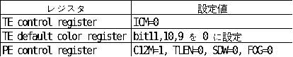

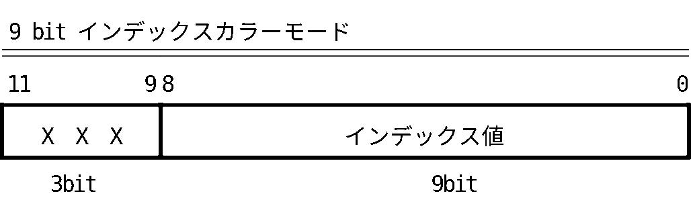

# 1.4 Buffer Formats

## 1.4.1 Display Size

The HuC6273 supports 256×240 and 320×200 modes. The physical size of each buffer is based on 256×256. In 320×200 mode, the hardware converts addresses so the image fits within a 256×256 buffer.

Address conversion in 320×200 mode is:

```c
if (x > 255) {
    x_prime = (x - 256) + (y % 4) * 64;
    y_prime = y / 4 + 200;
} else {
    x_prime = x;
    y_prime = y;
}
```

## 1.4.2 Display Buffer

The display buffer consists of the display plane, overlay plane, collision-detection bit plane, pixel-valid flag planes `PVLD[1..0]` used by Hidden Clear (see Appendix B), and the dither random-number plane. The display buffer is double-buffered, with front and back buffers. The HuC6273 can clear the display buffer automatically; see Section 1.10.

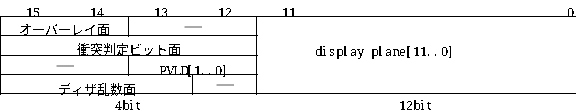

The upper four display-buffer bits are shared among the overlay plane (`bits 15..14`), collision-detection bit plane (`bits 15..12`), pixel-valid flag planes (`bits 13..12`), and dither random-number plane (`bits 15..13`). Even when the overlay plane is used, two bits (`bits 13..12`) remain available for collision detection.

### 1.4.2.1 Display Plane

The display plane has a depth of 12 bits. Its contents, together with the overlay plane, appear on the display. See the preceding section for each color mode’s format.

> **Note:** During 3D drawing, all ones are always written to the upper four display-buffer bits. To preserve data in those bits, such as the overlay plane, disable writes to the upper four bits with the PE mask register.

### 1.4.2.2 Overlay Plane

The two-bit overlay plane is displayed at a higher priority than the display plane. Enable it with `PE control register: OLEN = 1`. An internal HuC6273 LUT expands the two overlay bits to nine bits. Value zero is always transparent, revealing the display plane beneath it, so the overlay plane provides three visible colors. Set the overlay LUT with the `Write LUT` command.

3D drawing, `Put image`, and similar commands also write ones to display-buffer bits 15 and 14, which form the overlay plane. To protect the overlay plane, set the corresponding PE mask-register bits to zero. Conversely, setting those bits to one permits drawing into the overlay plane. For example, to draw a 3D primitive into the overlay plane only with pixel value `0x3`, set `PE mask register = 0xc000` and draw the primitive.

### 1.4.2.3 Collision-Detection Bit Plane

This plane is used by sprite collision detection, which determines whether a nontransparent sprite pixel collides with a pixel drawn earlier. If any collision-plane bit is set to one for a pixel, that pixel is included in collision testing for subsequently drawn sprites.

### 1.4.2.4 Pixel-Valid Flag Plane

The pixel-valid flag plane is used by Hidden Clear, which clears the display and Z buffers without consuming drawing time. Its contents are controlled by hardware. When Hidden Clear is enabled, software must not write to this plane. See Appendix B for use instructions.

### 1.4.2.5 Dither Random-Number Plane

In dither mode, this plane serves as a random-number table. Enable the applicable mode with `PE control register: FOG = 1, DZD = 0`. When intensity resolution is low—for example, with a three-bit I field—dithering can make visible Mach bands less conspicuous. Random values must be loaded into this plane before dithered drawing. Set the corresponding PE mask-register bits to one and load the data with `Put image`.

## 1.4.3 Z Buffer

The Z buffer has the same 256×256 size as the display buffer. In 320×200 mode it uses the same address conversion. The Z buffer is not double-buffered, so it must be cleared whenever the front and back display buffers are switched. The HuC6273 can clear it automatically in approximately 6.5 ms. Hidden Clear can reduce effective clear time to zero. These operations occur at the same time as display-buffer clearing; see Section 1.10.

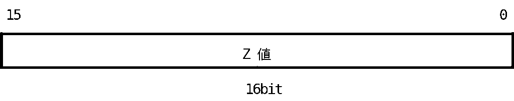

`0x0000` is the farthest value and `0xffff` is the nearest.

## 1.4.4 Texture Buffer

The texture buffer may hold 9-bit image data such as texture images and sprite patterns, and 16-bit data such as Sprite Control Tables (SCTs) and Command Macro Tables (CMTs).

With two 4-Mbit DRAMs, its size is 1M×9 bits. It is managed in units of 64K×9-bit blocks called **banks**.

For image data, one bank corresponds to 256×256 texels. A single texture image may occupy at most one bank. Smaller images may share subdivisions of a 256×256 region.

To draw a texture-mapped polygon, each vertex supplies the texture-map address to apply there instead of color data. Vertex data is therefore `(x, y, z, u, v)`, where `u` and `v` are texture indices.

The texture buffer is nine bits deep. When `Put Image to texture buffer` transfers image data, hardware packs the 12-bit color format into nine bits according to the current I-C mode. See Section 1.3.1.

### Texture Image Formats

```text
I-C mode, I=6 and C=3:
  bits 8..3: I field (6 bits)
  bits 2..0: C field (3 bits)

I-C mode, I=5 and C=4:
  bits 8..4: I field (5 bits)
  bits 3..0: C field (4 bits)

I-C mode, I=4 and C=5:
  bits 8..5: I field (4 bits)
  bits 4..0: C field (5 bits)

I-C mode, I=3 and C=6:
  bits 8..6: I field (3 bits)
  bits 5..0: C field (6 bits)

Indexed-color mode:
  bits 8..0: index value (9 bits)
```

In every mode, an all-zero value is transparent. Transparency allows complexly shaped images, such as a tree, to be composited effectively into a 3D image.

When storing 16-bit one-dimensional data such as an SCT or CMT, only the low eight bits of each texture-buffer memory location are used, and one word occupies two addresses. Byte order within the word is little-endian.

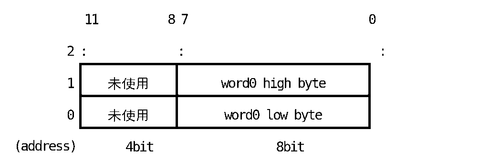

Two-dimensional image data and one-dimensional data, including drawing commands and sprite-control tables, may coexist in the texture buffer. `Put image` and `Read pixel` access it with two-dimensional X/Y addresses. The CPU may also access it directly through the direct texture-buffer access function, which uses one-dimensional addresses. Their relationship is:

```text
address_offset = x + 256 × y
```

# 1.5 Commands

3D drawing is performed by issuing command packets to the HuC6273. Their format is shown below.

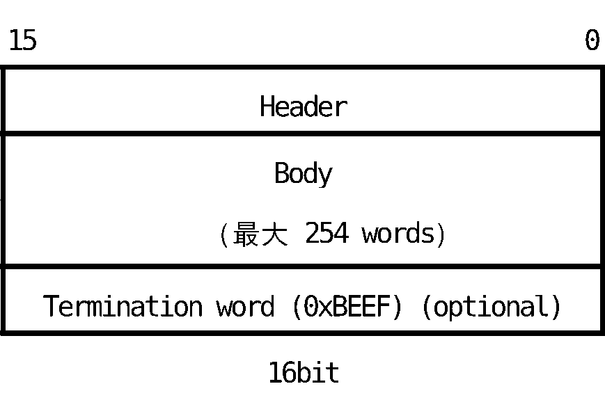

A packet is issued by writing it to the Command FIFO port. The HuC6273 executes issued commands in sequence. Command classes include:

1. 3D primitive drawing commands
2. Image-data transfer commands
3. Read and write commands for command-accessed registers, including TE and PE registers
4. Read and write commands for the overlay LUT

# 1.6 Per-Pixel Processing

When pixels generated by a 3D primitive command are written to the display buffer, the HuC6273 performs hidden-surface processing by Z comparison, shadow effects, and related operations. In the following pseudocode, subscript `s` denotes a source pixel generated by the command, and subscript `d` denotes data already in the display or Z buffer. For example, `Cd = Cs` means writing the generated pixel’s color component C to the display buffer.

## 1.6.1 Normal Drawing Mode

If Z comparison determines that the new polygon pixel is closer, it overwrites the pixel drawn previously.

```c
if (Zd <= Zs) {
    Cd = Cs;
    Id = Is;
    Zd = Zs;
} else {
    Cd = Cd;
    Id = Id;
    Zd = Zd;
}
```

## 1.6.2 Shadow Mode

Shadow mode writes half the intensity of the pixel already present: `PE control register: SDW = 1, RSDW = 0`. The existing color component is unchanged, creating an object-shadow effect. The following example does not perform Z comparison; this can be achieved by forcing the comparison true with `PE control register: ZCAT = 1`.

The reverse operation can double intensity to create a spotlight effect: `SDW = 1, RSDW = 1`.

```c
Cd = Cd;
Id = Id / 2;
Zd = Zd;
```

## 1.6.3 Fog Mode

With `FOG = 1, RFOG = 0`, the intensity component is modified in proportion to the source Z value. More distant objects become brighter and closer to white, creating fog. This example also uses dithering. Random values must first be loaded into the upper three bits of both display buffers. To disable dithering, set `DZD = 1`.

```c
if (Zd <= Zs) {
    Cd = Cs;
    Id = Is + random + Zs;
    Zd = Zs;
} else {
    Cd = Cd;
    Id = Id;
    Zd = Zd;
}
```

## 1.6.4 Reverse-Fog Mode

Reverse fog reduces intensity for more distant objects: `FOG = 1, RFOG = 1`.

```c
if (Zd <= Zs) {
    Cd = Cs;
    Id = Is - (random + Zs);
    Zd = Zs;
} else {
    Cd = Cd;
    Id = Id;
    Zd = Zd;
}
```

## 1.6.5 Texture Mapping

When drawing a texture-mapped 3D primitive, a transparent texture pixel—color code zero—does not alter the pixel or Z value already present at that location.

```c
if (Zd <= Zs) {
    if (Cs == 0 && Is == 0) {
        Cd = Cd;
        Id = Id;
        Zd = Zd;
    } else {
        Cd = Cs;
        Id = Is;
        Zd = Zs;
    }
} else {
    Cd = Cd;
    Id = Id;
    Zd = Zd;
}
```

Texture mapping also operates in shadow, fog, and other drawing modes. In shadow mode:

```c
if (Cs == 0 && Is == 0) {
    Cd = Cd;
    Id = Id;
    Zd = Zd;
} else {
    Cd = Cd;
    Id = Id / 2;
    Zd = Zd;
}
```

## 1.6.6 Mesh Drawing

An arbitrary 4×4-pixel pattern can be applied as a mesh. Set `TE control register: MSH = 0`. Mesh drawing is available in all drawing modes but only for 3D primitives. It cannot be applied to `Put image`, `Fill buffer`, or sprites.

```c
if (mesh_function(x, y) == TRUE) {
    Cd = Cs;
    Id = Is;
    Zd = Zs;
} else {
    Cd = Cd;
    Id = Id;
    Zd = Zd;
}
```

`mesh_function(x,y)` independently selects draw or skip for all 16 combinations of the low two X-address bits and low two Y-address bits. Set the pattern in the TE mesh-pattern register. Pixels are drawn only where the corresponding bit is one.


## 1.6.7 Flash Drawing

Flash drawing replaces either or both source components, intensity `Is` and color `Cs`, with values preset in the PE flash I-C-value register. Set `FLSH-I = 1` to replace intensity and `FLSH-C = 1` to replace color.

```c
if (Flash_I_mode)
    Id = Flash_I_value;
else
    Id = Is;

if (Flash_C_mode)
    Cd = Flash_C_value;
else
    Cd = Cs;

Zd = Zs;
```

# 1.7 Sprite Functions

The HuC6273 can draw sprites. By selecting arbitrary scan vectors over a sprite pattern, it supports rotation, enlargement, reduction, and deformation. Sprite Control Tables may be placed anywhere in the texture buffer, limited only by its capacity. The host processor starts drawing through the Sprite control register. One start operation may draw any number from one through 2,048 sprites.

# 1.8 Command-Macro Function

A sequence of command packets can be stored in the texture buffer and DMA-transferred directly into the Command FIFO without passing through the host processor. This is the command-macro function, and all commands may be used in a command macro. After storing the command sequence for an object, the host needs only to specify its starting address and length to draw that object.

Start a command macro as follows:

1. Set the bank containing the beginning of the command sequence in the CMT bank-select register.
2. Set the sequence’s starting address within the bank in the CMT start-address register.
3. Set the command-sequence length in the CMT byte-count register.

Writing the CMT byte-count register starts the macro. Completion is indicated by the `CMT done` interrupt or by the `CMBSY` Command Macro Busy bit in the Misc status register.

# 1.9 Direct Texture-Buffer Access

The host processor can read and write texture-buffer memory directly, allowing it to load or modify Sprite Control Tables and Command Macro Tables.

With two 4-Mbit DRAMs, the texture buffer is 1M×9 bits and is managed as 64K×9-bit banks. Because one texel is nine bits, each bank contains 64K texels. Two-dimensional data is nine bits wide and occupies one address per texel. One-dimensional data is 16 bits wide and occupies two addresses per word. Direct access provides unpack mode, which reads or writes nine bits per access, and pack mode, which accesses 16 bits per operation. The selected address region distinguishes the modes.

Before direct access, set the target bank number in the CMT bank-select register.

## 1.9.1 Pack Mode

Pack mode permits only word-aligned accesses, so the least significant address bit must always be zero. The low eight bits at an even texture-buffer address are packed into the low byte of the 16-bit word; the eight bits at the following odd address are packed into the high byte. The format is little-endian.

```text
Texture-buffer direct access, pack mode, R/W
0x80510000 through 0x8051FFFE

bits 15..8: data[7..0] from odd address
bits  7..0: data[7..0] from even address
```

## 1.9.2 Unpack Mode

Unpack mode is primarily for reading and writing two-dimensional image data, although `Put image to texture buffer` is slightly faster for writing such data. All texture-buffer bits are accessed. One texel of nine-bit data is transferred as a 16-bit word. On writes, the upper seven bits are ignored; on reads, they return zero. Accessing 64K texels therefore consumes 128K bytes of address space.

The relationship between a two-dimensional address `(x,y)` and its unpack-mode address is:

```text
address = 0x80520000 + (x + 256 × y) × 2
```

```text
Texture-buffer direct access, unpack mode, R/W
0x80520000 through 0x8053FFFE

bits 15..9: zero
bits  8..0: data[8..0]
```

# 1.10 Display-Buffer Clear Functions

The HuC6273 has two display buffers, Display Buffer 0 and Display Buffer 1. While one is being drawn, the other is shown on the screen. The buffer being drawn is the **back buffer**; the displayed buffer is the **front buffer**. When drawing finishes, the front and back buffers are exchanged so the newly generated image becomes visible. This operation is called buffer switching or buffer swapping. A swap is synchronized to vertical blanking or horizontal blanking. Its timing and initiation are controlled by writing the PE frame-control register.

After a swap, the display buffer that has become the new back buffer must be initialized. The HuC6273 provides three clear methods, selected in the memory-mapped Display control register:

1. Clear with the value specified in the PE clear-color-value register.
2. Clear by copying the image in the texture-buffer bank selected by the PE clear texture-select register. This is Clear With Texture, or CWT.
3. Enter drawing without a conventional clear by manipulating the display buffer’s pixel-valid flag plane. This is Hidden Clear.

Clearing by methods other than Hidden Clear takes approximately 6 ms. Hidden Clear removes this clear-time cost. See Appendix B, “Hidden Clear Mode,” for usage.

CWT allows the HuC6273 alone to display a background image. X and Y offsets can be applied during the copy to scroll the image; set them in the PE CWT X-offset and Y-offset registers.

At a swap, the contents of the display buffer that becomes the new back buffer can also be copied into the texture buffer. This Display To Texture copy, or DTT, is also selected in the Display control register. The copied image can be used as a texture or sprite image during the next drawing operation.
