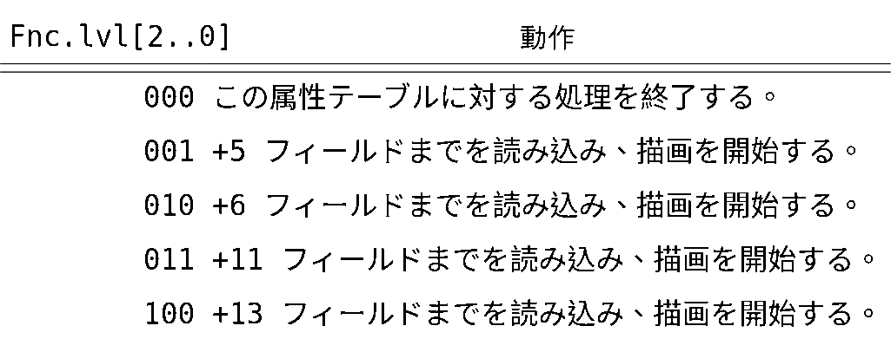
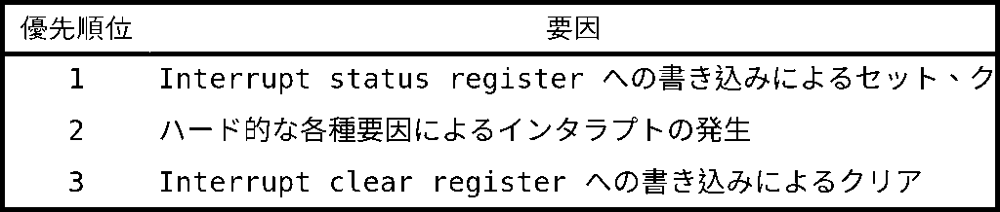
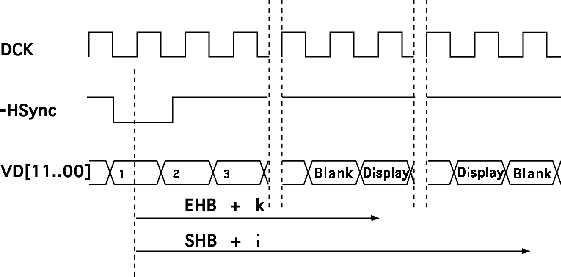
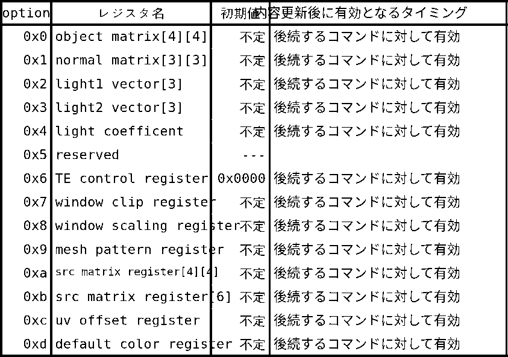
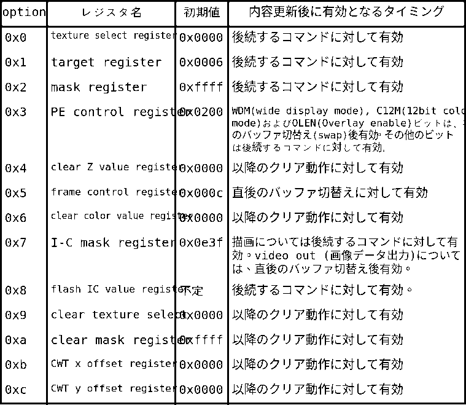
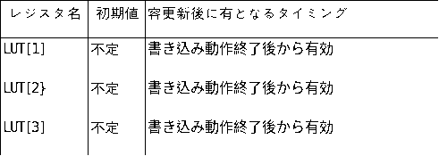

# HuC6273 Hardware Functional Specification

# Chapter 2: Hardware Functions

## 2.1 Sprite system

Sprite attributes are stored in the texture buffer. A 16-word **Sprite Control Table (SCT)** describes each sprite. Drawing begins when software writes the sprite-control register with the first SCT number and the number of sprites to process.

The sprite engine supports source-image selection, screen position, source size, scaling and scan parameters, color and transparency controls, display priority, collision groups, and optional parameter-scan deformation.

### 2.1.1 Sprite Control Table organization

Each SCT occupies 16 16-bit words. The engine reads the table from the texture-buffer bank and base address selected by the sprite registers. SCTs must be aligned and stored in the format shown by the original bit-field diagrams.

General rules:

- Reserved bits must be zero.
- Coordinates and offsets are signed or unsigned according to the field definition.
- Source addresses refer to the selected texture-buffer bank.
- A disabled or zero-size sprite produces no pixels.
- Collision detection is grouped; results are accumulated in the CD result registers.
- Parameters are latched as the SCT is read. Do not modify an SCT that is currently being consumed.

### 2.1.2 Word 0

Contains primary sprite mode and attribute-selection fields, including scan mode, image/color interpretation, and control flags. Use only documented combinations.

### 2.1.3 Word 1

Contains additional mode, priority, collision-group, and source-format fields. The exact bit allocation is retained in the source diagrams.

### 2.1.4 Word 2

Specifies the sprite’s horizontal screen coordinate or related X-position field.

### 2.1.5 Word 3

Specifies the vertical screen coordinate or related Y-position field.

### 2.1.6 Word 4

Specifies the source-image X position or horizontal source origin.

### 2.1.7 Word 5

Specifies the source-image Y position or vertical source origin.

### 2.1.8 Word 6

Specifies horizontal size/extent and associated scan information.

### 2.1.9 Word 7

Specifies vertical size/extent and associated scan information.

### 2.1.10 Words 8–11

Hold the initial scan parameters `XOff`, `YOff`, `XScan`, and `YScan`. They determine source offsets and source-coordinate increments used while rasterizing the sprite. Fixed-point interpretation follows the field definitions.

### 2.1.11 Words 12–15

Contain texture/source address continuation, color or key data, collision information, and parameter-table linkage as selected by the sprite mode. Follow the mode-specific bit diagrams; fields that are unused in a mode must be zero.

### 2.1.18 Parameter-table organization

Parameter scan allows free-form deformation by supplying a new offset and scan direction for each sprite scan line. For every line, the engine reads a parameter entry and uses it instead of the fixed `XOff`, `YOff`, `XScan`, and `YScan` values in SCT words 8–11.

Use parameter scan only when the table is completely populated for the visible line count. Keep the parameter table in texture memory and avoid CPU writes while the sprite engine is reading it.

## 2.2 Command-accessed registers

The Transformation Engine (TE) and Pixel Engine (PE) registers are normally written through command packets in the Command FIFO.

### 2.2.1 TE registers

See Chapter 3, “Write TE register.” These registers hold matrices, light vectors, lighting coefficients, clipping/scaling state, texture-coordinate offset, default color, and other transformation controls.

### 2.2.2 PE registers

See Chapter 3, “Write PE register.” These registers select texture banks and render targets, masking, depth and blending behavior, automatic clear state, and frame control.

## 2.3 Memory-mapped registers

Memory-mapped register accesses are not automatically ordered against previously issued commands. When ordering matters, wait until the relevant busy field in the Miscellaneous Status register clears, issue an appropriate synchronization command, or use the documented interrupt event before accessing dependent state.

### 2.3.1 Register map

The map contains functional control/status registers and a separate texture-buffer direct-access window.

#### 2.3.1.1 Functional registers

The functional window begins at `0x80500000` and contains Command FIFO, interrupts, readback, video timing, sprite control, status/control, configuration, raster hit, result registers, and test/debug registers.

#### 2.3.1.2 Texture-buffer direct access

The window beginning at `0x80510000` gives the CPU direct access to the currently selected texture-buffer bank in packed or unpacked mode.

### 2.3.2 Command FIFO port

Write command-packet words to this address. A packet consists of a header, body, and normally a `0xBEEF` termination word. Check FIFO free space before writing a complete packet, and never overrun the FIFO.

### 2.3.3 Command FIFO status register

Reports FIFO fullness, emptiness, available space, and related command-input state. Poll this register or use the appropriate interrupt policy before a burst write.

### 2.3.4 Command FIFO control register

Controls FIFO initialization and command-input behavior. Reset/clear the FIFO only when discarding all queued work is intentional.

### 2.3.5 Command Macro Table control

A Command Macro Table (CMT) is a list of HuC6273 commands stored in texture memory. The CMT engine can feed commands independently of direct CPU FIFO writes.

#### 2.3.5.1 CMT bank-select register

Selects the texture-buffer bank containing the CMT. The same bank selector is also used by CPU texture-buffer direct access where documented.

#### 2.3.5.2 CMT start-address register

Sets the first byte/word address of the CMT inside the selected bank.

#### 2.3.5.3 CMT byte-count register

Sets the number of bytes in the CMT. Writing this register starts CMT execution. A CMT can be started regardless of the current FIFO state, so software must ensure that command ordering and available FIFO capacity are safe.

### 2.3.6 Interrupt mask register

Only causes whose mask bits are 1 can assert the external interrupt. All mask bits are cleared at power-on and hard reset. Program and clear pending status before enabling a source.

Interrupt causes include command synchronization error, FIFO overflow, TE synchronization, pixel/readback events, sprite completion/collision, raster hit, frame/display events, and other block-specific conditions shown in the bit-field diagram.

### 2.3.7 Interrupt clear register

Writing a 1 clears the corresponding latched interrupt cause. Writing 0 leaves it unchanged. Clear only causes already serviced.

### 2.3.8 Interrupt status register

Reports every latched cause regardless of whether it is masked. A command-sync error means the packet length/termination format was inconsistent. FIFO overflow means command data was written without sufficient space. After a malformed stream, perform a software restart before trusting subsequent command interpretation.

### 2.3.9 Read-back register

Receives values returned by `Read pixel`, `Read TE register`, `Read PE register`, and `Read LUT` commands. Wait for the corresponding completion indication before reading it.

### 2.3.10 Video timing registers

Generate the internal horizontal and vertical blanking timing and therefore place the visible area.

#### 2.3.10.1 Horizontal timing register

Programs horizontal display start/end and related blanking timing. Values are expressed in the device’s internal dot-clock units. Change timing only while display output is safely disabled or during system initialization.

#### 2.3.10.2 Vertical timing register

Programs vertical display start/end and frame timing in raster units. The programmed mode must agree with the HuC6261 and board timing configuration.

### 2.3.11 Sprite registers

#### 2.3.11.1 SCT address-high register

Specifies the high address bits of the first Sprite Control Table in texture memory.

#### 2.3.11.2 Sprite control register

Contains the low SCT number/address and the sprite count. Writing the register starts sprite drawing. Do not retrigger until the prior sprite operation has completed unless the documented queueing condition is satisfied.

#### 2.3.11.3 Collision-detection result registers 0 and 1

Store collision results for up to eight groups. Clear or snapshot them at the required frame boundary before starting a new detection pass.

#### 2.3.11.4 Sprite window-clip register

Defines the rectangular area in which sprite pixels may be drawn. In 320 × 200 mode the hardware converts logical coordinates to its 256 × 256 physical organization; software uses logical display coordinates.

### 2.3.12 Miscellaneous status register

Reports busy states for the TE, PE, sprite engine, memory controller, command input, and related blocks. It also contains mode controls such as `NTRM` (no termination word).

- `NTRM = 0`: command packets use the normal `0xBEEF` termination word and both length and terminator checks are available.
- `NTRM = 1`: packets may omit the terminator; only checks possible without a terminator are performed. Packets with and without a terminator may be mixed, but malformed lengths become harder to detect.

Poll the specific block that owns data being read or overwritten; a global idle assumption is unsafe while other blocks remain active.

### 2.3.13 Display control register

Controls display-buffer access, automatic clear/copy behavior, output enable, overlay operation, and buffer selection. A safe frame-buffer switch generally requires:

1. Preventing PE and sprite access to buffers being reassigned.
2. Waiting until outstanding operations complete.
3. Selecting the new display/write buffers in the PE frame-control and display-control registers.
4. Performing any requested automatic clear.
5. Re-enabling rendering at a frame boundary.

Incorrect ordering can expose a partially rendered buffer or let two engines write the same memory.

### 2.3.14 Status control register

A write-only control used for software restart and recovery. Use software restart after command-sync error, FIFO overflow, or another condition that may have left an internal state machine out of phase. A software restart resets execution state but does not necessarily restore all programmable registers to power-on values.

### 2.3.15 Configuration register

Reports implementation information such as HuC6273 system version, installed/recognized memory size, and feature configuration. Treat reserved combinations as unsupported.

### 2.3.16 Raster-hit register

Programs the raster count that generates the raster-hit status/interrupt. To hit the first displayed raster, load the documented pre-roll value while raster 0 is being scanned; because of counter timing this may be the maximum encoded count rather than literal zero.

### 2.3.17 Result registers 0–15

Hold results copied from TE matrix operations and `Vertex test`. Use a synchronization command and wait for completion before reading. The register representation follows the fixed-point format of the command that produced the result.

### 2.3.18 Test registers

These registers are for device test and hardware debugging. Normal software must not write them.

- TE code-control register: microcode/test control.
- TE code-address register: current TE microcode address.
- Memory-test register: memory-controller test modes; keep zero in normal operation.
- Rasterizer registers: direct rasterizer inputs, write-only, debug use only.
- Error-status register: internal TE/PE/sprite diagnostic state.

## 2.4 Texture-buffer direct access

The CPU can directly read and write texture memory. Before doing so, select the intended bank and ensure no engine is using the same memory region.

### 2.4.1 Packed mode

Only aligned 16-bit accesses are permitted. Address bit 0 must be zero. The byte at the even texture address becomes bits 7–0 of the CPU word; the byte at the odd address becomes bits 15–8 (little-endian packing).

### 2.4.2 Unpacked mode

A CPU access transfers the full direct-access data width for one addressed texture element according to the register mode. Use this mode for convenient byte/element access when the additional bus traffic is acceptable.

### 2.4.3 Addressing inside texture memory

Texture memory stores both two-dimensional images and one-dimensional objects such as CMTs and SCTs. Image addressing uses bank, X, and Y organization; linear structures use the documented linear-to-bank conversion. Observe alignment and bank limits.

## 2.5 Register reset values

“Initial value” means the state after power-on or hard reset. Software restart does not alter ordinary register contents. Initialize every register whose initial value is listed as undefined before enabling its block.

The source figures provide complete TE, PE, overlay-LUT, and memory-mapped register tables.

# Original Figures Retained from the Source

The following figures are included in their original, unmodified form and in source order. Text embedded in these images remains Japanese.

