# HuC6273 Command Functional Specification

# Chapter 3: Commands

## 3.1 Command definition

Except for sprite drawing, 3D and related operations are started by writing command packets to the Command FIFO. A packet consists of:

- one 16-bit header word;
- a body of up to 254 words; and
- normally one termination word whose value is always `0xBEEF`.

The termination word marks the end of the packet. A no-termination format is also supported by setting `NTRM = 1` in the Miscellaneous Status register.

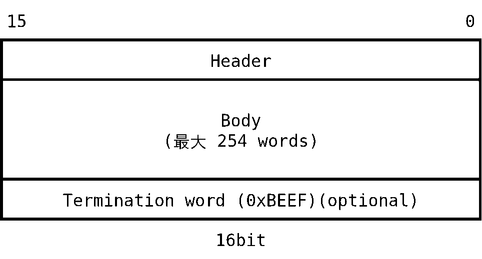

Packets with and without termination words can be mixed when `NTRM = 1`, but error detection is reduced as described below.

## 3.2 Header definition

The header identifies the opcode, option, and packet length.

`Length` is the number of words in the body **including** the termination word. For example, a one-word command body uses `Length = 2`. In no-termination mode, the numeric length does not change; the position that would contain the termination word is still counted. For `NOP` with `Length = 0`, the termination word is omitted.

## 3.3 Command-format error checking

Hardware checks:

1. Whether the word at the position specified by `Length` is `0xBEEF` when termination checking is enabled.
2. Whether `Length` is legal for the selected opcode/option. For example, `Write PE register` has a fixed length of 2.

A detected error sets **Command Sync Error** (`CSE`) in the Interrupt Status register.

- With normal termination format, both checks are available.
- With `NTRM = 1`, only command-specific length consistency can be checked reliably.
- When `NTRM = 1`, a non-`0xBEEF` word at the nominal termination position is treated as the next command header, which permits mixed packet styles.

The HuC6273 continues running after a sync error, but subsequent words may already have been misinterpreted. Apply a software restart through the Status Control register before resuming the stream.

Exceptions:

- A variable-length primitive command with `Length = 0` is not necessarily reported as an error. The command does not terminate correctly and following commands are not executed; software restart is required.
- In no-termination mode, a fixed-length command whose declared length is larger than the correct length may execute normally with the excess length ignored. This case may not be reported.

## 3.4 Opcode and option summary

| Opcode | Command | Options |
|---:|---|---|
| `0` | NOP | `0` |
| `1` | Triangle strip | vertex color / facet color / texture map / default color, with no normal, vertex normal, or facet normal as supported |
| `2` | Triangle list | same rendering variants as triangle strip |
| `3` | Poly line | vertex, facet, or default color; no, vertex, or facet normal as supported |
| `4` | Line list | vertex, facet, or default color; no, vertex, or facet normal as supported |
| `5` | Reserved | — |
| `6` | Put image | D/Z buffer, texture buffer, or D/Z with explicit D/Z values |
| `7` | Read pixel | D/Z buffer or texture buffer |
| `8` | Write TE register | matrix, lighting, control, clip, scaling, mesh, UV offset, default color, or addressed TE register |
| `9` | Write PE register | texture/target/mask/control/clear/frame/offset registers |
| `A` | Miscellaneous | fill, vertex test, TE sync, matrix operations/copies |
| `B` | Reserved | — |
| `C` | Read TE register | addressed TE register |
| `D` | Read PE register | addressed PE register |
| `E` | Write LUT | overlay lookup table |
| `F` | Read LUT | overlay lookup table |

Use only opcode/option combinations listed by the device. Reserved combinations are undefined.

## 3.5 General 3D drawing rules

1. For strips, the color value attached to the third/last vertex of each newly formed triangle is the triangle color where the selected shading mode uses that association.
2. Facet data is associated with the completed primitive, not with every source vertex.
3. Vertex and facet normal vectors must be normalized to length 1 before submission.
4. Texture coordinates are offset by the TE UV Offset register and wrap when the result exceeds 255.
5. Default-color variants use the TE Default Color register. For textured lighting variants, its intensity component participates in the lighting calculation.
6. Fixed-point fields must use the exact signed format specified for the command. Saturation and truncation follow the hardware datapath.
7. Configure matrices, light vectors, TE/PE control, clipping, scaling, target buffers, texture bank, depth mode, and UV offset before issuing primitives.
8. In 320 × 200 mode, hardware maps logical coordinates into its 256 × 256 physical memory organization. Software continues to use logical display coordinates.
9. The mesh, clipping, transparency, depth, blending, flash, and write-mask functions are controlled by TE/PE registers and affect later primitives until changed.
10. Initialize all registers whose reset state is undefined.

# 3.6 Command details

## 3.6.1 NOP (`0x0`)

Performs no rendering operation. `Length = 0`, and no termination word is required. NOP may be used for alignment or deliberate command-stream spacing.

## 3.6.2 Triangle strip (`0x1`)

A strip forms the first triangle from vertices 0–2 and each later triangle from the prior two vertices plus one new vertex. Vertex winding alternates as the strip advances.

### 3.6.2.1 Vertex color, no normal

Up to 63 vertices (61 triangles) fit in one command; the maximum packet length is 253 words (`4 × 63 + 1`). Each vertex supplies position and color.

### 3.6.2.2 Vertex color, vertex normal

Up to 36 vertices (34 triangles); maximum length 253 (`7 × 36 + 1`). Each vertex supplies position, color, and a normalized normal vector. Lighting is evaluated per vertex.

### 3.6.2.3 Facet color, facet normal

Up to 37 vertices (35 triangles); maximum length 253 (`7 × 37 - 8 + 1`). The first two vertices do not carry facet color/normal because they do not complete a triangle. Each later vertex completes one facet and supplies its color and normalized facet normal.

### 3.6.2.4 Texture map, no normal

Up to 50 vertices (48 triangles); maximum length 251 (`5 × 50 + 1`). Each vertex supplies position and UV. The TE UV Offset is added to U and V, with 8-bit wraparound.

### 3.6.2.5 Texture map, vertex normal

Up to 31 vertices (29 triangles); maximum length 249 (`8 × 31 + 1`). Each vertex supplies position, UV, and normalized normal. The intensity portion of TE Default Color is used in the lighting calculation.

### 3.6.2.6 Texture map, facet normal

Up to 32 vertices (30 triangles); maximum length 251 (`8 × 32 - 6 + 1`). The first two vertices have no facet normal. Later vertices complete facets and provide normalized facet normals. Default-color intensity participates in lighting; UV offset applies.

### 3.6.2.7 Default color, no normal

Draws the strip using TE Default Color.

### 3.6.2.8 Default color, vertex normal

Uses TE Default Color and per-vertex normalized normals for lighting.

### 3.6.2.9 Default color, facet normal

Uses TE Default Color and one normalized normal per completed facet.

## 3.6.3 Triangle list (`0x2`)

Every group of three vertices forms an independent triangle.

### 3.6.3.1 Vertex color, no normal

Up to 63 vertices (21 triangles); maximum length 253 (`12 × 21 + 1`).

### 3.6.3.2 Vertex color, vertex normal

Up to 36 vertices (12 triangles); maximum length 253 (`21 × 12 + 1`).

### 3.6.3.3 Facet color, facet normal

Up to 19 triangles; maximum length 248 (`13 × 19 + 1`). Each triangle carries one facet color and one normalized facet normal.

### 3.6.3.4 Texture map, no normal

Each vertex supplies position and UV. TE UV Offset is added before texture lookup.

### 3.6.3.5 Texture map, vertex normal

Each vertex supplies position, UV, and a normalized normal. Default-color intensity participates in lighting.

### 3.6.3.6 Texture map, facet normal

Up to 14 triangles; maximum length 253 (`18 × 14 + 1`). Each triangle supplies one normalized facet normal; UV offset and default-color intensity apply.

### 3.6.3.7 Default color, no normal

Draws each independent triangle using TE Default Color.

### 3.6.3.8 Default color, vertex normal

Uses TE Default Color and normalized per-vertex normals.

### 3.6.3.9 Default color, facet normal

Uses TE Default Color and one normalized normal per triangle.

## 3.6.4 Poly line (`0x3`)

Draws a connected sequence of line segments.

### 3.6.4.1 Vertex color, no normal

Each vertex carries position and color; adjacent vertices form one segment.

### 3.6.4.2 Vertex color, vertex normal

Each vertex additionally supplies a normalized normal for lighting.

### 3.6.4.3 Facet color, facet normal

The first vertex has no facet color or normal because it does not complete a segment. Each subsequent vertex completes one segment and supplies its facet color and normalized facet normal.

### 3.6.4.4 Default color, no normal

Uses TE Default Color for the connected line.

### 3.6.4.5 Default color, vertex normal

Uses TE Default Color and normalized per-vertex normals.

### 3.6.4.6 Default color, facet normal

Uses TE Default Color; the first vertex has no facet normal and each later vertex supplies the normal for the completed segment.

## 3.6.5 Line list (`0x4`)

Every pair of vertices forms an independent line.

### 3.6.5.1 Vertex color, no normal

Each endpoint carries position and color.

### 3.6.5.2 Vertex color, vertex normal

Each endpoint also carries a normalized normal.

### 3.6.5.3 Facet color, facet normal

Each line carries one facet color and one normalized facet normal.

### 3.6.5.4 Default color, no normal

Uses TE Default Color.

### 3.6.5.5 Default color, vertex normal

Uses TE Default Color and normalized endpoint normals.

### 3.6.5.6 Default color, facet normal

Uses TE Default Color and one normalized normal per line.

## 3.6.6 Put image (`0x6`)

In 320 × 200 mode, address conversion into the 256 × 256 physical organization is automatic.

### 3.6.6.1 To D/Z buffer

Transfers image data to the rectangle bounded by `x left`, `y top`, `x right`, and `y bottom` in the display buffer. The associated Z-buffer area is handled according to PE target/control settings.

### 3.6.6.2 To texture buffer

Transfers image data to the selected texture-buffer bank and rectangular region. The active bank is selected by the PE Texture Select register.

### 3.6.6.3 To D/Z with explicit D/Z values

Transfers paired image and depth data into corresponding display- and Z-buffer rectangles. PE target, write-enable, mask, and depth controls still apply.

## 3.6.7 Read pixel (`0x7`)

### 3.6.7.1 From D/Z buffer

Reads one display- or Z-buffer pixel at the specified X/Y address. PE Target selects the source. The value is placed in the Read Back register and completion is reported through status/interrupt state.

### 3.6.7.2 From texture buffer

Reads one pixel from the selected texture-buffer bank at the specified X/Y address. The result is placed in the Read Back register.

## 3.6.8 Write TE register (`0x8`)

### 3.6.8.1 Object matrix `[4][4]`

Sets the 4 × 4 object-transformation matrix. Initial value after power-on/hard reset is undefined.

### 3.6.8.2 Normal matrix `[3][3]`

Sets the 3 × 3 matrix used to transform normal vectors. Initial value is undefined.

### 3.6.8.3 Light 1 vector `[3]`

Sets the world-coordinate direction of directional light 1. Normalize the vector to length 1.

### 3.6.8.4 Light 2 vector `[3]`

Sets the world-coordinate direction of directional light 2. Normalize the vector to length 1.

### 3.6.8.5 Light coefficients `[5]`

Sets coefficients for lighting. Each coefficient represents light intensity multiplied by its reflection coefficient.

### 3.6.8.6 TE control register

Controls transformation, lighting, perspective/division, clipping, culling, mesh, and related TE functions. Some bypass combinations reduce coordinate-transformation time. Keep reserved bits zero.

### 3.6.8.7 Window clip register

Defines the rectangular region in which 3D drawing is permitted. Logical coordinates are used in 320 × 200 mode.

### 3.6.8.8 Window scaling register

Holds coefficients that map normalized screen coordinates into device coordinates, supporting enlargement, reduction, and X/Y translation.

### 3.6.8.9 Mesh pattern register

Selects the bit pattern used for mesh drawing when mesh mode is enabled by the TE control field.

### 3.6.8.10 Source matrix `[4][4]`

Sets the source matrix used by TE matrix-operation commands.

### 3.6.8.11 Source matrix `[6]`

Sets the six source values used by `Vertex test`: X maximum/minimum, Y maximum/minimum, and Z maximum/minimum. Initialize them to the correct extreme values before testing a vertex set.

### 3.6.8.12 UV offset register

Adds an offset to U and V supplied by textured primitive packets. Results wrap modulo 256.

### 3.6.8.13 Default color register

Specifies the default color for polygon and line variants. Only the low 12 bits are valid; write zero to the upper four bits.

### 3.6.8.14 Addressed TE-register write

Writes an internal TE register by supplying its register address and value. Registers that are write-only through this command may still be readable through the corresponding `Read TE register` command where documented.

## 3.6.9 Write PE register (`0x9`)

### 3.6.9.1 Texture Select register

Selects the texture bank used by later textured 3D draws, `Put image (to texture buffer)`, and `Read pixel (from texture buffer)`.

### 3.6.9.2 Target register

Selects destination buffers for `Put image` and source buffers for `Read pixel`. It also contains write-buffer enables and read-buffer selection fields.

### 3.6.9.3 Mask register

Masks display-buffer writes bit by bit. A mask bit of 1 permits writing; 0 preserves the destination bit. Reset value is all ones.

### 3.6.9.4 PE control register

Controls depth comparison, transparency, blending, flash substitution, texture/pixel interpretation, and related raster operations. Some combinations improve performance when Z comparison is disabled; other combinations do not. Use only the documented state table.

### 3.6.9.5 Clear Z Value register

Value used to clear the Z buffer. Reset value is `0x0000`, representing the farthest value in the documented depth convention.

### 3.6.9.6 Frame Control register

Selects display/write buffer arrangement, swapping behavior, and related frame state. Program it in coordination with Display Control and only after dependent engines are idle.

### 3.6.9.7 Clear Color Value register

Color value used by automatic or explicit buffer clear. Reset value is `0x0000`.

### 3.6.9.8 I-C Mask register

Selects which intensity and color-component bits are significant in the relevant indexed/intensity-color operation. The documented default corresponds to the standard I/C partition.

### 3.6.9.9 Flash I-C Value register

In flash drawing mode, replaces the source pixel’s intensity and/or color component with the programmed value before writing. Interpretation depends on indexed or direct mode.

### 3.6.9.10 Clear Texture Select register

Selects the texture image copied during automatic clear-from-texture mode.

### 3.6.9.11 Clear Mask register

Masks bits during clear operations. Reset value is `0xFFFF`.

### 3.6.9.12 CWT/DTT offsets

Clear-with-texture (CWT) and display-to-texture (DTT) operations add X/Y offsets to the selected source texture image. In 320 × 200 mode the logical wrap dimensions are 320 × 200.

### 3.6.9.13 CWT X Offset register

Sets the horizontal source offset for clear-with-texture. Reset value is `0x0000`.

### 3.6.9.14 CWT Y Offset register

Sets the vertical source offset for clear-with-texture. Reset value is `0x0000`.

## 3.6.10 Miscellaneous commands (`0xA`)

### 3.6.10.1 Fill buffer

Writes specified values into a rectangular display- and Z-buffer area. PE Target `WBSEL`, masks, and other write controls apply; disable one buffer through `WBSEL` when filling only the other.

### 3.6.10.2 Vertex test

Transforms a list of model-coordinate vertices into view coordinates and accumulates maximum/minimum X, Y, and Z into Source Matrix elements 0–5. Initialize those extrema before starting. Use `TE sync`, then copy/read the results after completion.

### 3.6.10.3 TE sync

When TE reaches this command, it sets the `TESYNC` interrupt/status bit. Waiting for this event guarantees that all earlier commands have completed in the TE stage, though later PE work may still be active.

### 3.6.10.4 Matrix operations

The HuC6273 can operate as a matrix processor. It uses:

- `Msrc`: source matrix;
- `Mcmd`: command/object matrix;
- `Mdst`: destination matrix.

Fixed-point formats include 1.0.15 and 1.8.7. Use the format matching the selected opcode and ensure operands are scaled to avoid overflow.

### 3.6.10.5 Matrix op, 3 × 1, 1.0.15

Computes `Mdst[3] = Msrc × Mcmd[3]`. The multiply-accumulate result follows the 1.0.15 fixed-point truncation/saturation rules.

### 3.6.10.6 Matrix op, 4 × 4, 1.0.15

Computes `Mdst[4][4] = Mcmd[4][4] × Msrc[4][4]` in 1.0.15 format.

### 3.6.10.7 Matrix op, 3 × 3, 1.0.15

Computes `Mdst[3][3] = Mcmd[3][3] × Msrc[3][3]` in 1.0.15 format.

### 3.6.10.8 Matrix op, 4 × 4, 1.8.7

Computes the 4 × 4 product in signed 1.8.7 format.

### 3.6.10.9 Matrix op, 3 × 3, 1.8.7

Computes the 3 × 3 product in signed 1.8.7 format.

### 3.6.10.10 Destination-to-source copy

Copies Destination Matrix `[4][4]` to Source Matrix `[4][4]`.

### 3.6.10.11 Destination-to-object copy

Copies Destination Matrix `[4][4]` to TE Object Matrix `[4][4]`.

### 3.6.10.12 Destination-to-normal copy

Copies Destination Matrix `[3][3]` to TE Normal Matrix `[3][3]`.

### 3.6.10.13 Destination-to-result copy

Copies Destination Matrix `[4][4]` to memory-mapped Result registers 0–15. Wait for command completion before reading them.

### 3.6.10.14 Source-to-result copy

Copies TE Source Matrix elements 0–5 to Result registers 0–5, normally to retrieve `Vertex test` extrema.

### 3.6.10.15 Result-to-source copy

Copies Result registers into TE Source Matrix so that a previously exported matrix result can be reused as a later matrix operand.

### 3.6.10.16 Destination-to-Light-1 copy

Copies Destination Matrix row/element group `[0][3]` to TE Light 1 Vector `[3]`.

### 3.6.10.17 Destination-to-Light-2 copy

Copies Destination Matrix row/element group `[0][3]` to TE Light 2 Vector `[3]`.

## 3.6.11 Read TE register (`0xC`)

Reads the addressed TE register into the Read Back register. Use the TE-register address table from the addressed write command, then wait for completion before reading the result.

## 3.6.12 Read PE register (`0xD`)

Reads the addressed PE register into the Read Back register. Valid addresses are listed in the PE register table.

## 3.6.13 Write LUT (`0xE`)

Writes entries in the lookup table used by the 2-bit overlay plane. Initialize the LUT before enabling overlay (`OLEN = 1`).

## 3.6.14 Read LUT (`0xF`)

Reads the selected overlay-LUT entry into the Read Back register.

## Command-stream cautions

- Verify FIFO capacity for the whole burst being written.
- Use `0xBEEF` termination consistently unless no-termination mode is deliberately enabled.
- Do not use a zero length for variable-length primitive commands.
- Apply software restart after command sync error or FIFO overflow.
- Use TE sync for TE ordering, and separately wait for PE/sprite/memory busy fields when those blocks own the relevant data.
- Treat undefined reset values as uninitialized state.

# Original Figures Retained from the Source

The following figures are included in their original, unmodified form and in source order. Text embedded in these images remains Japanese.

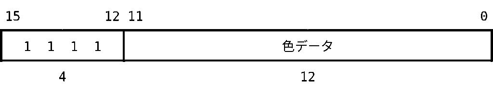

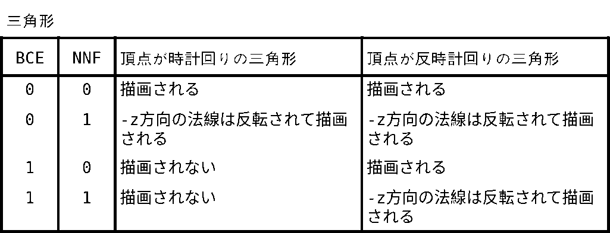

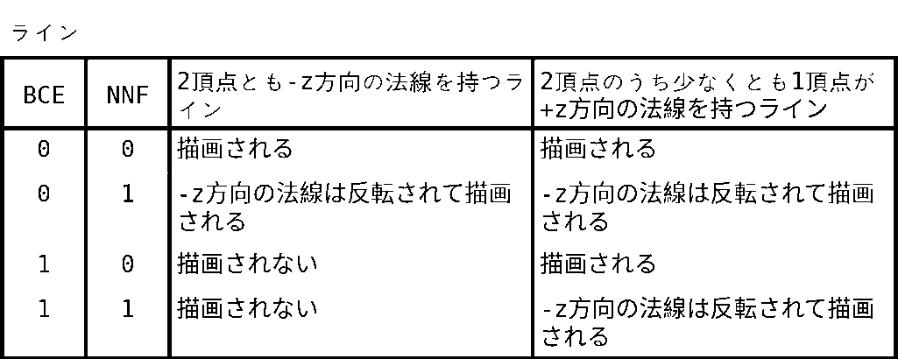

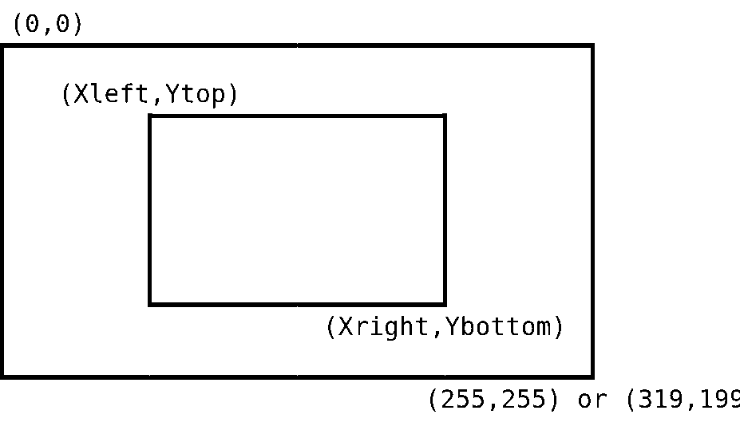

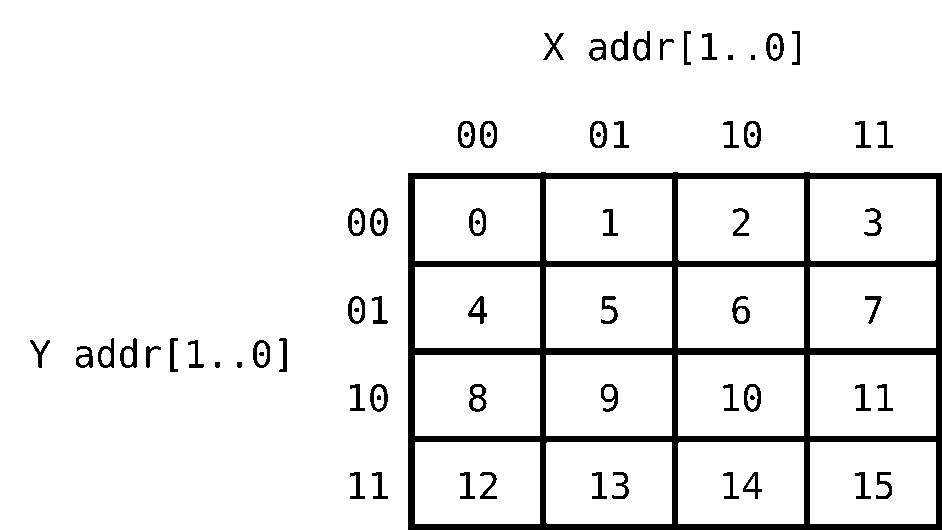

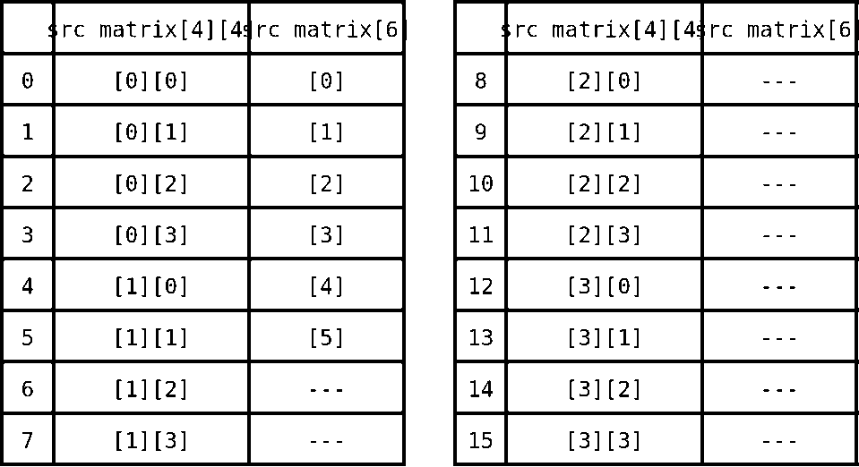

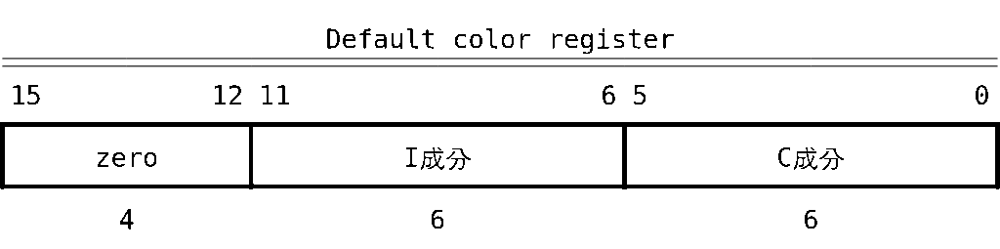

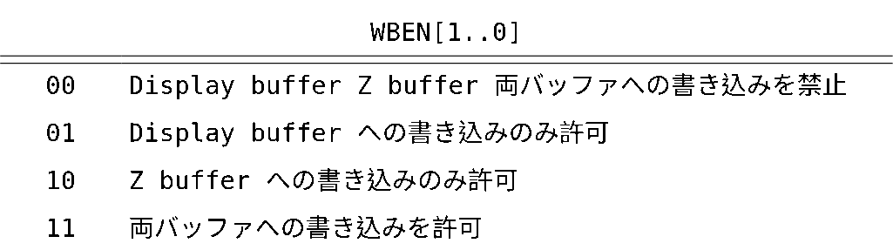

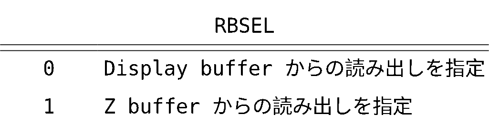

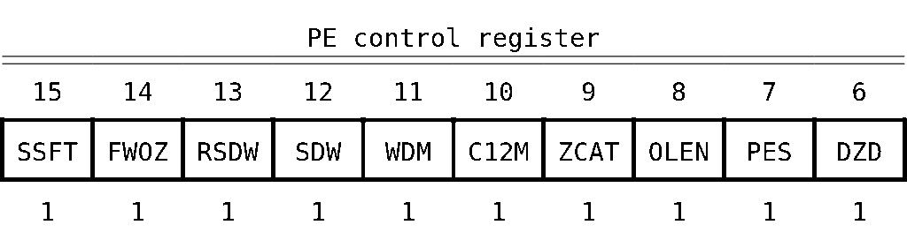

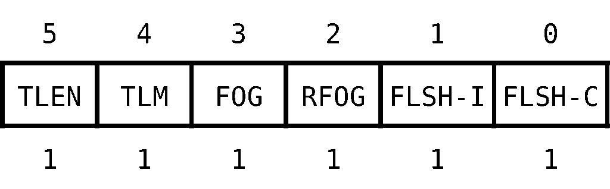

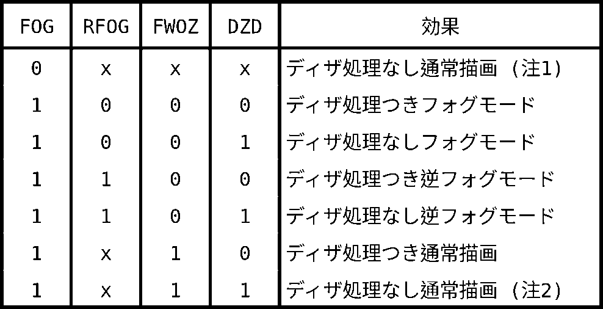

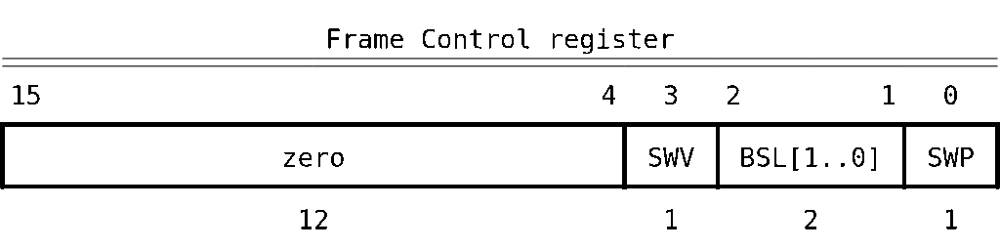

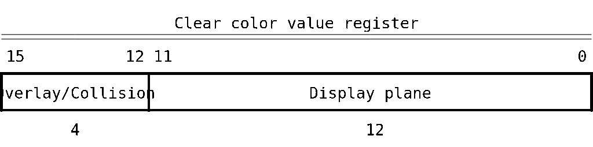

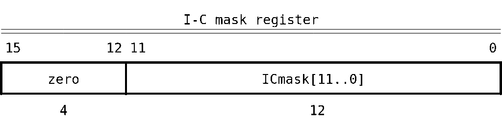

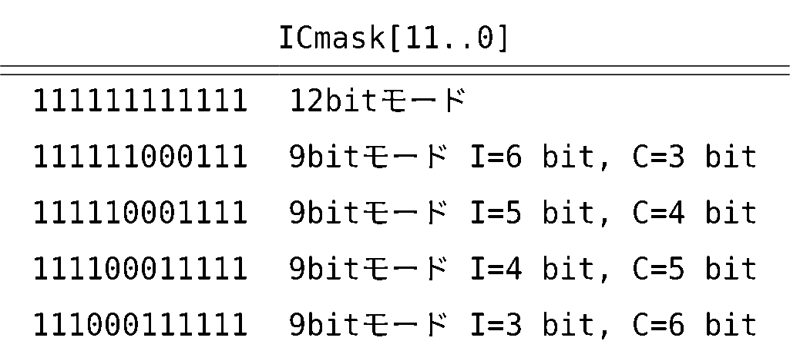

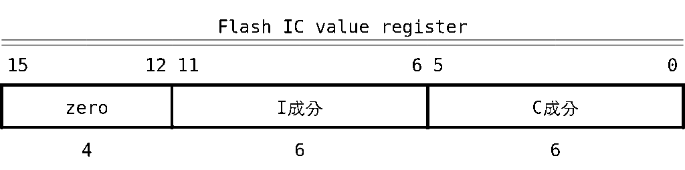

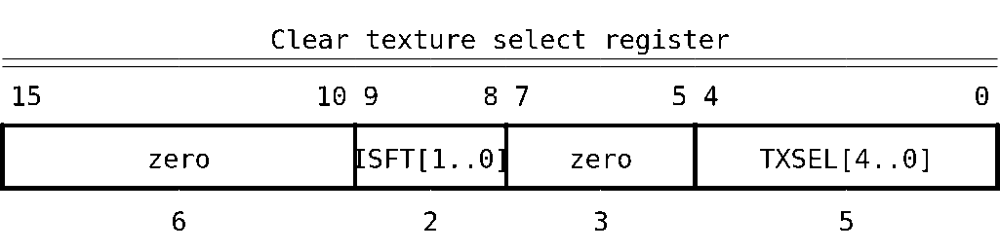

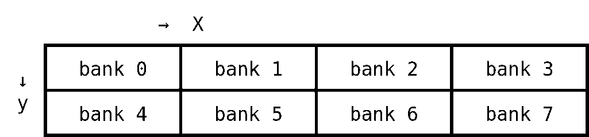

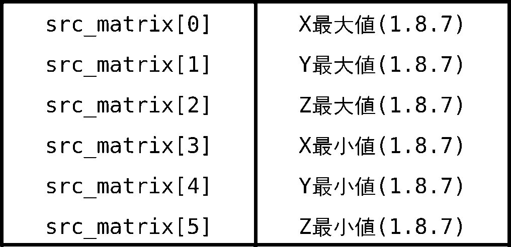

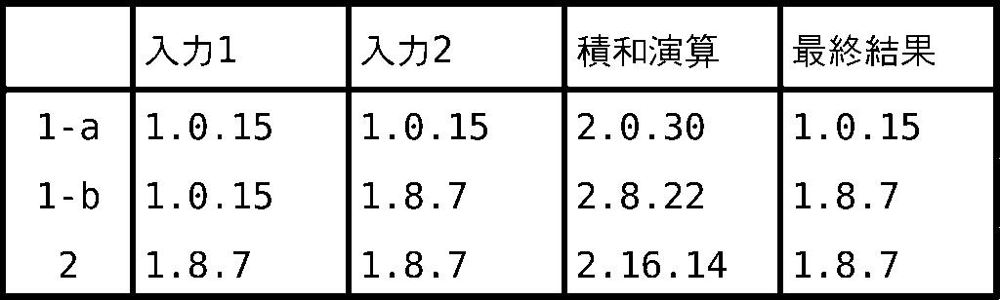

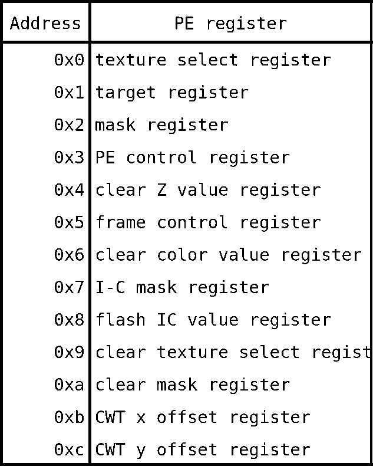
