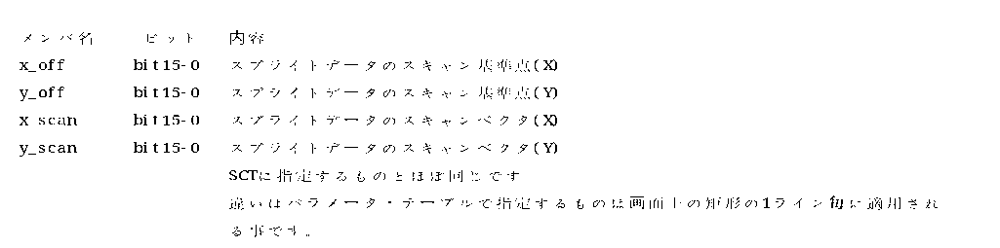
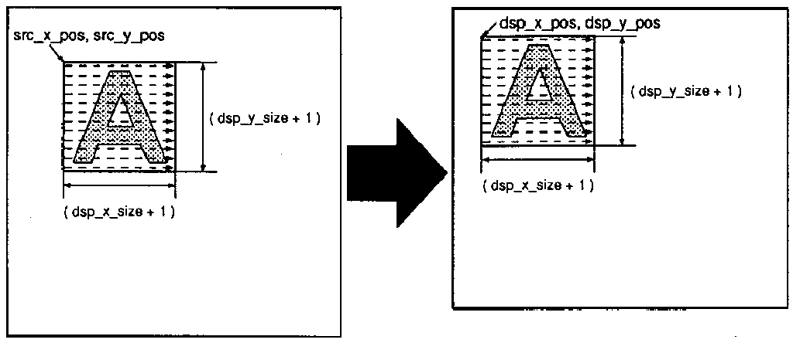
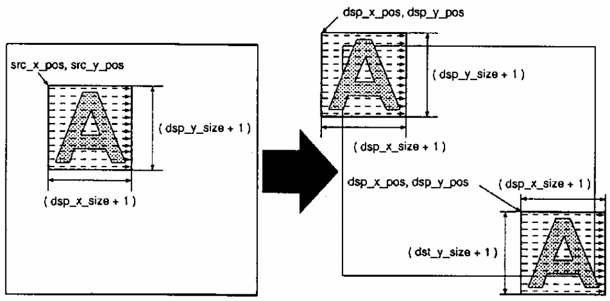
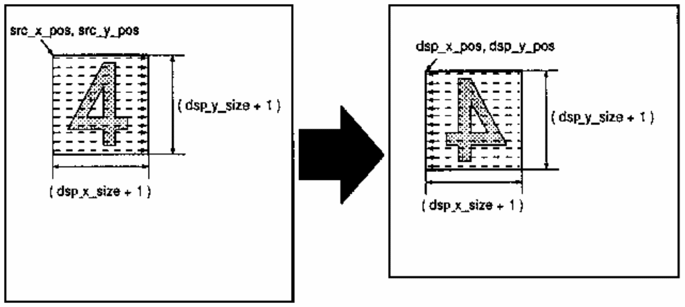
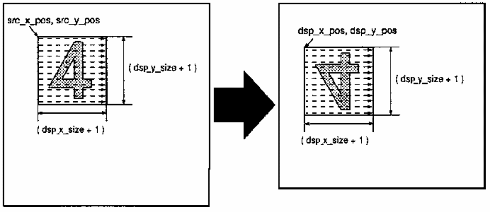

# PC-FXGA Authoring Software

# “GMAKER” Starter Kit (Version 1.0)

# Device Notes: HuC6273 Sprite Supplement

NEC Home Electronics, Ltd.  
November 10, 1995

## Contents

1. Introduction
   - 1.1 Features of the HuC6273 sprite function
   - 1.2 Terminology
   - 1.3 SCT (Sprite Control Table)
   - 1.4 Parameter tables
2. Creating an SCT and executing drawing
   - 2.1 Creating an SCT for a simple sprite
   - 2.2 Loading an SCT
   - 2.3 Executing drawing
3. Enlarging, reducing, and rotating sprites
   - 3.1 Enlargement and reduction
   - 3.2 Rotation
   - 3.3 Scan-start precision and offset
4. Transforming sprites with parameters
   - 4.1 Trapezoidal transformation
   - 4.2 Simulating raster scrolling
   - 4.3 Loading a parameter table
5. Using other functions
   - 5.1 Z-value priority control
   - 5.2 Using collision detection
   - 5.3 Vertical raster scrolling
   - 5.4 Improving performance

# Chapter 1: Introduction

This document briefly summarizes how to use the HuC6273 sprite function.

The HuC6273 sprite function is extremely flexible, but its parameter settings are correspondingly complex and require care. The ASL library, its source code, and ASL sample programs are provided to aid understanding. It is difficult to cover every function, however, and ASL implements only the functions expected to be used relatively often.

Because ASL is provided as sample code, optimizations that would reduce source readability were intentionally avoided. To improve performance, you must understand the sprite function and manipulate SCTs and scan-parameter tables directly.

This document uses symbols and structures defined by ASL. See `asl.h` for details.

## 1.1 Features of the HuC6273 sprite function

### No per-scanline sprite-count limit

Unlike common line-buffer sprite systems, the HuC6273 imposes no limit on the number of sprites visible on one line. HuC6273 sprites are written into the display buffer, so multiple sprites do not have to be rendered simultaneously.

### Drawing takes time

The HuC6273 sprite unit is fundamentally a display-buffer drawing mechanism. Writing the display buffer therefore takes time proportional to the sprite area. A simple calculation suggests that roughly 600 sprites of 16 × 16 pixels could be drawn per 1/60 second, but contention with 3D drawing, screen clearing, and other accesses will substantially reduce the practical number. The time required to prepare and load SCTs must also be considered.

Reducing the frame rate—for example, from 60 to 30 frames per second—provides more drawing time and allows more sprites to be rendered.

### Sprite priority can be controlled with the Z buffer

Use Z-value comparison and assign larger Z values to higher-priority sprites to control overlap priority. Without this function, priority depends on drawing order: later sprites have higher priority.

### Sprite-to-sprite collision detection

The unused upper four bits of the display buffer can be used to detect collisions between sprites. These bits are also used by hidden clear, overlay-plane display, and dithering, so do not assign the same bits to multiple functions simultaneously.

## 1.2 Terminology

### SCT

SCT is short for **Sprite Control Table**, a table containing the parameters required to draw a HuC6273 sprite.

Strictly speaking, an SCT is the table read from the texture buffer by the sprite engine. In this document, however, a table created in main memory for later transfer to the texture buffer is also called an SCT.

### ASL

ASL is a sprite-drawing library designed primarily to make the HuC6273 sprite function relatively easy to use without detailed hardware knowledge. It is not especially efficient for production use. After learning the hardware, directly creating or modifying SCTs is often preferable.

### FARL

FARL is the lowest-level library for using the HuC6273. `farl.h` defines symbols such as memory-mapped register addresses and is useful for hardware-level operations.

### Collision-detection function

This function detects and reports overlap between sprites.

Although HuC6273 sprites are fundamentally rectangular, transparent texels do not participate in collision detection, so arbitrary shapes can be tested.

The chip can also test collisions without displaying a sprite. You can therefore use one visible sprite with collision detection disabled and a second invisible collision sprite, allowing the collision shape to differ from the visible shape.

### Hidden clear

The display buffer normally has to be cleared before drawing, and clearing takes time. Hidden clear makes that clearing time effectively zero. See the HuC6273 manual for details.

### Dithering

Dithering compensates for insufficient color resolution in 3D rendering. The HuC6273 can add hardware-generated random values to pixel luminance. It is unrelated to sprite drawing except that the random-value storage bits are shared with collision detection. See the HuC6273 manual for details.

### Fixed-point representation

The HuC6273 uses fixed-point numbers for 3D calculations and sprite scan parameters. Formats are written as:

`(sign bits).(integer bits).(fraction bits)`

Many 3D-block values use 1.0.15 or 1.8.7 format, whereas sprite parameters use 1.7.8 format. To convert an ordinary integer to 1.7.8 fixed point, multiply it by 256 (`2^8`), ignoring overflow.

### Texel

Texel is short for **texture cell**. In texture mapping, it distinguishes a pixel in texture data from a displayed pixel. Because the HuC6273 draws sprite patterns stored in the texture buffer, this document calls a sprite-pattern element a *texel* and reserves *pixel* for an element in the display buffer.

## 1.3 SCT (Sprite Control Table)

An SCT contains the information required to draw a sprite. One entry consists of 16 words. SCTs reside in the texture buffer; when drawing begins, the HuC6273 is given the bank address and related information, reads the SCT, and renders the sprite.

ASL defines an SCT as follows. Subsequent explanations use structures and symbols from `asl.h` and `farl.h`.

```c
typedef struct {
    unsigned short head;
    unsigned short cntl;
    unsigned short dsp_x_pos;
    unsigned short dsp_y_pos;
    unsigned short dsp_xy_size;
    unsigned short src_xy_pos;
    unsigned short z;
    unsigned short src_xy_size;
    short          src_x_off;
    short          src_y_off;
    short          src_x_scan;
    short          src_y_scan;
    unsigned short pt_bank_sel;
    unsigned short pt_off_addr;
    unsigned short reserved1;
    unsigned short reserved2;
} ASLSct;
```

### SCT members

| Member | Bits / mask | Meaning |
|---|---|---|
| `head` | 15–13, `ASL_MSK_FNC_LVL` | Function level. Selects the sprite display function, including non-display modes. |
|  | 9, `ASL_MSK_V_FLIP` | Vertical flip. Set to 1 to draw upside down. |
|  | 8, `ASL_MSK_H_FLIP` | Horizontal flip. Set to 1 to draw left-right reversed. |
|  | 4–0, `ASL_MSK_BANKSEL` | Bank containing the sprite pattern. |
| `cntl` | 15, `ASL_MSK_CDEN` | Collision detection enable. Set to 1 to perform collision detection. |
|  | 14, `ASL_MSK_GHST` | Ghost/invisible mode. When 1, nothing is written to the visible display plane, but the collision plane is still written, producing an invisible collision sprite. |
|  | 13, `ASL_MSK_ZCMP` | Z comparison enable. When 1, a pixel is drawn only if the sprite Z value is equal to or greater than the Z-buffer value. |
|  | 12, `ASL_MSK_ZWEN` | Z write enable. When 1, the sprite Z value is written to the Z buffer. |
|  | 10–8, `ASL_MSK_CDRES_IDX` | Selects the field of the memory-mapped CD result register that receives the collision result. |
|  | 7–4, `ASL_MSK_FLAG_SET` | Value written into the collision-bit plane, the upper four bits of the display buffer. |
|  | 3–0, `ASL_MSK_FLAG_CHK` | Collision-evaluation mask. Collision-plane data is ANDed with this field for testing. |
| `dsp_x_pos` | 9–0, `ASL_MSK_DSP_X_POS` | X coordinate of the displayed sprite. |
| `dsp_y_pos` | 8–0, `ASL_MSK_DSP_Y_POS` | Y coordinate of the displayed sprite. Together these specify the upper-left corner of the rectangle scanned in the display buffer. |
| `dsp_xy_size` | 15–8, `ASL_MSK_DSP_Y_SIZE` | Displayed Y size minus 1. |
|  | 7–0, `ASL_MSK_DSP_X_SIZE` | Displayed X size minus 1. |
| `src_xy_pos` | 15–8, `ASL_MSK_SRC_Y_POS` | Y coordinate of the sprite pattern in the texture buffer. |
|  | 7–0, `ASL_MSK_SRC_X_POS` | X coordinate of the sprite pattern in the texture buffer. |
| `z` | 15–0, `ASL_MSK_Z_VAL` | Sprite Z value, used for Z-buffer writes and comparisons. |
| `src_xy_size` | 15–8, `ASL_MSK_SRC_Y_SIZE` | Source pattern Y size minus 1. |
|  | 7–0, `ASL_MSK_SRC_X_SIZE` | Source pattern X size minus 1. Used during scaling and rotation. With `src_xy_pos`, this defines the texture-buffer source rectangle; texels outside it are transparent. |
| `src_x_off` | 15–0, `ASL_MSK_SRC_X_OFF` | X coordinate of the source scan reference/start point. |
| `src_y_off` | 15–0, `ASL_MSK_SRC_Y_OFF` | Y coordinate of the source scan reference/start point. |
| `src_x_scan` | 15–0, `ASL_MSK_SRC_X_SCAN` | X component of the texture scan vector, in 1.7.8 fixed point. |
| `src_y_scan` | 15–0, `ASL_MSK_SRC_Y_SCAN` | Y component of the texture scan vector, in 1.7.8 fixed point. |
| `pt_bank_sel` | 4–0, `ASL_MSK_PT_BANKSEL` | Bank containing the parameter table. |
| `pt_off_addr` | 15–0, `ASL_MSK_PT_OFF_ADDR` | Parameter-table address as an offset from the beginning of the selected bank. |
| `reserved1` | — | Reserved; currently unused. |
| `reserved2` | — | Reserved; currently unused. |

For explanatory purposes, this document sometimes splits `dsp_xy_size`, `src_xy_pos`, and `src_xy_size` into X and Y components named `dsp_x_size`, `dsp_y_size`, `src_x_pos`, `src_y_pos`, `src_x_size`, and `src_y_size`.

## 1.4 Parameter tables

A parameter table is used for special sprite transformations and, like an SCT, resides in the texture buffer.

ASL defines one parameter-table entry as follows:

```c
typedef struct {
    short x_off;
    short y_off;
    short x_scan;
    short y_scan;
} ASLPt;
```

Member details are shown below.



ASL reuses the SCT symbols for parameter-table fields.

# Chapter 2: Creating an SCT and executing drawing

## 2.1 Creating an SCT for a simple sprite

The following C example creates an SCT.

- `sct`: area in which the SCT is created
- `bank`: bank containing the sprite pattern
- `srcX`, `srcY`: position of the sprite pattern within the bank
- `sizeX`, `sizeY`: sprite dimensions
- `dstX`, `dstY`: position at which to draw in the display buffer

```c
sct.head = ASL_VAL_FNC_NORM | (bank & ASL_MSK_BANKSEL);
sct.cntl = 0;
sct.dsp_x_pos = dstX & ASL_MSK_DSP_X_POS;
sct.dsp_y_pos = dstY & ASL_MSK_DSP_Y_POS;
sct.dsp_xy_size =
    ((sizeX - 1) & ASL_MSK_DSP_X_SIZE) |
    (((sizeY - 1) << ASL_SFT_DSP_Y_SIZE) & ASL_MSK_DSP_Y_SIZE);
sct.src_xy_pos =
    (srcX & ASL_MSK_SRC_X_POS) |
    ((srcY << ASL_SFT_SRC_Y_POS) & ASL_MSK_SRC_Y_POS);
```

`ASL_VAL_FNC_NORM` selects the simplest sprite-drawing function level. It copies a rectangular sprite from the texture buffer to the display buffer without scaling, rotation, or other advanced processing.

At this function level, only the first six words of the SCT are used. Because the source pattern and displayed sprite have the same dimensions, `src_xy_size` need not be set; the hardware uses `dsp_xy_size`.



**Texture buffer / display buffer**  
Figure 1: Drawing a sprite

Negative `dsp_x_pos` or `dsp_y_pos` coordinates allow a sprite to extend beyond the left or top edge of the screen.



**Texture buffer / display buffer**  
Figure 2: Drawing a sprite partly outside the screen

`dsp_x_pos` is 10 bits wide, allowing coordinates from -512 through 511. `dsp_y_pos` is 9 bits wide, allowing coordinates from -256 through 255.

Set bit 8 of `head` to draw the SCT horizontally flipped:

```c
sct.head |= ASL_VAL_H_FLIP;
```



**Texture buffer / display buffer**  
Figure 3: Horizontal flip

Likewise, set bit 9 for a vertical flip:

```c
sct.head |= ASL_VAL_V_FLIP;
```



**Texture buffer / display buffer**  
Figure 4: Vertical flip

Horizontal and vertical flipping are implemented by changing the scan direction used while writing the display buffer.

## 2.2 Loading an SCT

An SCT must be placed in the texture buffer. Two methods are available.

### Use the Put Image command

This method is primarily intended for images. To place an SCT, either preprocess the data to account for I-C-mode packing or use index mode. Coordinate-to-address conversion is also required because the command specifies coordinates rather than a raw address. It is therefore not well suited to SCT transfer and is not described further here.

### Use texture-buffer direct access

The 192-KB region beginning at `FARL_TEXTURE_BUFFER` provides direct texture-buffer access. To load SCTs or parameter tables, use the 64-KB portion accessible in packed mode. When used for SCTs and parameter tables, the texture buffer may be treated as a contiguous 64-KB memory space; this is the recommended method.

Before writing by direct access, select the bank with the CMT bank select register. Although that register is nominally for the CMT function, it is shared because the CMT also resides in the texture buffer.

After bank selection, the selected bank is mapped into the region beginning at `FARL_TEXTURE_BUFFER`; transfer the data into that region.

- `bank`: bank to receive the SCT
- `sct`: buffer containing the SCT
- `sctNo`: destination SCT number within the bank

```c
unsigned short *src, *dst;
int i;

FarlSetMemReg(FARL_CMT_BANK_SELECT_REG, bank);

src = (unsigned short *)sct;
dst = (unsigned short *)(FARL_TEXTURE_BUFFER + (32 * sctNo));

for (i = 0; i < 16; i++) {
    dst[i] = src[i];
}
```

ASL and FARL identify the destination by an SCT number in 32-byte units rather than by a byte offset. One bank holds 2,048 SCTs, so valid SCT numbers are 0 through 2,047. The memory-mapped registers used to execute drawing likewise take a value in 32-byte units.

## 2.3 Executing drawing

Before drawing a sprite, inspect the `SBSY` bit in the Misc Status register and verify that no sprite operation is already running. If one is active, wait for it to finish.

```c
while (FarlGetMemReg(FARL_MISC_STATUS_REG) & FARL_MISC_STATUS_SBSY)
    ;
```

When swapping display buffers, also wait for sprite drawing to finish before the swap. The 3D engine executes its command stream sequentially, so all earlier 3D commands are complete when a swap executes. The sprite engine runs in parallel with the 3D engine, so no such guarantee exists for sprite work.

After a swap, wait for the swap to complete before beginning sprite drawing for the next frame; otherwise sprite drawing may begin against the wrong buffer. SCTs for the next frame may nevertheless be prepared and transferred before the swap.

To execute sprite drawing, write the SCT Address High register and the Sprite Control register. The write to the Sprite Control register actually starts the operation.

- `bank`: bank containing the SCTs to execute
- `sctNo`: first SCT number
- `num`: number of SCTs to execute

```c
FarlSetMemReg(
    FARL_SCT_ADDRESS_REG,
    (num & 0x0700) |
    ((bank & 0x001f) << 3) |
    ((sctNo & 0xff00) >> 8)
);

FarlSetMemReg(
    FARL_SP_CONTROL_REG,
    ((sctNo & 0x00ff) << 8) | (num & 0xff)
);
```

Up to 2,048 SCTs—the maximum that fit in one bank—can be executed in one operation. Specify 2,048 by writing zero in the count field.
