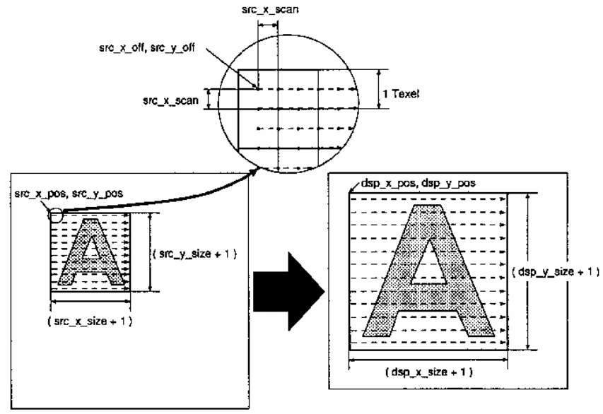
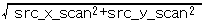
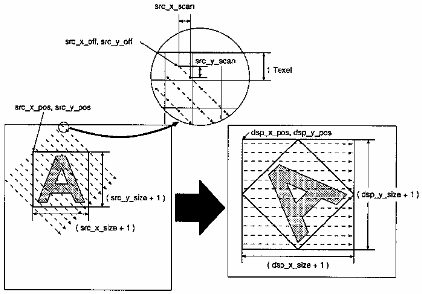
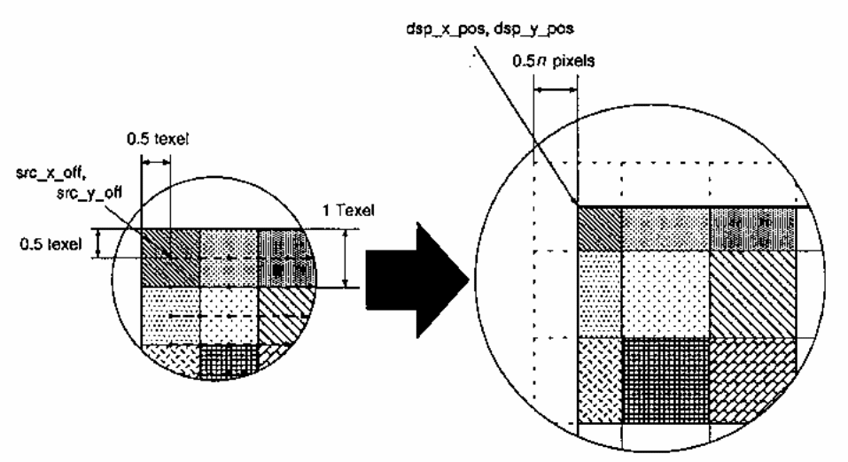
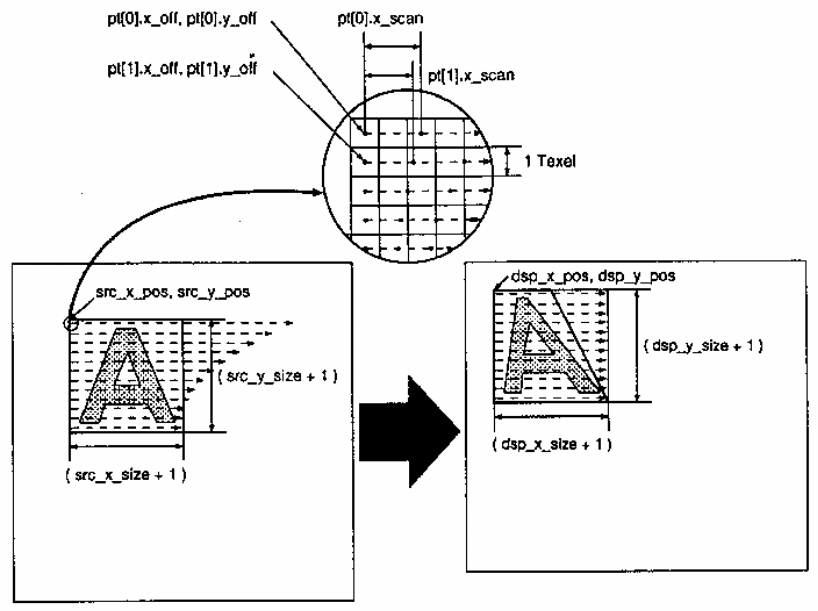
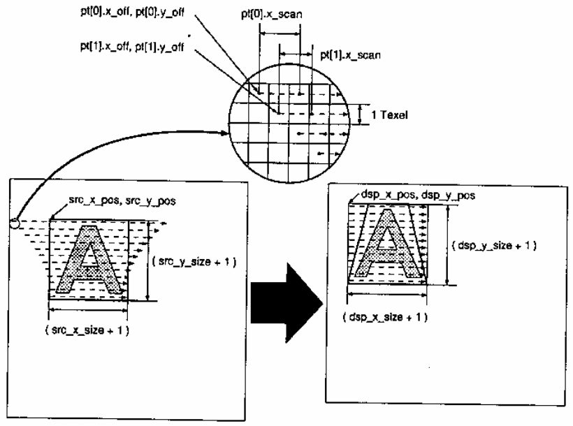
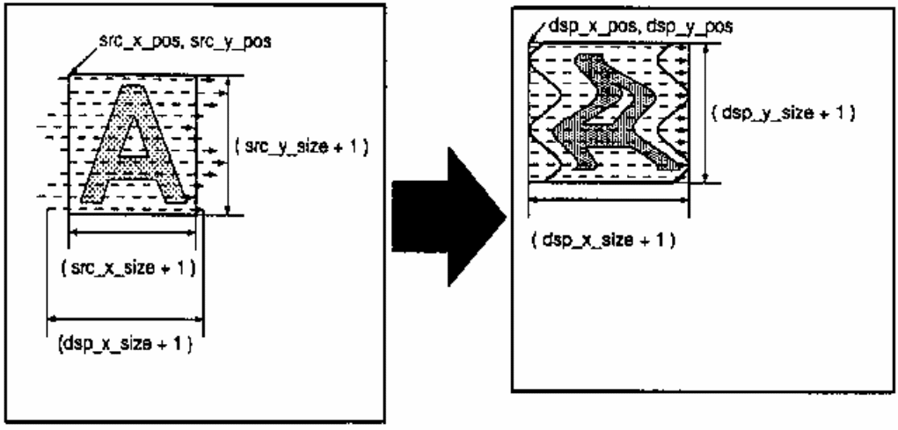
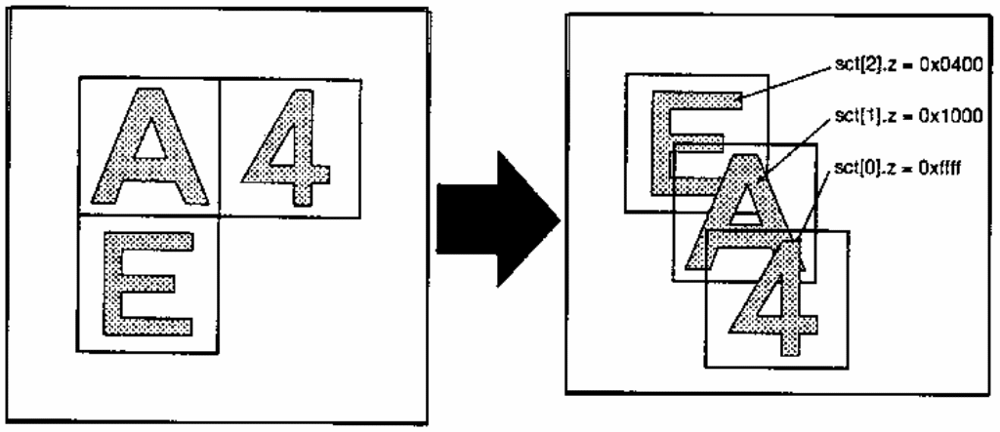
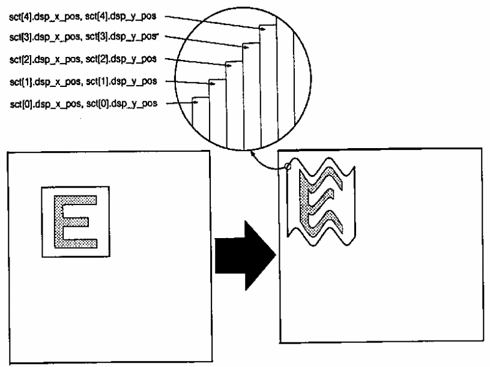

# Chapter 3: Enlarging, reducing, and rotating sprites

To enlarge, reduce, or rotate a sprite, configure the SCT fields `src_x_off`, `src_y_off`, `src_x_scan`, and `src_y_scan`.

## 3.1 Sprite enlargement and reduction

The following C example creates an SCT that draws a sprite at twice its original size.

- `sct`: area in which the SCT is created
- `bank`: bank containing the sprite pattern
- `srcX`, `srcY`: position of the sprite pattern within the bank
- `sizeX`, `sizeY`: sprite dimensions
- `dstX`, `dstY`: destination position in the display buffer

```c
sct.head = ASL_VAL_FNC_ZOOMROT | (bank & ASL_MSK_BANKSEL);
sct.cntl = 0;
sct.dsp_x_pos = dstX & ASL_MSK_DSP_X_POS;
sct.dsp_y_pos = dstY & ASL_MSK_DSP_Y_POS;
sct.dsp_xy_size =
    ((sizeX * 2 - 1) & ASL_MSK_DSP_X_SIZE) |
    (((sizeY * 2 - 1) << ASL_SFT_DSP_Y_SIZE) & ASL_MSK_DSP_Y_SIZE);
sct.src_xy_pos =
    (srcX & ASL_MSK_SRC_X_POS) |
    ((srcY << ASL_SFT_SRC_Y_POS) & ASL_MSK_SRC_Y_POS);
sct.src_xy_size =
    ((sizeX - 1) & ASL_MSK_DSP_X_SIZE) |
    (((sizeY - 1) << ASL_SFT_DSP_Y_SIZE) & ASL_MSK_DSP_Y_SIZE);
sct.src_x_off = 0;
sct.src_y_off = 0;
sct.src_x_scan = 256 / 2;
sct.src_y_scan = 0;
```

Use function level `ASL_VAL_FNC_ZOOMROT` for scaling. This level uses the first 12 words of the SCT. Because the displayed size is doubled, `dsp_x_size` and `dsp_y_size` are set to twice the source size. The original sprite-pattern dimensions must therefore be supplied in `src_x_size` and `src_y_size`, which were not needed at the normal function level.

`src_x_off` and `src_y_off` specify the scan starting point used when reading the sprite pattern from the texture buffer. They are coordinates relative to `src_x_pos` and `src_y_pos`. Both are zero here because scanning begins at the normal upper-left corner.

`src_x_scan` and `src_y_scan` specify how far the texture-buffer scan advances when the display-buffer scan advances by one pixel. For every one-pixel horizontal step in the display buffer, the texture-buffer position advances by `(src_x_scan, src_y_scan)`. At the end of a display-buffer line, the display scan moves down one pixel; in the texture buffer the corresponding advance is `(-src_y_scan, src_x_scan)`.

These fields use 1.7.8 fixed-point format, allowing intervals smaller than one texel. In this example the source must advance half a texel for every destination pixel—one texel for every two destination pixels—so `src_x_scan` is set to half of 256 (`1.0`).

More generally, multiply `dsp_x_size` and `dsp_y_size` by `n` and set `src_x_scan` to `1/n` to enlarge by `n`. To reduce by `n`, divide the destination sizes by `n` and multiply `src_x_scan` by `n`.



**Texture buffer / display buffer**  
Figure 5: Enlarging a sprite

## 3.2 Sprite rotation

Rotation also uses `src_x_off`, `src_y_off`, `src_x_scan`, and `src_y_scan`.

Unlike simple scaling, rotation changes both scan-vector components. Their values depend on the rotation angle and center.

For pure rotation without scaling, choose parameters such that:

`src_x_scan² + src_y_scan² = 1`

For rotation angle `θ`, this normally means setting the X scan component to `cos θ` and the Y scan component to `sin θ`.

For simultaneous scaling by `n`, choose the vector magnitude shown in the following source figure to equal `1/n`, setting the components to `(cos θ)/n` and `(sin θ)/n`.





**Texture buffer / display buffer**  
Figure 6: Rotating a sprite

As shown, the display-buffer scan always proceeds horizontally from left to right, unless `ASL_VAL_H_FLIP` reverses it. It is the texture-buffer scan direction that rotates. To rotate the visible sprite counterclockwise by `θ`, rotate the texture scan clockwise by `θ`.

The rectangle bounded by `src_x_pos`, `src_y_pos`, `(src_x_pos + src_x_size)`, and `(src_y_pos + src_y_size)` acts as a window. Scanned areas outside it are not drawn.

## 3.3 Scan-start precision and offset

`src_x_scan` and `src_y_scan` use 1.7.8 fixed point, so scan intervals can be specified with sub-texel precision. By contrast, `src_x_off` and `src_y_off` are integers and can specify the start only in whole texels. This design preserves the largest possible coordinate range in 16 bits for transformations based on parameter tables.

A 0.5-texel offset is added to the scan start specified by `src_x_off` and `src_y_off`, so sampling begins at the center of a texel.

Consequently, a naive enlargement may cut off half of the leftmost and topmost texels.



**Texture buffer / display buffer**  
Figure 7: Scan-start offset

When scaling or rotating about a point other than the sprite’s upper-left corner, the whole-texel start-point restriction introduces truncation error. Including the 0.5-texel offset, the source-space error is from -0.5 through +0.5 texel. At enlargement ratio `n`, this becomes an error of -0.5n through +0.5n pixels in the display buffer.

Because `dsp_x_pos` and `dsp_y_pos` are specified in whole pixels, the error appears as displacement of the lower-right edge or rotation center.

# Chapter 4: Transforming sprites with parameters

The HuC6273’s most powerful sprite feature is transformation with a scan-parameter table. Conceptually, this allows `src_x_off`, `src_y_off`, `src_x_scan`, and `src_y_scan` to change on every scanline.

To use a scan-parameter table, set the SCT function level to `ASL_VAL_FNC_TBL`. This level uses the first 14 SCT words. The SCT’s own scan offset and vector fields are ignored; instead, the engine reads the table selected by `pt_bank_sel` and `pt_off_addr`. Set `pt_bank_sel` to the texture-buffer bank containing the table and `pt_off_addr` to its address offset from the beginning of that bank.

This chapter concentrates on constructing scan-parameter tables and omits repeated SCT-construction details.

## 4.1 Trapezoidal transformation

As an example, consider transforming a rectangular sprite into a trapezoid whose upper edge is half the source width while the lower edge remains full width. Calculate `x_scan` and `y_scan` as a continuously changing scale from 0.5 to 1.0. One parameter entry is required per display-buffer scanline, so the required number of entries corresponds to the displayed Y size.

- `pt`: buffer that receives the scan-parameter table
- `sSizeX`, `sSizeY`: source sprite dimensions
- `dSizeY`: displayed Y dimension

```c
float scale;
int i;

for (i = 0; i < dSizeY; i++) {
    scale = ((float)(dSizeY - i) * 0.5 + i * 1.0) / (float)dSizeY;
    pt[i].x_off = 0;
    pt[i].y_off = (short)((float)(sSizeY / dSizeY) * i);
    pt[i].x_scan = (short)((1.0 / scale) * 256.0);
    pt[i].y_scan = 0;
}
```



**Texture buffer / display buffer**  
Figure 8: Trapezoidal sprite transformation, left-aligned

The first example leaves `x_off` unchanged, so the trapezoid is aligned to the left. The following version adjusts `x_off` to center the transformation.

```c
float scale;
int i;

for (i = 0; i <= dSizeY; i++) {
    scale = ((float)(dSizeY - i) * 0.5 + i * 1.0) / (float)dSizeY;
    pt[i].x_off = (short)((1.0 - (1.0 / scale)) * ((float)sSizeX / 2.0));
    pt[i].y_off = (short)((float)(sSizeY / dSizeY) * i);
    pt[i].x_scan = (short)((1.0 / scale) * 256.0);
    pt[i].y_scan = 0;
}
```



**Texture buffer / display buffer**  
Figure 9: Centered trapezoidal sprite transformation

## 4.2 Simulating raster scrolling

Raster scrolling varies horizontal displacement by scanline to make an image wave from side to side. Because the HuC6273 writes a sprite into the display buffer, the conventional technique cannot be used directly, but a scan-parameter table can reproduce the same effect.

Keep `x_scan` at 1.0 (`256`) and vary `x_off`. If the maximum excursion is `w`, make `dsp_x_size` equal to `src_x_size + w`.

- `pt`: parameter-table buffer
- `srcX`, `srcY`: sprite-pattern position within its bank
- `sizeX`, `sizeY`: sprite dimensions
- `dstX`, `dstY`: destination position
- `func()`: function that calculates the wave displacement
- `w`: maximum wave amplitude

```c
for (i = 0; i < sizeY; i++) {
    pt[i].x_off = w / 2 + func(i);
    pt[i].y_off = i;
    pt[i].x_scan = 256;
    pt[i].y_scan = 0;
}
```



**Texture buffer / display buffer**  
Figure 10: Sprite waving horizontally

## 4.3 Loading a parameter table

A parameter table can be written to the texture buffer with direct access in the same way as an SCT.

- `bank`: bank to receive the table
- `pt`: buffer containing the table
- `addr`: destination address offset within the bank
- `num`: number of scan-parameter entries

```c
unsigned short *src, *dst;
int i;

FarlSetMemReg(FARL_CMT_BANK_SELECT_REG, bank);

src = (unsigned short *)buf;
dst = (unsigned short *)(FARL_TEXTURE_BUFFER + addr);

for (i = 0; i < (4 * num); i++) {
    dst[i] = src[i];
}
```

# Chapter 5: Using other functions

## 5.1 Priority control with Z values

Normally, a later-drawn HuC6273 sprite covers an earlier one. Drawing priority can instead be controlled by Z-value comparison.

To draw a sprite with a Z value, set bits 13 and 12 of `cntl` and load `z`. Larger Z values appear closer to the viewer. The example assumes the SCTs have already been created.

```c
sct[0].cntl |= ASL_VAL_ZCMP | ASL_VAL_ZWEN;
sct[0].z = 0xffff;

sct[1].cntl |= ASL_VAL_ZCMP | ASL_VAL_ZWEN;
sct[1].z = 0x1000;

sct[2].cntl |= ASL_VAL_ZCMP | ASL_VAL_ZWEN;
sct[2].z = 0x0400;
```



**Texture buffer / display buffer**  
Figure 11: Priority control with Z values

`ASL_VAL_FNC_NORM` cannot be used for Z-valued sprites; use `ASL_VAL_FNC_NORM_Z`. This function level uses the first seven words of the SCT.

When the 3D engine is active, Z-valued sprites require care. The shared Z system can also be used deliberately to place sprites in front of or behind 3D objects.

Bit 13 of `cntl` enables Z comparison and bit 12 enables writing to the Z buffer. Setting them independently supports more advanced behavior, which is outside the scope of this document.

## 5.2 Using collision detection

HuC6273 sprites can use the non-visible display-buffer bits—the collision-bit plane—for collision detection.

When an opaque sprite pixel is drawn, the engine reads data previously written into the non-visible bits at that pixel. This reveals whether an earlier sprite occupied the position.

Before testing collisions, clear the result registers. `FARL_CD_RESULT_REG0` and `FARL_CD_RESULT_REG1` each contain four 4-bit fields, for eight result fields in total. The SCT selects the destination field. The simple example clears both complete registers.

```c
FarlSetMemReg(FARL_CD_RESULT_REG0, 0);
FarlSetMemReg(FARL_CD_RESULT_REG1, 0);
```

For a simple two-sprite test, the first sprite writes a pattern into the non-visible collision bits. Configure its SCT as follows; the SCT is assumed to have already been created.

- `patt`: 4-bit pattern written into the collision plane

```c
sct[0].cntl |= (patt << ASL_SFT_FLAG_SET) & ASL_MSK_FLAG_SET;
```

The new value is ORed with the value already present in the collision plane rather than replacing it directly.

For the later sprite, enable collision testing, select the collision bits to inspect, and select the result-register field.

- `mask`: 4-bit mask selecting collision bits
- `index`: result-field index

```c
sct[1].cntl |=
    ASL_VAL_CDEN |
    (mask & ASL_MSK_FLAG_CHK) |
    ((index << ASL_SFT_CDRES_IDX) & ASL_MSK_CDRES_IDX);
```

For every opaque pixel, the hardware ANDs the collision-plane value with the mask and ORs the result into the selected result field. Thus a collision affecting even one pixel is detected.

By assigning separate bits to different masks and write patterns, the four non-visible bits can support as many as four independent collision classes simultaneously.

This assumes those bits are not used by other functions. Overlay display and hidden clear each consume two non-visible bits, leaving two for collision detection. Dithering consumes three, leaving one. Overlay and hidden clear together consume all four, so collision detection cannot then be used.

Set bit 14 of `cntl` to suppress writes to the visible display plane while preserving normal collision-plane writes and tests. Combining such an invisible collision sprite with an ordinary visible sprite allows the collision shape to differ from the displayed shape.

## 5.3 Vertical raster scrolling

A scan-parameter table supplies parameters for horizontal scanlines, so it cannot directly create a vertically waving sprite. The same effect can be produced by drawing many one-pixel-wide sprites side by side.

This exploits the absence of a conventional “maximum sprites per horizontal line” restriction.

- `sct`: SCT array
- `bank`: bank containing the source pattern
- `srcX`, `srcY`: source position
- `sizeX`, `sizeY`: sprite dimensions
- `dstX`, `dstY`: destination position
- `func()`: function that calculates vertical displacement

```c
for (i = 0; i < srcX; i++) {
    sct[i].head = ASL_VAL_FNC_NORM | (bank & ASL_MSK_BANKSEL);
    sct[i].cntl = 0;
    sct[i].dsp_x_pos = (dstX + i) & ASL_MSK_DSP_X_POS;
    sct[i].dsp_y_pos = (dstY + func(i)) & ASL_MSK_DSP_Y_POS;
    sct[i].dsp_xy_size =
        0 |
        (((sizeY - 1) << ASL_SFT_DSP_Y_SIZE) & ASL_MSK_DSP_Y_SIZE);
    sct[i].src_xy_pos =
        ((srcX + i) & ASL_MSK_SRC_X_POS) |
        ((srcY << ASL_SFT_SRC_Y_POS) & ASL_MSK_SRC_Y_POS);
}
```



**Texture buffer / display buffer**  
Figure 12: Sprite waving vertically

## 5.4 Improving performance

The previous examples create SCTs in main memory and then transfer them to the texture buffer.

Because direct access makes the texture buffer readable and writable like main memory, SCTs may instead be constructed in place. This removes transfer overhead and provides a modest speed improvement.

For a sprite that merely changes position, it may be sufficient to update only `dsp_x_pos` and `dsp_y_pos` in the SCT used by the previous frame. Changing the `head` function level to `ASL_VAL_FNC_NONE` suppresses drawing, so a flashing sprite can be implemented by changing only one word every few frames.

These optimizations require direct SCT editing rather than ASL’s SCT-construction functions. The same principle applies to scan-parameter tables.

## Copyright and registered trademarks

- This technical document is part of the software-development tools for PC-FXGA. Do not use it for any purpose other than PC-FX or PC-FXGA software development.
- Hudson Soft assumes no responsibility or liability for direct or indirect damage resulting from use of this technical document.
- Hudson Soft does not answer questions directly concerning this technical document or its contents. Please refrain from contacting the company with such inquiries.
- Before using this technical document, read and comply with the applicable “Software Terms of Use.”

© 1995 HUDSON SOFT  
© 1995 KUBOTA CORP.
