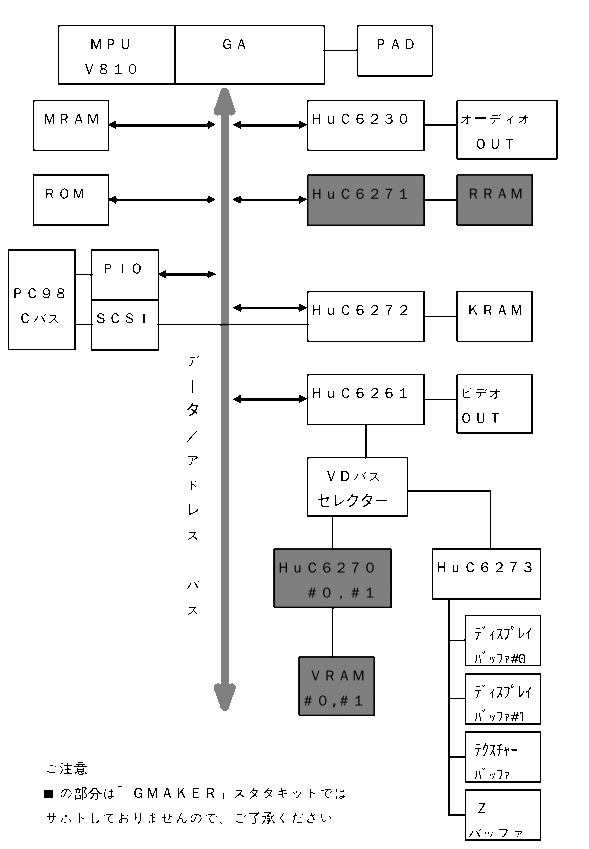

# PC-FXGA Authoring Software

## “GMAKER” Starter Kit (Ver. 1.0)

# About the Device Manuals

NEC Home Electronics, Ltd.  
November 10, 1995

Copyright © 1995 NEC Home Electronics, Ltd.

## Contents

Chapter 1: Introduction  
Chapter 2: Device Manual Files  
Chapter 3: PC-FXGA Block Diagram

## Chapter 1: Introduction

This file (`DEVMANU.WRI`) contains information intended to help you better understand the device manuals.

“Chapter 2: Device Manual Files” describes the Write files located in the `\DOC\DEVICE` directory.

“Chapter 3: PC-FXGA Block Diagram” contains a PC-FXGA block diagram to help you understand the overall hardware configuration of the PC-FXGA devices.

---

## Chapter 2: Device Manual Files

The Write files in the `DOC\DEVICE\` directory are described below.

> Note: A single device may be covered by multiple files. This applies to the HuC6272 and HuC6273 documentation and to the supplementary HuC6273 sprite documentation.

- `DEVMAMU.WRI` — About the device manuals (this file)
- `FXGABOAD.WRI` — Overview of the entire PC-FXGA device set
- `FXGA_GA.WRI` — Gate-array device description
- `C6230.WRI` — HuC6230 device description
- `C6261.WRI` — HuC6261 device description
- `C6272_1.WRI` — HuC6272 device description, Chapters 1 and 2
- `C6272_2.WRI` — HuC6272 device description, Chapter 3
- `C6272_3.WRI` — HuC6272 device description, References (a) through (e)
- `C6273_1.WRI` — HuC6273 device description, Chapter 1, Sections 1.1 through 1.2.2
- `C6273_2.WRI` — HuC6273 device description, Chapter 1, Sections 1.2.3 through 1.2.9
- `C6273_3.WRI` — HuC6273 device description, Chapter 1, Sections 1.3 through 1.10
- `C6273_4.WRI` — HuC6273 device description, Chapter 2
- `C6273_5.WRI` — HuC6273 device description, Chapter 3
- `C6273_A.WRI` — HuC6273 device description, Appendix
- `C6273_S1.WRI` — Supplementary HuC6273 sprite documentation, Chapters 1 and 2
- `C6273_S2.WRI` — Supplementary HuC6273 sprite documentation, Chapters 3 through 5
- `ROMFONT.WRI` — Built-in ROM fonts
- `YOUGO.WRI` — Device-manual glossary

---

## Chapter 3: PC-FXGA Block Diagram

The simplified block diagram below shows the overall PC-FXGA device configuration.

