# PC-FXGA Authoring Software

# “GMAKER” Starter Kit (Version 1.0)

# PC-FXGA Board Device Reference

NEC Home Electronics, Ltd.  
November 10, 1995

## Contents

1. Introduction
   - 1.1 PC-FXGA board overview
   - 1.2 Main functions
2. Operating functions
   - 2.1 Memory map
   - 2.2 I/O access space
   - 2.3 Address list
   - 2.4 On-board register list
   - 2.5 Keypad interface
   - 2.6 Timer
   - 2.7 Interrupt controller
   - 2.8 Other on-board registers
   - 2.9 Device access with V810 bit-string instructions
   - 2.10 Write buffer
   - 2.11 HuC6270 interrupt-driven control

# Chapter 1: Introduction

## 1.1 PC-FXGA board overview

The PC-FXGA board combines a V810 CPU, the HuC62-series chipset, a gate-array base section containing the DRAM controller and interrupt controller, and a peripheral debugger-support section. Together they provide an environment in which PC-FX-class software can execute and be evaluated as a complete system.

## 1.2 Main functions

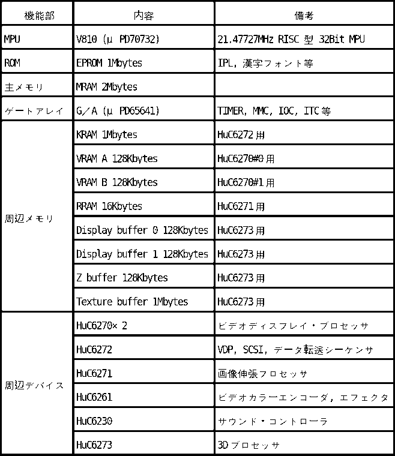

# Chapter 2: Operating Functions

## 2.1 Memory map

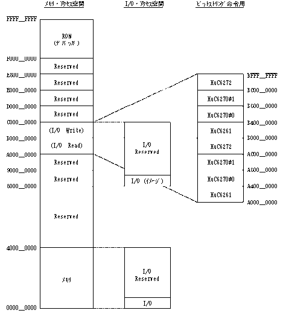

## 2.2 I/O access space

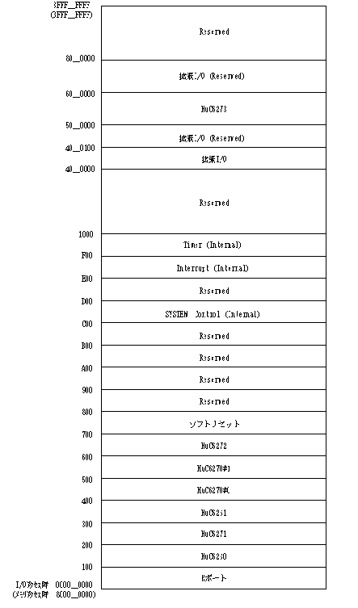

## 2.3 Address list

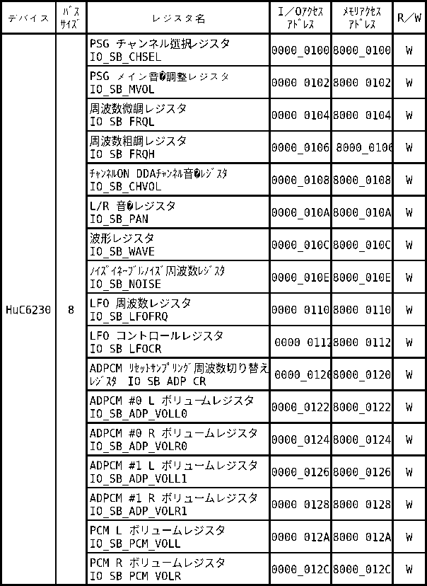

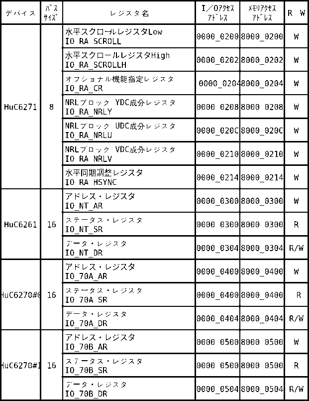

HuC6270 #0 is connected to the HuC6261 `VDA` input (lower-priority/lower path), and HuC6270 #1 is connected to `VDB` (upper path).

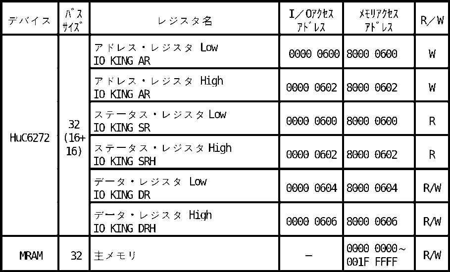

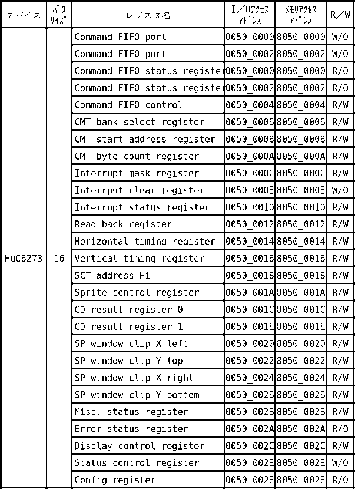

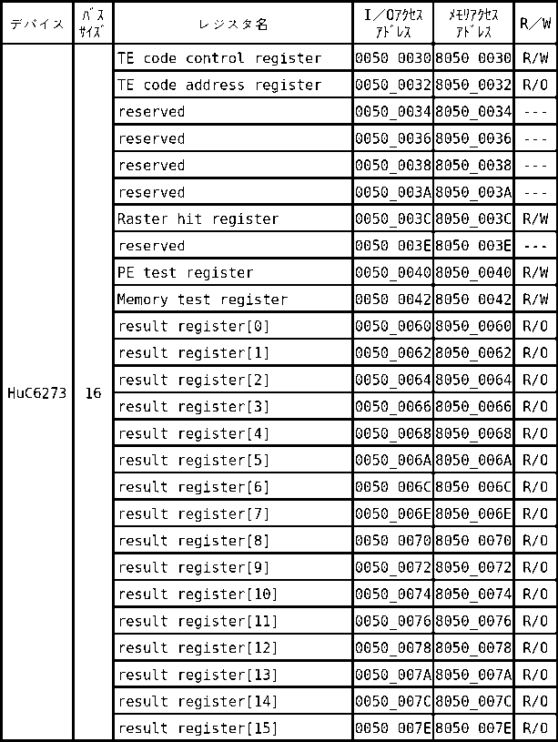

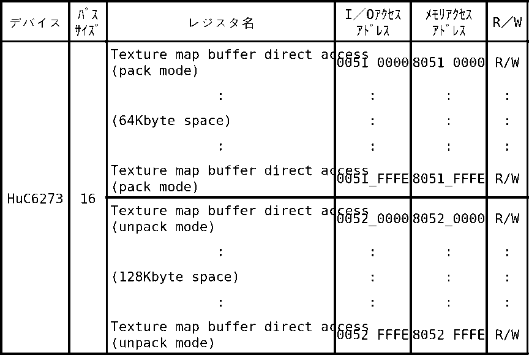

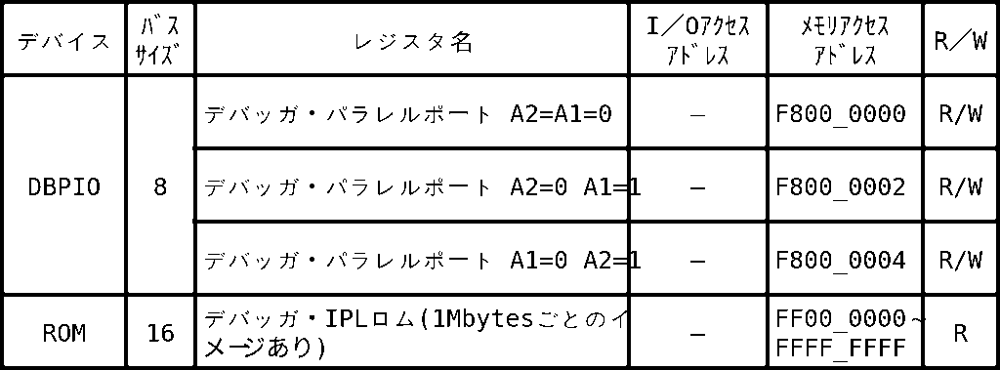

## 2.4 On-board register list

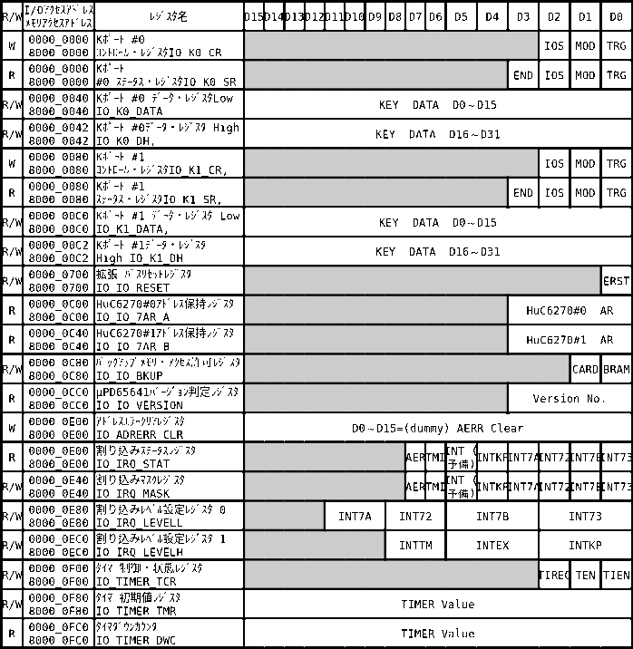

## 2.5 Keypad interface

The keypad interface connects standard pads and compatible controllers. Two independent ports are provided, so different device types may be connected simultaneously. Transfer data is 32 bits wide. Bits D31–D28 contain a four-bit device signature that identifies the connected device class.

### Register organization

#### K-port Control register (`IO_K0_CR`, `IO_K1_CR`)

Requests a transfer to the pad/device connected to the port. It also selects input/output direction and can issue the clear/reset signal used by multitaps.

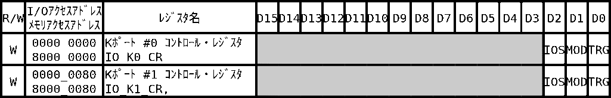

#### K-port Status register (`IO_K0_SR`, `IO_K1_SR`)

Reports transfer state.

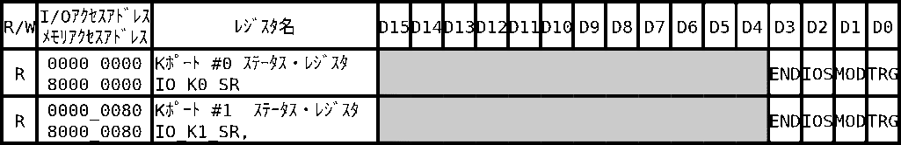

- **TRG (`BIT_K_TRG`)** — Write 1 to begin a transfer. Hardware clears it when the transfer completes.
- **MOD (`BIT_K_MOD`)** — When set for a requested transfer, issues a clear signal to a multitap or similar selector.
- **IOS (`BIT_K_IOS`)** — Direction at transfer request: 0 = output, 1 = input.
- **END (`BIT_K_END`)** — Set when transfer completes. Completion normally raises a K-port interrupt. Reading the K-port data register clears both the interrupt and `END`.

The control register may be written only while both `TRG` and `END` are zero.

#### K-port Data Low (`IO_K0_DL`, `IO_K1_DL`)

Reads/writes the low 16 bits of the 32-bit port datum. A read clears the K-port completion interrupt and the status-register `END` bit.

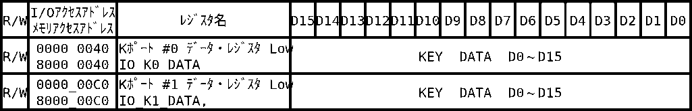

#### K-port Data High (`IO_K0_DH`, `IO_K1_DH`)

Reads/writes the high 16 bits.

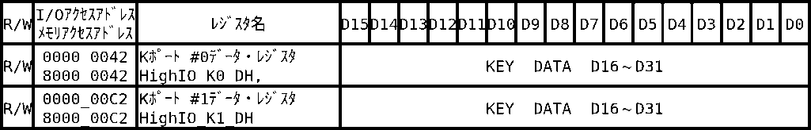

Data registers may be read or written only while `TRG = 0`.

### Transfer-data formats

#### Standard pad — signature 15 (`0xF`)

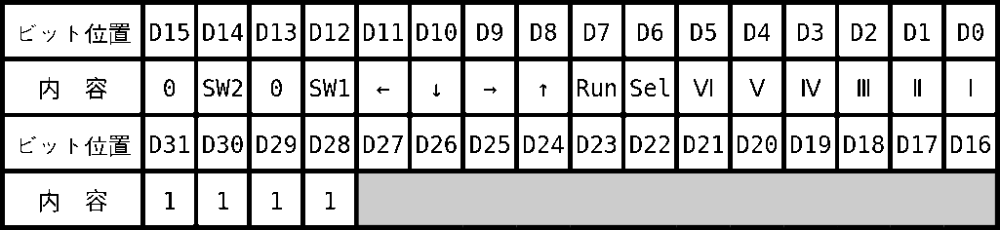

Shaded fields in the original diagram are undefined.

#### Mouse — signature 13 (`0xD`)

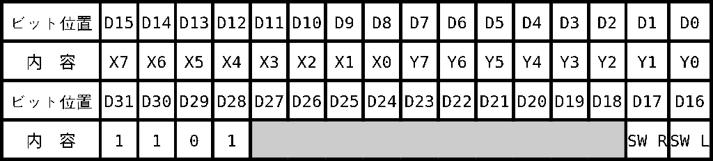

Shaded fields are undefined. `SW-L` and `SW-R` use 1 for pressed and 0 for normal/released. Movement direction and internal-counter range are shown below.

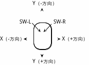

#### Multitap — signature 14 (`0xE`)

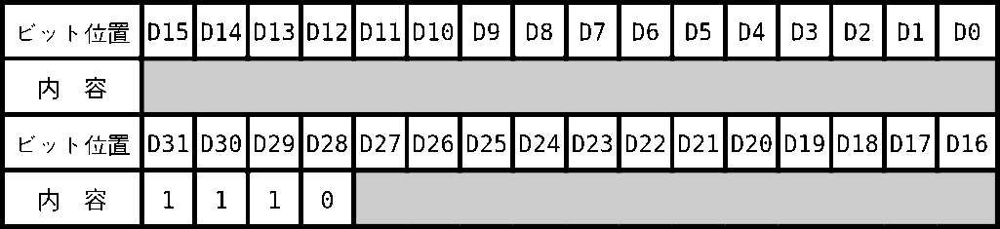

Perform the first transfer with multitap clear enabled, then subsequent transfers without clear. For a four-device multitap, the fifth read returns the multitap signature (`0xExxxxxxx`).

Restrictions:

1. Software that does not support multitaps must issue multitap clear before every read or write.
2. Software that supports multitaps must continue reading until the multitap signature is obtained every time.
3. This applies to PC-FX multitaps with two through five pad connectors.

## 2.6 Timer

The board has one 16-bit down-counter. One count is the 42.95454-MHz system clock divided by 30, or 1.431818 MHz. Interrupt intervals from approximately 698 ns to approximately 46 ms can be generated.

### Timer Control/Status register (`IO_TIMER_TCR`)

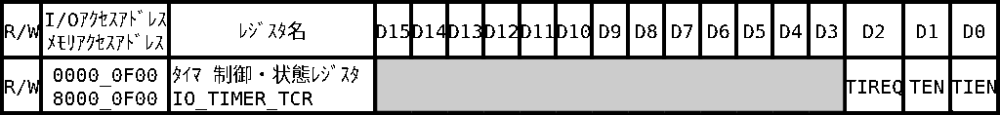

- **TIEN** — Timer-interrupt enable. When 1, `TIREQ = 1` generates a timer interrupt. Reset value is 0.
- **TEN** — Timer-count enable. Changing 0 → 1 loads the initial-value register into the down-counter and starts counting.
- **TIREQ** — Set when the counter borrows/underflows. Clear it to 0 to acknowledge the timer interrupt.

Setting `TIEN`, `TEN`, and `TIREQ` all to 1 can intentionally generate a timer interrupt.

### Timer Initial Value register (`IO_TIMER_TMR`)

Sets the reload count. Do not write zero because it causes an immediate borrow/underflow.

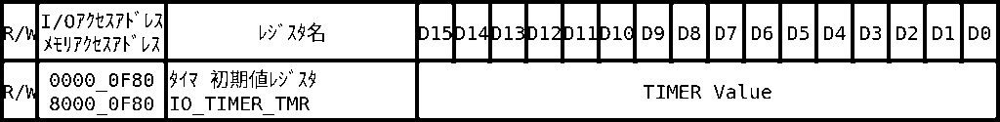

### Timer Down Counter (`IO_TIMER_DWC`)

Counts down while `TEN = 1`. On borrow, reloads from the initial-value register and continues. Read accuracy is -1/+0 count; the sampled value never appears one count too large.

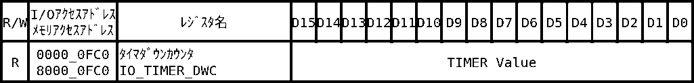

## 2.7 Interrupt controller

The controller receives peripheral-chip interrupts, the timer interrupt, and the address-error interrupt, then applies masking and programmable CPU interrupt levels.

### Address Error Clear register (`IO_ADRERR_CLR`)

Writing this register clears the address-error interrupt.

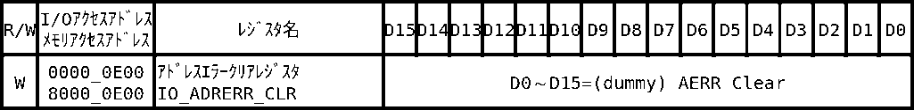

An address error is raised when a V810 load, store, or I/O instruction uses an invalid alignment.

### Interrupt Status register (`IO_IRQ_STAT`)

Each bit reads 1 while the corresponding interrupt signal is active.

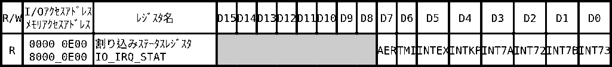

### Interrupt Mask register (`IO_IRQ_MASK`)

A source is enabled only when its corresponding mask bit is 0. After reset, all causes are masked. A masked source still appears in the status register.

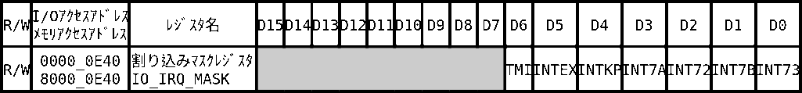

### Interrupt Level registers (`IO_IRQ_LEVELL`, `IO_IRQ_LEVELH`)

Assign the CPU interrupt level for each source.

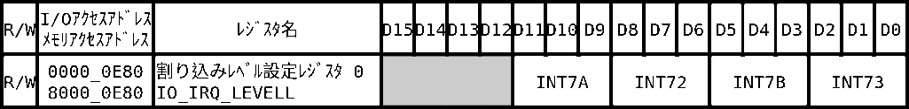

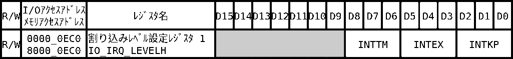

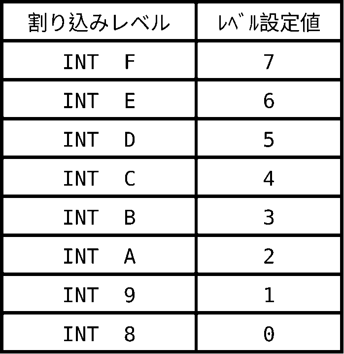

All interrupts must be masked before changing level assignments. Reset defaults are shown here:

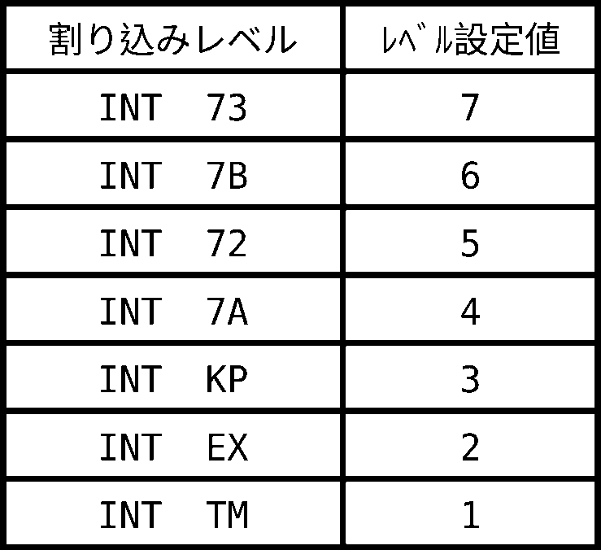

## 2.8 Other on-board registers

### 2.8.1 Expansion-bus Reset register (`IO_IO_RESET`)

Issues reset to the expansion bus and backup-memory expansion bus.

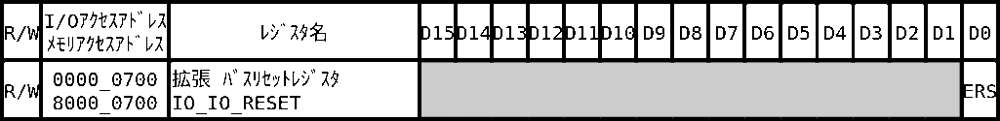

**ERST:** While 1, both expansion-bus reset outputs are asserted. Hold the bit at 1 for at least the reset duration required by every connected device.

### 2.8.2 HuC6270 Address-Hold registers

Each register preserves the last value written to the corresponding HuC6270 Address Register (`AR`). An interrupt handler can save this value at entry and restore it to the HuC6270 AR before returning, increasing the chance that foreground and interrupt code can safely share HuC6270 access.

This mechanism cannot save all HuC6270 internal state, such as VRAM write addresses. Software must still protect multi-register sequences.

#### HuC6270 #0 Address-Hold register

Returns the most recent AR value written to HuC6270 #0.

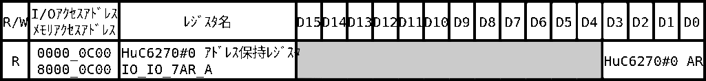

#### HuC6270 #1 Address-Hold register

Returns the most recent AR value written to HuC6270 #1.

### 2.8.3 Backup-memory Access Enable (`IO_IO_BKUP`)

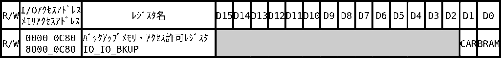

- **BRAM** — 1 permits read/write access to internal backup memory. Reset value 0.
- **CARD** — 1 permits read/write access to external backup memory. Reset value 0.

### 2.8.4 Gate-array version register (`IO_IO_VERSION`)

Returns the version number of the μPD65641 gate array.

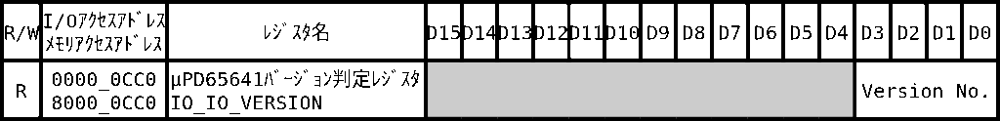

## 2.9 Device access with V810 bit-string instructions

V810 bit-string transfer instructions can perform block transfers by addressing a device’s memory-access aperture. The mechanism only repeats reads or writes; software must first set every device-specific address/control register.

Example: write to HuC6270 #0 VRAM.

1. Write `MAWR` to HuC6270 #0 `AR`.
2. Write the VRAM destination address through `DR`.
3. Write `VWR` to `AR`.
4. Set V810 `r26` and `r27` to zero, `r28` to transfer-byte-count × 16, `r29` to HuC6270 #0 memory aperture `0xA4000000`, and `r30` to the source-data address.
5. Execute `MOVBSU`.

If an interrupt changes device register state during the transfer, the transfer may target the wrong address or mode. Protect the whole sequence.

V810 bit-string cautions:

- For an unaligned write, the instruction may write as many as three bytes beyond the intended destination while attempting to restore the original values of the extra bytes.
- For an unaligned read, as many as three additional byte-read cycles may occur.

## 2.10 Write buffer

A normal I/O write requires six cycles. The board has a one-entry write buffer for HuC6230, HuC6261, HuC6270, HuC6271, and HuC6272. When the buffer is empty, a write to one of these devices releases the CPU with zero wait states after two cycles while the buffered write completes.

Software must still preserve ordering. Read-back, synchronization, or another documented barrier may be required before depending on the result of a buffered write.

## 2.11 HuC6270 interrupt-driven control

Background, sprite-display, and scroll-position register changes take effect immediately and influence the next raster. To make a change effective from the next frame rather than the next line, write it inside the vertical-blank-start interrupt handler.

When an interrupt handler accesses a HuC6270, save the current AR value at the start of the handler and restore it before return. Use `IO_IO_7AR_A` for HuC6270 #0 and `IO_IO_7AR_B` for HuC6270 #1.

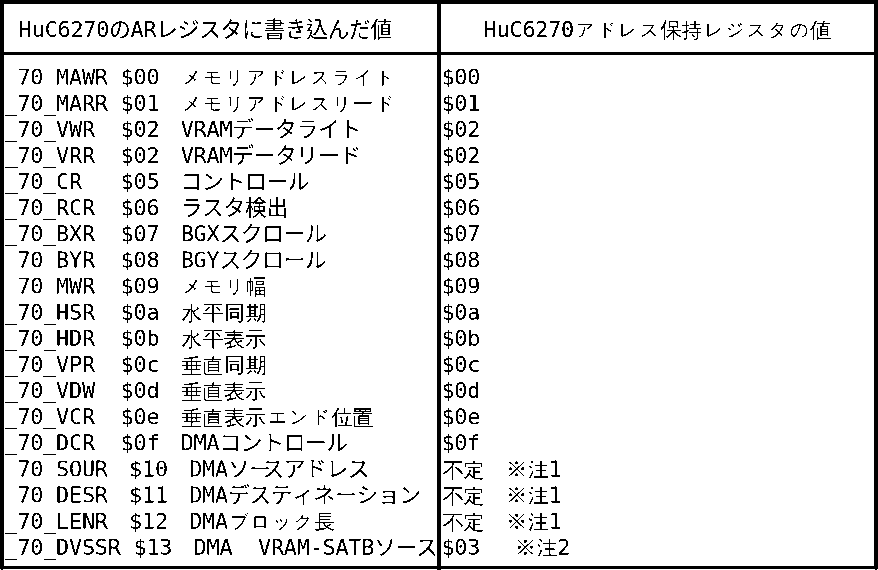

Notes:

1. VRAM-to-VRAM DMA is valid only in burst mode and is normally used only in special cases. The address-hold registers do not preserve the DMA source, destination, or length-register selection state.
2. If `_70_DVSSR (0x13)` was written to the HuC6270 AR, the address-hold register reads `0x03`, because literal AR value `0x03` is otherwise unused. When restoring a saved value of `0x03`, write `0x13` to the HuC6270 AR.

### 2.11.1 Before using VRAM-to-VRAM DMA

The address-hold mechanism does not cover `_70_SOUR`, `_70_DESR`, or `_70_LENR`. Access these VRAM-to-VRAM DMA registers only with interrupts disabled, and keep the complete selection/write sequence atomic.

### 2.11.2 Sample program guidance

The source manual includes C and assembly samples for:

- saving/restoring both HuC6270 AR selections in an interrupt handler;
- setting display and scroll registers at vertical blank;
- starting VRAM-to-VRAM DMA under interrupt exclusion;
- operating HuC6270 #0 and #1 independently;
- using the board timer and interrupt controller.

The samples depend on the `c62dev`, `v93`, and support headers shipped with the starter kit. Symbol names and register constants must match the installed SDK revision.
