# PC-FXGA Authoring Software

# “GMAKER” Starter Kit (Version 1.0)

# Device Notes: Gate Array

NEC Home Electronics, Ltd.  
November 10, 1995

## Contents

1. Memory-control unit details (MMC)
2. Timer-control unit (TMC)
   - 2.1 Timer-control unit details
3. Interrupt-control unit (ITC)
   - 3.1 Interrupt-control unit details
4. Expansion-bus access-control unit (EBC)
5. K-port control unit (KPC)
6. Address list (memory map)
7. I/O access-space details
8. Internal registers

# Chapter 1: Memory-Control Unit Details (MMC)

## Structure

1. Main-memory access-control circuit
2. ROM control circuit

## Functions

### 1. Main-memory access-control circuit

- Address range: `00000000H–00FFFFFFH`
- Maximum capacity: 16 MB; this differs from the final product specification.
- Data width: 32 bits
- Access time:
  - Fast-page mode: 2 clocks, 0 wait states
  - Without fast-page mode: 5 clocks, 3 wait states

DRAM access normally uses fast-page mode. Fast-page mode is cancelled only when:

- the row address misses; or
- the specified maximum RAS low-pulse width would be exceeded.

### 2. ROM control circuit

- Address range: `F0000000H–FFFFFFFFH` in memory space
- A 1-MB image is repeated through the range.
- Data width: 16 bits
- Access time: 4 clocks, 2 wait states

### Address space for bit-string instructions

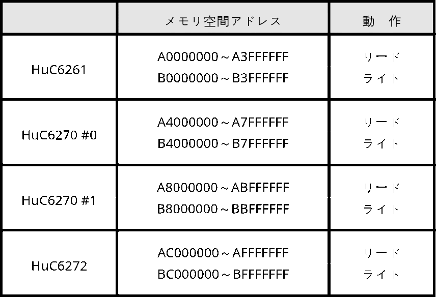

# Chapter 2: Timer-Control Unit (TMC)

## Structure

1. Timer-interrupt control circuit
2. Full timer-counter count
3. Timer-counter read accuracy
4. Timer-counter clock
5. Interrupt period

## Functions

### 1. Timer-interrupt control circuit

The circuit consists of:

- Timer Control/Status Register (`TCR`)
- Timer Register (`TMR`)
- Timer Counter (`DWC`)

`TCR` contains timer-count enable, interrupt enable, and interrupt-request bits. `TMR` and `DWC` are 16 bits wide. `DWC` is a down counter and uses the system clock, approximately 43 MHz, divided by 30.

The CPU can read and write `TCR` and `TMR`, and can read `DWC` even while it is counting.

When decrementing produces a borrow, the counter sets the interrupt-request bit and reports a timer interrupt if interrupts are enabled. After the borrow, it reloads the value in `TMR` and continues counting.

A timer interrupt can also be forced by writing 1 to the timer count-enable, interrupt-enable, and interrupt-request bits in `TCR`. Clear the interrupt by writing 0 to the interrupt-request bit.

For a full 16-bit count, software writes `FFFFH` to `TMR`. Writing `0000H` is prohibited because it causes an immediate borrow.

### 2. Full timer-counter count

`2^16 - 1 = 65,535` counts, when `FFFFH` is explicitly loaded or automatically preloaded.

### 3. Timer-counter read accuracy

-1 count to +0 count; the result never deviates in the +1 direction.

### 4. Timer-counter clock

- Frequency: `42.95454 MHz / 30 = 1.431818 MHz`
- Period: `1 / 1.431818 MHz = 698.4128 ns`

### 5. Interrupt period

`698.4128 ns × 65,535 = 45.77048 ms`

## 2.1 Timer-Control Unit Details

### Structure

1. Timer Control/Status Register (`TCR`)
2. Timer Register (`TMR`)
3. Timer Counter (`DWC`, 16-bit down counter)

### 1. Timer Control/Status Register (TCR)

Only three bits are valid.

- I/O address: `00000F00H`, read/write
- I/O or memory address: `80000F00H`, read/write

#### TIREQ — timer interrupt request

Set when the timer counter produces a borrow. Write 0 to clear a timer interrupt. Writing 1 to `TIREQ`, `TCE`, and `TIEN` together forces the timer-interrupt output `XINTTM` active.

#### TCE — timer count enable

- 1: run the counter
- 0: stop the counter

#### TIEN — timer interrupt enable

When `TIEN`, `TCE`, and `TIREQ` are all 1, `XINTTM` is asserted. If `TIEN` is 0, the interrupt is suppressed even when `TCE` and `TIREQ` are 1.

### 2. Timer Register (TMR)

A 16-bit register that supplies the timer-counter initial value. Writing zero is prohibited.

- I/O address: `00000F80H`, read/write
- I/O or memory address: `80000F80H`, read/write

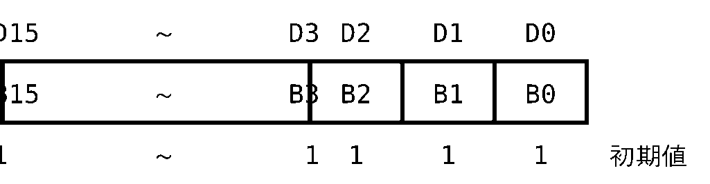

### 3. Timer Counter (DWC)

A 16-bit down counter. Its initial value is loaded from `TMR`. On borrow, `DWC` reloads `TMR` and continues counting.

- I/O address: `00000FC0H`, read only
- I/O or memory address: `80000FC0H`, read only

# Chapter 3: Interrupt-Control Unit (ITC)

## Structure

1. Interrupt-control circuit

## Functions

The unit combines interrupts from peripheral ICs and the gate-array timer into one interrupt-request output, and outputs the level of the highest-priority pending interrupt.

Software can configure the interrupt level for every source and independently enable or mask each source.

The status register records the NMI condition caused by a CPU address error and all maskable interrupt conditions. The CPU can read this register.

An address error is detected by the V810 when the effective address of a load/store or I/O instruction is misaligned and the CPU forcibly aligns it.

### Interrupt types and initial interrupt levels

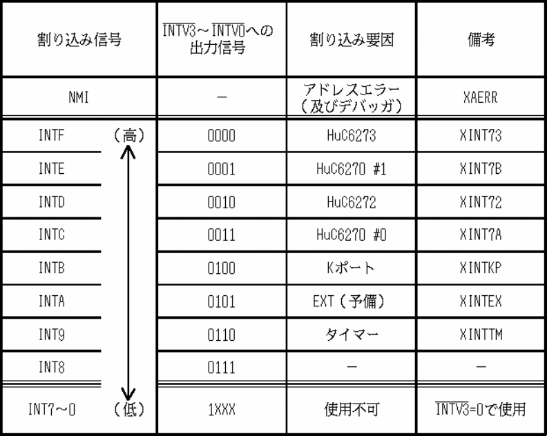

## 3.1 Interrupt-Control Unit Details

### Structure

1. Interrupt Signal Status Register (`ISR`)
2. Address-Error Status Clear Controller (`AESCC`)
3. Interrupt Mask Register (`IMR`)
4. Interrupt Level Registers (`ILR0`, `ILR1`)

### 1. Interrupt Signal Status Register (ISR)

Shows the request state of each interrupt signal.

- Address `00000E00H`, read
- Address `80000E00H`, read

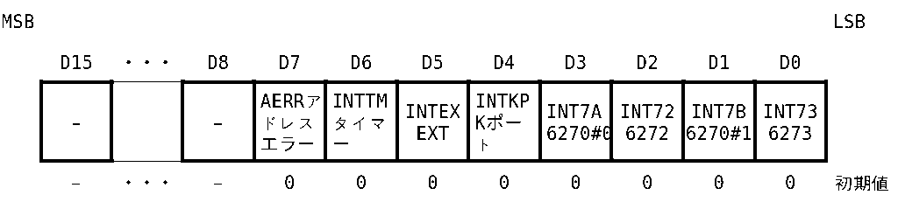

- 1: interrupt requested
- 0: no interrupt requested

A read returns the individual interrupt states and the address-error NMI state on D7–D0 regardless of `IMR`.

Interrupt sources other than NMI retain their request outputs until the CPU performs the source-specific acknowledge/clear operation, so the ITC does not latch them separately.

The address-error NMI status remains set after one address error until cleared through `AESCC`.

### 2. Address-Error Status Clear Controller (AESCC)

Clears the address-error status.

- Address `00000E00H`, write
- Address `80000E00H`, write

Writing either address clears the address-error status.

### 3. Interrupt Mask Register (IMR)

Controls enable/mask state for every interrupt source.

- Address `00000E40H`, read/write
- Address `80000E40H`, read/write

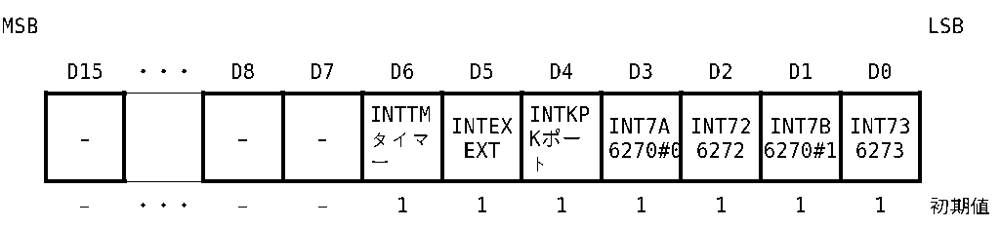

- 1: interrupt masked
- 0: interrupt enabled

Writing configures the masks. Reading returns the states on D6–D0.

### 4. Interrupt Level Registers (ILR0 and ILR1)

Configure the interrupt level for each source.

#### ILR0

- Address `00000E80H`, read/write
- Address `80000E80H`, read/write

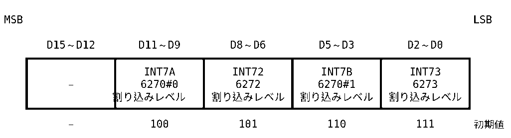

#### ILR1

- Address `00000EC0H`, read/write
- Address `80000EC0H`, read/write

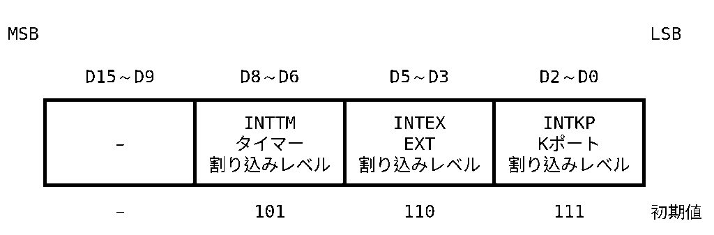

Interrupt levels may be changed only while every interrupt is masked in `IMR`.

Reading returns the configured levels on D11–D0 or D8–D0, regardless of the mask settings.

If multiple sources are assigned the same interrupt level, software must resolve the ambiguity in the interrupt-handler dispatch routine.

### Values used to configure interrupt levels

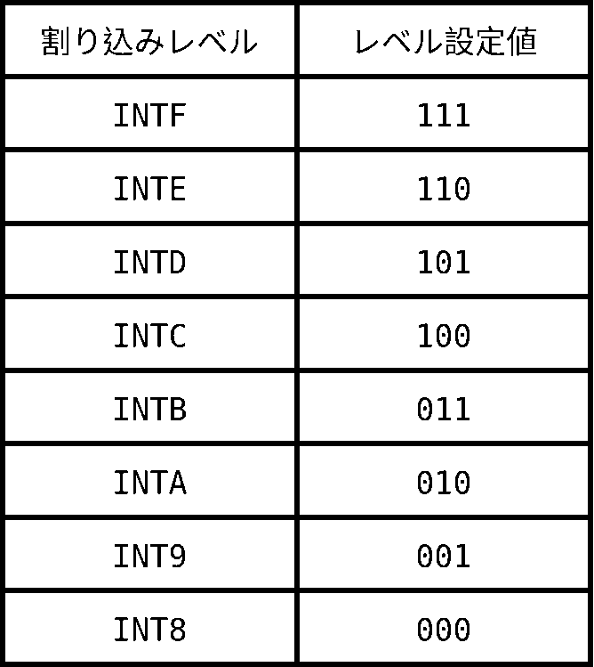

# Chapter 4: Expansion-Bus Access-Control Unit (EBC)

## Structure

1. Address decoder
2. Wait-state controller

## Functions

### 1. Address decoder

Decodes the CPU address and asserts a select signal when the address lies in a region exposed on the expansion bus.

- I/O: `00400000H–00800000H`
- I/O or memory: `80400000H–80800000H`

The actual addresses driven onto the product bus are defined by the product specification.

### 2. Wait-state controller

Expansion-bus accesses normally take four clocks, with two wait states inserted automatically. The wait cycle can be extended by driving the `XEB` pin low.

# Chapter 5: K-Port Control Unit (KPC)

## Structure

1. K-port 0 Control (`K0CR`)
2. K-port 0 Status (`K0SR`)
3. K-port 0 Data Low (`K0DL`)
4. K-port 0 Data High (`K0DH`)
5. K-port 1 Control (`K1CR`)
6. K-port 1 Status (`K1SR`)
7. K-port 1 Data Low (`K1DL`)
8. K-port 1 Data High (`K1DH`)

## 1. K-Port 0 Control (K0CR)

Controls K-port 0 transfer.

- Address `00000000H`, write
- Address `80000000H`, write

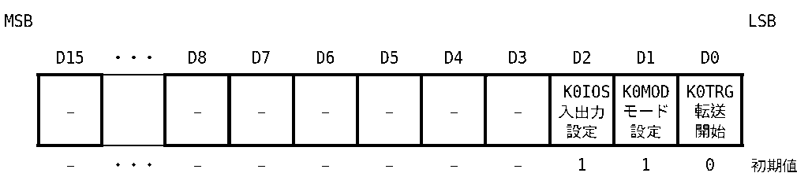

### D2, K0IOS — direction

- 1: input, initial value
- 0: output

### D1, K0MOD — mode

- 1: mode with multitap clear, initial value; use for the first transfer when a multitap is connected
- 0: mode without multitap clear; use for second and later transfers

### D0, K0TRG — transfer start

- 1: start a K-port 0 transfer sequence using the selected direction and mode; automatically rewritten to 0 after the 32-bit transfer
- 0: do not start a transfer. Software cannot write 0 because this state is written by the system; it is the initial value.

`K0CR` can be written only while `K0SR` shows `K0TRG = 0` and `K0END = 0` throughout the write cycle.

### K0CR setting behavior

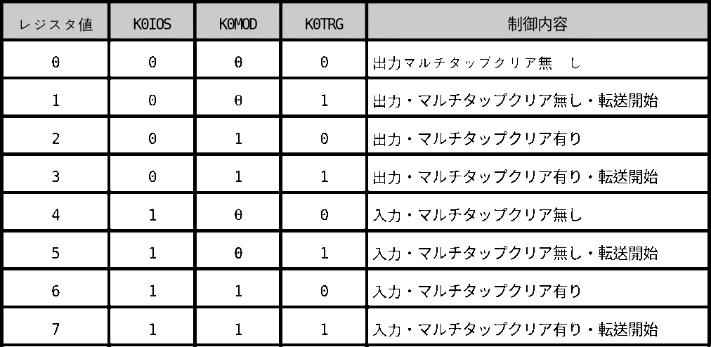

## 2. K-Port 0 Status (K0SR)

Reports K-port 0 transfer status.

- Address `00000000H`, read
- Address `80000000H`, read

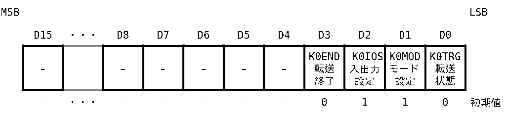

### D3, K0END — transfer completed

- 1: set when the transfer sequence completes; generates a K-port interrupt if unmasked
- 0: cleared when either halfword of a K-port 0 data register is read or written

### D2, K0IOS — direction state

- 1: input
- 0: output

### D1, K0MOD — mode state

- 1: multitap-clear mode
- 0: no-multitap-clear mode

### D0, K0TRG — transfer state

- 1: transfer in progress; automatically becomes 0 after the 32-bit transfer
- 0: no transfer in progress

If `K0END` changes from 0 to 1 or `K0TRG` changes from 1 to 0 on the first rising clock edge after T2 during a `K0SR` read cycle, the read value is undefined.

### K0SR status behavior

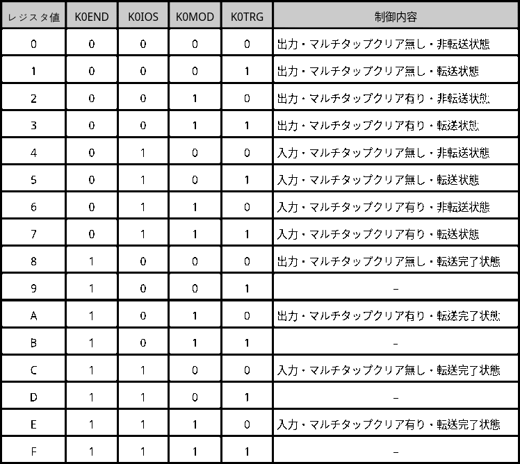

## 3. K-Port 0 Data Low (K0DL)

Lower-halfword K-port 0 data register.

- Address `00000040H`, read/write
- Address `80000040H`, read/write

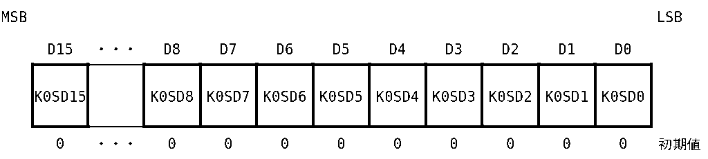

- 1: corresponding `K0SD` signal is low
- 0: corresponding `K0SD` signal is high

Reading or writing clears `K0END`. Access is permitted only while `K0TRG = 0` throughout the cycle.

## 4. K-Port 0 Data High (K0DH)

Upper-halfword K-port 0 data register.

- Address `00000042H`, read/write
- Address `80000042H`, read/write

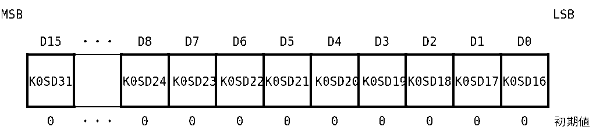

- 1: corresponding `K0SD` signal is low
- 0: corresponding `K0SD` signal is high

Reading or writing clears `K0END`. Access is permitted only while `K0TRG = 0` throughout the cycle.

## 5. K-Port 1 Control (K1CR)

Controls K-port 1 transfer.

- Address `00000080H`, write
- Address `80000080H`, write

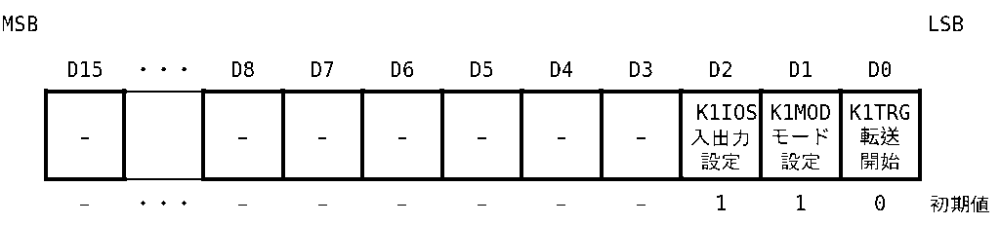

### D2, K1IOS — direction

- 1: input, initial value
- 0: output

### D1, K1MOD — mode

- 1: mode with multitap clear, initial value; use for the first transfer when a multitap is connected
- 0: mode without multitap clear; use for second and later transfers

### D0, K1TRG — transfer start

- 1: start a K-port 1 transfer sequence using the selected direction and mode; automatically rewritten to 0 after the 32-bit transfer
- 0: do not start a transfer. Software cannot write 0 because this state is written by the system; it is the initial value.

`K1CR` can be written only while `K1SR` shows `K1TRG = 0` and `K1END = 0` throughout the write cycle.

### K1CR setting behavior

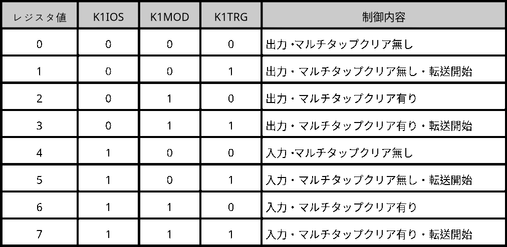

## 6. K-Port 1 Status (K1SR)

Reports K-port 1 transfer status.

- Address `00000080H`, read
- Address `80000080H`, read

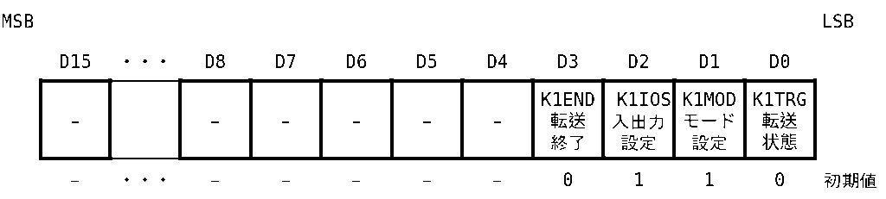

### D3, K1END — transfer completed

- 1: set when the transfer sequence completes; generates a K-port interrupt if unmasked
- 0: cleared when either halfword of a K-port 1 data register is read or written

### D2, K1IOS — direction state

- 1: input
- 0: output

### D1, K1MOD — mode state

- 1: multitap-clear mode
- 0: no-multitap-clear mode

### D0, K1TRG — transfer state

- 1: transfer in progress; automatically becomes 0 after the 32-bit transfer
- 0: no transfer in progress

If `K1END` changes from 0 to 1 or `K1TRG` changes from 1 to 0 on the first rising clock edge after T2 during a `K1SR` read cycle, the read value is undefined.

### K1SR status behavior

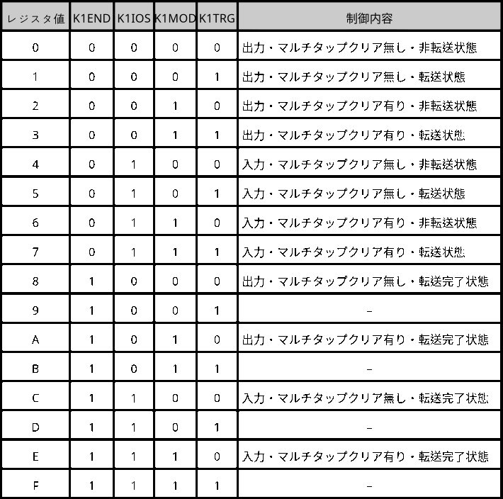

## 7. K-Port 1 Data Low (K1DL)

Lower-halfword K-port 1 data register.

- Address `000000C0H`, read/write
- Address `800000C0H`, read/write

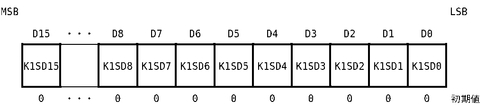

- 1: corresponding `K1SD` signal is low
- 0: corresponding `K1SD` signal is high

Reading or writing clears `K1END`. Access is permitted only while `K1TRG = 0` throughout the cycle.

## 8. K-Port 1 Data High (K1DH)

Upper-halfword K-port 1 data register.

- Address `000000C2H`, read/write
- Address `800000C2H`, read/write

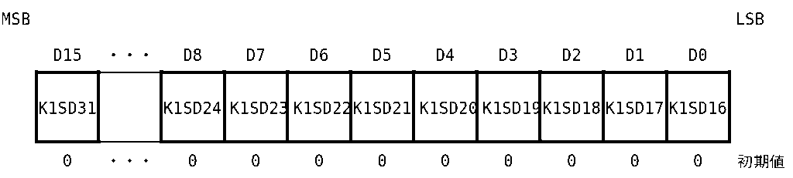

- 1: corresponding `K1SD` signal is low
- 0: corresponding `K1SD` signal is high

Reading or writing clears `K1END`. Access is permitted only while `K1TRG = 0` throughout the cycle.

# Address List (Memory Map)

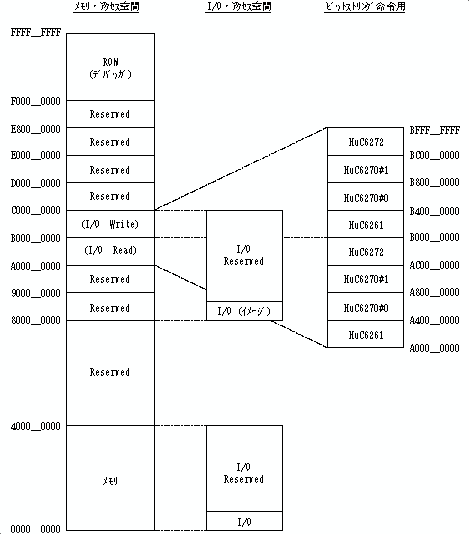

# I/O Access-Space Details

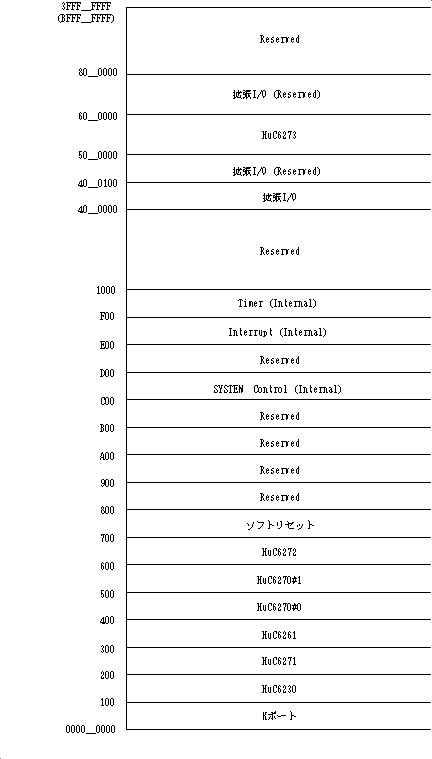

# Internal Registers

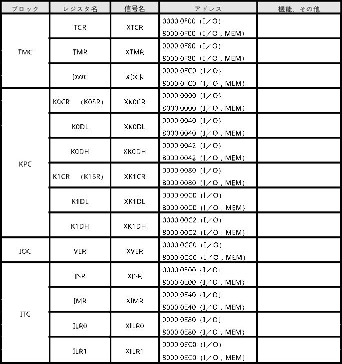

## Copyright and registered trademarks

- This technical document is part of the software-development tools for PC-FXGA. Do not use it for any purpose other than PC-FX or PC-FXGA software development.
- Hudson Soft assumes no responsibility or liability for direct or indirect damage resulting from use of this technical document.
- Hudson Soft does not answer questions directly concerning this technical document or its contents. Please refrain from contacting the company with such inquiries.
- Before using this technical document, read and comply with the applicable “Software Terms of Use.”
- Copyright in this technical document is held by Hudson Soft.

© 1995 HUDSON SOFT
