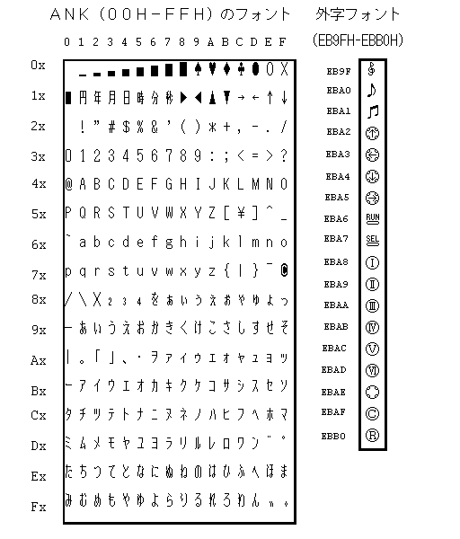

# PC-FXGA Authoring Software

## “GMAKER” Starter Kit (Ver. 1.0)

# Kanji ROM Fonts

NEC Home Electronics, Ltd.  
November 10, 1995

The PC-FXGA provides ANK and kanji fonts in ROM. Their addresses can be obtained with the `font_adrs` function.

Four ANK font sizes are provided for character codes `00H` through `FFH`: 8×16, 6×12, 8×8, and 8×12.

Two kanji font sizes are provided for character codes `8140H` through `EBB0H`: 16×16 and 12×12.

For non-kanji characters, JIS Level 1 kanji, and JIS Level 2 kanji, the encoding is basically based on the newer JIS code system, with PC-98 half-width and full-width box-drawing characters, symbols, and other characters added. Consult general reference material for details of the fonts in this encoding.

The following patterns are provided as the fonts for ANK and user-defined character codes.

`KJDMP.BIN` is a program that displays every PC-FXGA font. Load and run it in FXDB:

```text
fxdb r@ kjdmp.bin 8000;rg 8000
```



## Copyrights, Registered Trademarks, and Related Notices

- This technical document is part of the PC-FXGA software-development tools. Do not use it for any purpose other than developing software for the PC-FX or PC-FXGA.
- Hudson Soft Co., Ltd. assumes no responsibility or liability for any direct or indirect damage resulting from use of this technical document.
- Hudson Soft does not answer questions directly concerning this technical document or its contents. Please refrain from contacting Hudson Soft with inquiries.
- Before using this technical document, read the “Software Terms of Use” carefully and comply with them.
- Copyright in this technical document is held by Hudson Soft Co., Ltd.

Copyright © 1995 Hudson Soft.
